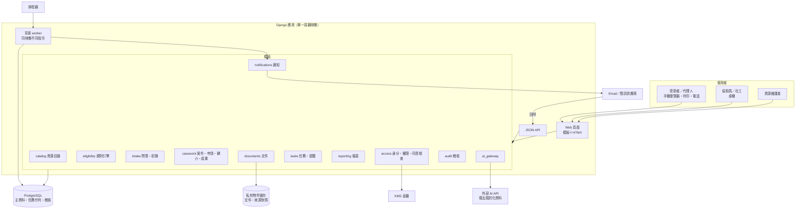

# 技術架構
work_id：STP-PLATFORM-PLAN-001｜版本：v0.4-draft（R2 修正）｜2026-10-04
前提：尚未取得政府介接、MyData 資格、LINE 官方帳號或正式部署環境；本文件是建議目標架構，不代表已部署。

## 1. 設計限制
- 團隊假設：1～2 名工程師（可兼職）＋資源維護與個案人員；不能有需要專職 SRE 的元件。
- 敏感個資：需加密、最小權限、稽核、備份與刪除；資料位置以台灣境內為優先（試點合作機構可能要求，見 [DECISIONS_AND_UNKNOWNS.md](DECISIONS_AND_UNKNOWNS.md) U-07）。
- 使用者：低頻寬手機、協助員桌機、列印；不能依賴 App 安裝。
- 外部系統：無 API；所有送件、轉介是「記錄人工動作」，不是自動送出。

## 2. 方案比較
| 評估面向 | A. Python／Django 模組化單體＋PostgreSQL（推薦） | B. Next.js＋BaaS（例如 Supabase） | C. 無程式碼（試算表＋表單＋自動化工具） |
|---|---|---|---|
| 開發速度 | 中高：內建 ORM、遷移、表單、權限、後台 | 高（前端）；後台需自建 | 最高（第一週可用） |
| 資源維護後台 | Django admin 可快速客製成 P9 | 需自建 | 試算表即後台，但版本與查核流程難控 |
| 權限與稽核 | 角色＋物件層級於服務層實作；稽核表只增不改 | RLS 強，但規則分散於 DB 與前端 | 只有檔案層級權限，難以欄位級控制 |
| 規則版本與可重現評估 | 程式控制，易測試 | 可行 | 困難 |
| 資料位置 | 可部署於台灣區域的雲端或本地機房 | 依 BaaS 提供區域（台灣區域可得性待確認） | 依 SaaS，通常境外 |
| 維運負擔 | 低～中（受管容器＋受管資料庫） | 低 | 最低 |
| 鎖定風險 | 低（標準 PostgreSQL、容器） | 中 | 高 |
| 適合 | 試點到擴大 | 偏重前端體驗的產品 | 僅適合 P0／P1 的非敏感資源整理 |

**推薦 A**（推薦且可逆，見 D-201）。理由：個案與規則邏輯都在伺服器端，易測試與稽核；Django admin 大幅降低資源維護後台成本；一個可部署單位最適合小團隊。限制：前端互動較弱（以 HTMX 補強即可滿足表單型流程）；Python 單體在極高流量下需水平擴充（本服務量級不構成問題）。
C 方案只用於 P0～P1 的公開資源草稿整理（不含個資），並於 F-02 上線後匯入。

## 3. 推薦架構
| 層 | 選擇（推薦且可逆） | 說明 |
|---|---|---|
| 前端 | Django 伺服器端模板＋HTMX＋少量原生 JS；列印用 CSS | 首屏輕、無需建置工具鏈；公開頁可快取 |
| 後端 | Django（採當時官方 LTS 版本，開發時以 djangoproject.com 支援表確認）＋ Django REST framework 或 Django Ninja 提供 JSON API | 頁面與 API 共用同一服務層 |
| 資料庫 | PostgreSQL（受管服務，啟用自動備份與時間點復原） | jsonb 存規則與快照；partial unique index 防重複 |
| 私有文件 | 物件儲存私有 bucket（統一權限、禁止公開、版本化、生命週期刪除）；短效簽章 URL；上傳後病毒掃描 | 預設不存文件，見 P5 |
| 欄位加密 | 敏感欄位（身分證號、金額、安全旗標）應用層信封加密，金鑰由雲端 KMS 管理 | 資料庫備份外洩時仍受保護 |
| 身分驗證 | 工作人員：帳密＋MFA（TOTP 或 WebAuthn），或據點既有 Google Workspace／Microsoft Entra SSO＋MFA；受助者：MVP 無帳號 | 試點後 F-21 以簡訊 OTP 或案件代碼＋生日查詢（待評估） |
| 角色權限 | 角色（R1～R9）＋物件層級（指派案件、機構、同意範圍），集中於 `access` 模組的政策函式；每個 view 與 API 強制呼叫 | 以權限矩陣產生自動化測試 |
| 背景任務 | PostgreSQL 為基礎的任務佇列（候選：Procrastinate；備選：Django 內建 tasks 介面搭配資料庫後端）；排程由雲端排程器呼叫受保護端點或常駐 worker | 不另外維運 Redis |
| 通知 | `notifications` 模組＋供應商轉接層：Email（交易型 Email 服務）、簡訊（台灣簡訊供應商，待比價）、LINE（試點後，需帳號） | 寄送與回呼都寫入 Notification |
| 稽核 | AuditEvent 表（只新增、雜湊鏈）；資料庫角色禁止 UPDATE/DELETE | 管理者查詢介面 |
| 監控 | 雲端日誌與監控＋錯誤追蹤（送出前移除個資）＋外部可用性檢查 | 告警到值班 Email／通訊群組 |
| 備份 | 資料庫每日自動備份＋時間點復原（保留 14～30 天）；物件版本化；每季還原演練 | 備份同區域加密 |
| AI 介接 | `ai_gateway` 模組：去識別化、提示版本、輸出檢查、逾時回退、用量記錄；供應商可替換 | 預設關閉，以功能旗標啟用 |
| 檢索 | MVP 不需要向量檢索：資源量 ≤數百筆，以 PostgreSQL 全文檢索＋結構化篩選即可；擴大後再評估 pgvector | 避免不必要元件 |

### 3.1 部署建議（推薦且可逆，見 D-202）
- 候選：Google Cloud `asia-east1`（台灣彰化）區域的 Cloud Run（容器）＋ Cloud SQL for PostgreSQL ＋ Cloud Storage ＋ Cloud Scheduler ＋ Secret Manager ＋ Cloud KMS。理由：資料可留在台灣區域、全受管、按用量計費。
- 替代：國內雲端業者或合作機構機房的虛擬機＋Docker Compose（若合作機構要求資料不得使用境外業者）。架構不依賴特定雲端專屬服務，只需「容器＋PostgreSQL＋S3 相容物件儲存＋排程」。
- 環境：`local`（Docker Compose、合成資料）→ `staging`（獨立專案、只允許合成資料，啟動時檢查 `is_synthetic`）→ `production`（通過 [BUILD_PLAN_AND_ACCEPTANCE.md](BUILD_PLAN_AND_ACCEPTANCE.md) §3 閘門後才建立）。三者不同雲端專案與金鑰。
- 官方參考（查核日期 2026-10-03）：Google Cloud 區域列表 https://cloud.google.com/about/locations ；Cloud Run 定價頁 https://cloud.google.com/run/pricing （頁面將 asia-east1 列於 Tier 1 定價區）；Cloud SQL 定價 https://cloud.google.com/sql/pricing 。本輪無法自網頁取得完整價目表，成本以區間估算，須以官方計算機 https://cloud.google.com/products/calculator 確認（U-10）。

## 4. 架構圖與資料流

主要資料流：
1. **免姓名免帳號初篩**：P2 答案存 ScreeningSession（24 小時）→ `eligibility.evaluate()` 讀已發布版本 → 結果頁；未要求聯絡則到期刪除。
2. **建案**：協助員建立 Household／ServiceCase／Consent → 匯入 session 答案為 Fact（C1）→ Assessment。
3. **申請**：Application 狀態轉換經 `casework.transition()`（檢查權限、狀態、證據、冪等鍵）→ 寫 AuditEvent → 產生 Task。
4. **通知**：Task 到期 → worker 建 Notification（檢查 Consent 與靜默時段）→ 供應商 → 回呼更新狀態 → 失敗建立人工任務。
5. **資源更新**：排程比對來源雜湊 → NEEDS_RECHECK 任務 → R5 發布新版 → 影響分析 → REASSESS 任務。
6. **報表**：每日夜間由唯讀複本或交易快照計算彙總表（排除 is_synthetic）→ P12。

## 5. 模組界線
| 模組 | 擁有的資料 | 對外介面（服務函式） | 不可做 |
|---|---|---|---|
| catalog | Organization、Source、Resource、ResourceVersion、DocumentRequirement、HouseholdScopeDefinition、VerificationRecord | `publish_version`、`suspend`、`search_public` | 不讀個案資料 |
| eligibility | EligibilityRule；純函式引擎 | `evaluate(facts_snapshot, versions) -> results` | 無副作用、不呼叫 AI、不寫資料庫（由 intake/casework 寫 Assessment） |
| intake | ScreeningSession、HelpRequest | `start_session`、`answer`、`request_help` | 不存未同意的聯絡資料 |
| casework | Household、Person、Fact、FactKeyDefinition、ServiceCase、Assessment、ReviewDecision、Application、Referral、Outcome、OutcomeEvent、Interaction、ActionPlan | `transition(machine, id, transition_id, evidence)`、`record_outcome_event`、`verify_outcome_event`、`merge_households` | 不直接寄通知（交給 tasks）；不接受直接指定目標狀態 |
| documents | DocumentRecord、檔案 | `create_upload_intent`、`confirm_upload`、`download_url`、`purge`、（試點後）`extract_local` | 不把檔案或其辨識文字傳給外部 AI；本機辨識只在同一私有環境內執行（F-26） |
| tasks | Task | `create_or_get(dedup_key)`、`escalate` | — |
| notifications | Notification、NotificationEvent、Outbox、供應商設定 | `schedule`、`handle_callback` | 不判斷業務狀態 |
| access | StaffUser、角色、Consent、AccessGrant、ReviewNote | `can(actor, action, obj)`、`require_consent(purpose, target)`、`grant_access`、`approve_grant` | 管理者無一般個案存取；BG／REVIEW_SAMPLE 不可擴大範圍 |
| audit | AuditEvent、PurgeRecord | `record(...)` | 應用程式不可修改或刪除；清除只經專用 `audit_purge` 排程 |
| retention | ControlRecord（外部控制紀錄，含 DeletionLedger 視圖）、副本清冊設定 | `record_control(rec)`（先寫外部紀錄再套用）、`revoke_cleanup(consent)`、`purge_expired()`、`reapply_controls()`（備份還原後；冪等） | 不讀取內容；只處理物件參照 |
| reporting | 彙總表、ReportRun | `funnel(period, org, metric_spec_version)` | 不輸出個案層級；排除合成資料 |
| ai_gateway | AI 呼叫紀錄（不含原文或只含去識別化文字） | `draft_resource_fields`、`plain_explain`、`summarize` | 不寫入已發布資料；不接受個案資料（MVP）；不接受文件影像或其文字 |

依賴方向：Web/API → 各模組服務函式 → 資料；模組之間只透過服務函式呼叫，以 import-linter 類工具在 CI 檢查。

## 6. 主要 API
共同規則：
- 錯誤格式：RFC 9457 Problem Details（`type`、`title`、`detail`、`errors[]`），使用者訊息另提供白話版。
- **權限**：「權限」欄使用 [PRODUCT_REQUIREMENTS.md](PRODUCT_REQUIREMENTS.md) §4 的角色與範圍代碼（ASG、SITE-REV、REF、OWN、GRANT、SAMPLE、BG、AGG、INT、ALL-PUB）。未登入 401；無權限 403；不透露物件是否存在時回 404。權限矩陣與 API、頁面、狀態機的一致性由文件政策檢查（`gen_permissions.py`）驗證；產品授權行為測試（T-19、T-32～T-35、T-50、T-51）待 WP-08 實作後才存在，目前**沒有**「每格都有產品自動化測試」。
- **狀態轉換一律以 `transition_id` 呼叫**（[DATA_MODEL_AND_STATE_MACHINES.md](DATA_MODEL_AND_STATE_MACHINES.md) §3，來源 `state_machines.json`）：請求帶 `transition_id`、`evidence`、`expected_row_version`；伺服器檢查目前狀態、操作者、前置條件與必要證據；不接受直接指定目標狀態；`SYSTEM` 轉換不能由 API 呼叫。
- **冪等**：所有會建立紀錄或產生外部效果的 POST 需 `Idempotency-Key`。伺服器以 `(actor_id, key)` 存 IdempotencyRecord（24 小時）：首次→處理；相同 key＋相同請求內容→**重播**：只取出儲存的回應形狀（狀態碼與資源參照），再以**當下**的權限、同意與刪除狀態重新取得資源內容回傳（已失去權限或同意撤回→403 且不回內容；資源已刪除→410；刪除優先於 403）；相同 key＋不同內容→422；相同 key 仍在處理中→409 `IN_PROGRESS`。
- **併發**：狀態轉換與欄位更新帶 `expected_row_version`，不符回 409。
- **稽核**：所有個案讀取與寫入寫入 AuditEvent；經 AccessGrant 的存取帶 `access_grant_id`。

| API | 用途 | 輸入 | 輸出 | 權限 | 錯誤與重複防護 |
|---|---|---|---|---|---|
| `GET /api/public/resources` | 公開查詢 | region、category、q、page | `catalog_visibility` 列表內的資源摘要 | PUBLIC·ALL-PUB | 速率限制；不回暫停／過期／草稿 |
| `GET /api/public/resources/{key}` | 資源詳情 | key | 版本內容、來源、查核日期；暫停者回狀態與原因 | PUBLIC·ALL-PUB | — |
| `POST /api/screenings` | 開始初篩工作階段 | 無 | session token | R1·TOKEN、R2·TOKEN（公開入口；速率限制） | 速率限制；不記 IP 只記雜湊與計數；僅限符合 AS-1～AS-6 的環境啟用（[BUILD_PLAN_AND_ACCEPTANCE.md](BUILD_PLAN_AND_ACCEPTANCE.md) §3.2） |
| `PUT /api/screenings/{token}/answers` | 儲存答案（含成員簡表） | 題號→答案；成員列 | 下一題、是否急迫 | R1·TOKEN、R2·TOKEN、R3·ASG（token 持有者或代填的 R3） | 驗證題號與值；急迫回傳 J5 指示 |
| `POST /api/screenings/{token}/evaluate` | 初篩 | — | 只含 `FORMAL` 資源的結果（三分類＋理由＋確認路徑） | R1·TOKEN、R2·TOKEN（只回 FORMAL） | 單一資源引擎錯誤 → 該資源需人工，不整體失敗；不回 `MANUAL_CHECK_ONLY`／`NOT_RECOMMENDED` |
| `DELETE /api/screenings/{token}` | 清除並離開 | — | 204 | R1·TOKEN、R2·TOKEN（清除並離開：立即硬刪工作階段（CP-05）並清除 cookie（CP-25）） | 冪等；立即硬刪 ScreeningSession，並清除 token cookie；共用裝置使用 |
| `POST /api/help-requests` | 請人聯絡 | token、聯絡方式、時段、CONTACT 同意 | HelpRequest id | R1·TOKEN、R2·TOKEN（需 CONTACT 同意） | Idempotency-Key；同 token 只建一筆 |
| `POST /api/cases` | 建案 | 管道、household 基本、consent | case id、可能重複清單 | R3·ASG（建案者成為責任人） | Idempotency-Key；指紋相符回 409 附候選（需確認合併或強制新建並寫理由） |
| `POST /api/cases/{id}/consents` | 建立同意 | 用途、對象、方式、代理 | consent id | R3·ASG | 同意書版本必填 |
| `POST /api/consents/{id}/revoke` | 撤回 | 撤回用途、管道、撤回人 | 受影響項目清單、cleanup 任務 | R1·OWN、R2·SELF、R3·ASG（R1／R2 於試點後；試點初期由 R3 登錄） | 冪等；同一交易內：寫撤回欄位、取消排程通知、REFERRAL_SHARE 轉介走 RF-17、建立清除任務；**先**由獨立見證持久確認 seq、再附加外部 ControlRecord 並取得確認，見證未確認或紀錄寫入失敗回 503 不改主庫，payload 不合法回 422，套用失敗回 202（OPERATIONS §1.3.3） |
| `PUT /api/cases/{id}/facts` | 更新事實 | `fact_key`（須在 FactKeyDefinition）、value、confirmation_level、source | 新 Fact 版本 | R1·OWN、R3·ASG（R1 於試點後） | 樂觀鎖；保留歷史；未登錄字彙拒絕 |
| `POST /api/cases/{id}/assessments` | 評估 | 觸發原因、`as_of` | Assessment（含每資源 `recommendation`） | R3·ASG、R4·SITE-REV（R3／R4 才可見 MANUAL_CHECK_ONLY） | 相同 `(case, input_hash, 版本清單, as_of)` 60 秒內回既有結果；R3／R4 才可見 `MANUAL_CHECK_ONLY` |
| `POST /api/assessments/{id}/reviews` | 複核（ReviewDecision） | decision、kind、reason | ReviewDecision | R4·SITE-REV（複核人≠承辦） | 版本已變 → 409 要求重評；理由必填 |
| `POST /api/assessments/{id}/retry` | 重試失敗的評估（AS-03） | 原因 | 新的 COLLECTING 評估 | R3·ASG（AS-03 重試評估（僅 EVALUATION_FAILED）） | 僅 EVALUATION_FAILED；寫 AuditEvent |
| `POST /api/cases/{id}/applications` | 建立申請 | resource、benefit_period_key、`kind`、`related_application_id`、`relation_reason` | Application | R3·ASG（SUPPLEMENTARY 另需 R4 核可（relation_approved_by）） | Idempotency-Key；違反唯一約束 → 409 附既有申請與可行的 kind（`ORIGINAL_EXISTS_*`、`RELATED_STATE_INVALID_*`、`DUPLICATE_RELATED`…） |
| `POST /api/applications/{id}/transitions` | 申請狀態轉換 | `transition_id`、evidence、expected_row_version | 新狀態 | R3·ASG、R4·SITE-REV（依 transition_id 的操作者；更正轉換僅 R4） | 非法轉換 422；證據缺漏 422；版本 409；AP-08 必附收件憑據且 Idempotency-Key；AP-14 需 R4 確認 |
| `POST /api/cases/{id}/referrals` | 建立轉介 | org、service、shared_fields | Referral（RF-01 自動） | R3·ASG | 同意檢查失敗 403＋原因；重複 409 |
| `POST /api/referrals/{id}/transitions` | 轉介狀態 | `transition_id`、evidence | 新狀態 | R3·ASG、R4·SITE-REV、R6·REF（依 transition_id 的操作者） | 同上；RF-17 自動建立 STOP_USE_NOTICE 任務 |
| `GET /api/referrals` | 轉介清單 | 篩選條件 | 轉介摘要；R6 只含 `shared_fields` | R3·ASG、R4·SITE-REV、R6·REF（個案轉介清單；R5 不可） | R6 僅見轉介給自己、同意有效的那一筆；R5 無此 API |
| `POST /api/documents/upload-intents` | 申請上傳 | requirement、person、MIME、size | 簽章上傳 URL（5 分鐘） | R3·ASG、R1·OWN（R1 於試點後；需 DOCUMENT_STORAGE 同意） | 需 DOCUMENT_STORAGE 同意；大小與類型白名單 |
| `POST /api/documents/{id}/confirm` | 確認上傳 | 雜湊 | 掃描排程 | R3·ASG、R1·OWN（同上） | 雜湊不符拒絕；掃描失敗隔離 |
| `GET /api/documents/{id}/download` | 下載 | 用途 | 短效 URL | R3·ASG、R4·SITE-REV、R1·OWN、R2·GRANT（R7 不可；每次寫 AuditEvent） | 每次寫 AuditEvent |
| `POST /api/documents/{id}/extract` | 本機文字辨識（試點後，F-26） | 方法 `LOCAL_OCR` | extraction（`confirmed=false`） | R3·ASG（試點後；本機辨識） | 需 DOCUMENT_EXTRACTION 同意；影像與文字不離開私有環境；失敗回人工登錄；**不存在外部 AI 版本** |
| `POST /api/outcomes/{id}/events` | 登錄取得事件 | event_type、occurred_on、evidence_level、description | OutcomeEvent | R3·ASG、R4·SITE-REV、R6·REF（R6 僅 E2 服務確認；CORRECTION 僅 R4） | 缺 evidence_level 422；`voids_event_id` 僅 R4 |
| `GET /api/outcome-events/pending-verification` | 待驗證事件摘要 | 無 | 被指派驗證的單筆事件摘要（類型、日期、取得證據、描述） | R3·VERIFY、R4·SITE-REV（待驗證清單：R3 只見被指派驗證的單筆事件摘要） | VERIFY 範圍不含家庭、成員、文件，也不提供未被指派案件的一般讀取 |
| `POST /api/outcome-events/{id}/verify` | 驗證取得事件 | 驗證說明 | `verified_by`／`verified_at` | R3·VERIFY、R4·SITE-REV（驗證人≠登錄人、≠案件責任人、≠代班責任人；R3 不因此取得該案其他資料） | 驗證人＝登錄人、案件責任人或代班責任人 → 403；冪等 |
| `POST /api/outcomes/{id}/transitions` | 取得狀態轉換 | `transition_id`、evidence | 新狀態 | R3·ASG、R4·SITE-REV（更正轉換僅 R4） | 未 APPROVED／ACCEPTED 的 Outcome 不存在；OC-08／09 只限 R4 |
| `POST /api/tasks` | 建立案件任務 | 類型、期限、指派 | Task | R3·ASG、R4·SITE-REV | `dedup_key` 重複回既有 |
| `PATCH /api/tasks/{id}` | 更新、完成、延期案件任務 | 狀態、期限、理由 | Task | R3·ASG、R4·SITE-REV | 延期須附理由；樂觀鎖 |
| `POST /api/resource-tasks` | 建立資源查核任務 | 資源、類型、期限 | ResourceTask | R5·INT（資源查核任務） | 只含資源資料，不含個案 |
| `POST /api/notifications/{id}/transitions` | 人工通知處理 | `transition_id`（NF-02、NF-07、NF-12、NF-13） | 新狀態 | R3·ASG、R4·SITE-REV（人工通知處理） | 同上 |
| `GET /api/capacity` | 機構容量資料 | 機構、服務 | 容量狀態、最後確認日與方式 | R3·INT、R4·INT、R5·INT、R6·OWN-ORG、R7·INT、R9·INT（機構與服務容量；不含個案） | 不含任何個案資料；R6 只見自身機構 |
| `PATCH /api/organizations/{id}/capacity` | 更新容量 | 容量狀態、確認方式、確認日期 | 容量 | R3·INT、R4·INT、R5·INT、R6·OWN-ORG（附確認方式與日期；R6 於試點後只可更新自身機構） | 必附確認方式與日期；試點初期 R6 由 R3 代登錄 |
| `POST /api/notifications/callbacks/{provider}` | 供應商回呼 | 供應商格式 | 200 | 供應商簽章驗證（非人員角色） | 事件先寫 NotificationEvent，以 `(provider, provider_event_id)` 去重；依狀態機只前進，亂序或重複事件 `applied=false`；DELIVERED 後的失敗設 `late_failure` 並建立任務；未知 id 記錄並忽略 |
| `POST /api/admin/resources/{id}/versions` | 建立版本 | 欄位 | 草稿 | R5·INT | 驗證必填與 UNKNOWN 標記 |
| `POST /api/admin/versions/{id}/transitions` | 版本生命週期 | `transition_id`、VerificationRecord／理由 | 新狀態＋影響分析（RV-12／RV-13 為系統轉換） | R5·INT、R4·INT、R7·INT（R4 僅限暫停轉換 RV-09、RV-10；R7 僅限暫停／停用轉換 RV-09、RV-10、RV-14） | 同人限制 403；發布冪等；暫停時回資源層級影響摘要（彙總件數；不含逐案 ID 或個案內容） |
| `GET /api/admin/versions/{id}/recommendation` | 正式推薦判定與原因碼 | as_of | `FORMAL`／`MANUAL_CHECK_ONLY`／`NOT_RECOMMENDED`＋原因 | R5·INT、R4·INT、R9·INT、R3·INT、R7·INT | — |
| `POST /api/access-grants` | 申請例外存取 | grant_type、purpose、scope、期限 | AccessGrant（待核准） | R7·INT、R4·SITE-REV（R7 申請 BREAK_GLASS；R4 核發 REVIEW_SAMPLE） | 期限上限（BG ≤4 小時、REVIEW ≤14 天）；範圍不可事後擴大 |
| `POST /api/access-grants/{id}/approve` | 核准 | — | 已核准 | R7·INT、R4·SITE-REV（核准人≠申請人） | 自己核准 403；審批寫 AuditEvent |
| `POST /api/access-grants/{id}/revoke` | 撤銷 | 理由 | — | R7·INT、R4·SITE-REV | 冪等 |
| `POST /api/review-notes` | 獨立覆核意見 | 對象、意見 | ReviewNote | R9·SAMPLE（只寫意見） | 只能寫意見，不能修改被覆核資料 |
| `GET /api/reports/funnel` | 漏斗報表 | 期間、據點、`metric_spec_version` | ReportRun＋彙總（n<5 遮蔽） | R3·AGG、R4·AGG、R5·AGG、R6·AGG、R7·AGG、R8·AGG、R9·AGG（R3 僅自身據點；無個案下鑽） | 排除合成資料；回傳所用版本與參數；不提供個案下鑽或匯出 |
| `GET /api/audit-events` | 稽核查詢 | 物件、期間 | 事件 metadata（不含敏感值） | R7·INT、R9·INT（metadata；R9 為彙總與抽樣） | 查詢本身也稽核；不可 UPDATE／DELETE |

### 6.1 外部失敗可見與人工接管
- 所有外部呼叫（簡訊、Email、來源抓取，試點後的本機辨識）經 outbox 表：`pending → sent → confirmed | failed`；失敗顯示在 P10 與管理頁「外部失敗」清單。
- 重試：指數退避（1 分、5 分、30 分），最多 3 次；永久錯誤（號碼無效、退信）不重試。
- 人工接管：每筆失敗有「改由人工處理」按鈕，建立任務並記錄處理結果；接管後系統不再自動重試。
- 申請與轉介因無外部 API，系統永遠不自動送出；「送件」是人工動作的紀錄，避免重複送件的風險集中在資料庫唯一約束與送件前檢查。

### 6.2 交易一致性、重複與亂序處理
**狀態轉換（單一資料庫交易）**：
1. 以 `UPDATE … WHERE id=? AND row_version=?` 做樂觀鎖並寫入新狀態（0 列受影響→409）；
2. 寫入 AuditEvent（雜湊鏈：同一 `chain_id` 以 `SELECT … FOR UPDATE` 鎖住鏈尾列後附加，避免分叉）；
3. 建立後續 Task（`INSERT … ON CONFLICT (dedup_key) WHERE status IN (OPEN, IN_PROGRESS, ESCALATED) DO NOTHING`）；
4. 寫入 IdempotencyRecord 的完成結果；
5. 需要外部效果者寫入 Outbox（同一交易）；
6. 提交。任何一步失敗全部回滾，不會出現「狀態已改但稽核或任務缺漏」。
**外部效果**：worker 以 `FOR UPDATE SKIP LOCKED` 領取 Outbox，對供應商使用冪等鍵（`Notification.idempotency_key`）；至少一次傳遞＋接收端冪等＝效果恰一次。回應逾時而結果未知時標記 `UNKNOWN_OUTCOME`，先以冪等鍵向供應商查詢，不盲目重送（NF-08）。
**回呼**：以 NotificationEvent 去重（事件 ID）並依狀態機單向前進（訊息 ID 與事件 ID 分開：一則訊息可有多個事件）；亂序、重複、同訊息多事件的行為見 `engine_cases.json` 的 `callback_scenarios`（T-45）。
**重複與併發建立**：Application 與 Referral 以 §2.13／§2.14 的唯一約束保證；兩個不同 Idempotency-Key 的並發請求只有一個成功，另一個得到 409 與既有紀錄（T-46）；送件相關任務以 `dedup_key` 唯一。
**資料庫約束優先於應用檢查**：所有唯一性、必填、外鍵、狀態與轉換合法性最終由資料庫約束或單一轉換函式保證，不依賴前端或呼叫順序。

### 6.3 技術表
| 表 | 內容 | 保存 |
|---|---|---|
| IdempotencyRecord | `actor_id`、`key`、`request_hash`（請求內容雜湊，不可還原）、`state(IN_PROGRESS／DONE)`、`response`＝`{status_code, resource_ref:{type,id}, shape_version}`、`created_at`；`unique(actor_id, key)`。**只存形狀，不存回應內容**（結構見 [schemas/idempotency_response.schema.json](schemas/idempotency_response.schema.json)）；只記錄 2xx 的建立結果，錯誤回應不存 | 24 小時 |
| Outbox | `id`、`effect_type`、`payload`（不含敏感全文，僅參照 ID）、`status`、`attempts`、`next_attempt_at`、`idempotency_key`、`last_error` | 完成後 30 天 |

## 7. 成本來源與擴充
成本來源（金額見 [OPERATIONS_AND_PRIVACY.md](OPERATIONS_AND_PRIVACY.md) §3）：容器運算、受管資料庫（最大固定成本）、物件儲存、KMS、日誌、網域與憑證、Email／簡訊用量、AI token、錯誤追蹤服務、備份、開發與維運工時。

AI 定價參考（Anthropic 官方定價頁 https://platform.claude.com/docs/en/about-claude/pricing ，查核日期 2026-10-03，美元／百萬 token）：Claude Haiku 4.5 輸入 $1、輸出 $5；Claude Sonnet 5.5 輸入 $2、輸出 $10；Batch API 五折。實際使用量很小（多為資源維護端草稿），價格變動不影響架構。資料處理條款與保存期間需在啟用前確認（U-09）。

擴充路徑：
| 觸發 | 擴充 |
|---|---|
| 多縣市 | 資源與規則已有 regions；加入地區管理者角色與分區查核佇列 |
| 多機構 | organization_id 已在個案資料上；加入租戶設定與跨機構分享協議檢查 |
| 流量增加 | Cloud Run 水平擴充；資料庫升級規格、讀取複本給報表 |
| 提供機構自助 | 開放 R6 受限帳號與 API 金鑰（F-23） |
| 官方資料介接 | 透過 `integrations` 新模組，取得資格後實作，不影響規則引擎 |
| 搜尋品質 | 加入 pgvector 或外部檢索（資源數 >500 時評估） |
