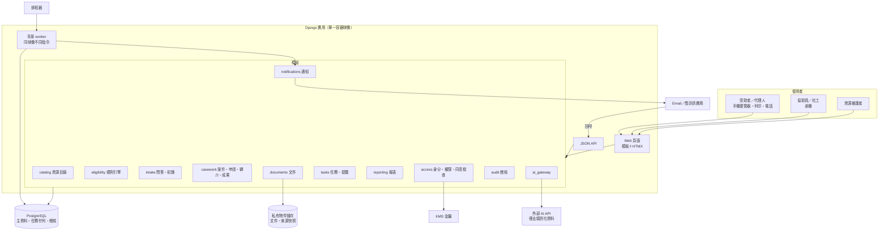

# 技術架構
work_id：STP-PLATFORM-PLAN-001｜版本：v0.2-draft｜2026-10-03
前提：尚未取得政府介接、MyData 資格、LINE 官方帳號或正式部署環境；本文件是建議目標架構，不代表已部署。

## 1. 設計限制
- 團隊假設：1～2 名工程師（可兼職）＋資源維護與個案人員；不能有需要專職 SRE 的元件。
- 敏感個資：需加密、最小權限、稽核、備份與刪除；資料位置以台灣境內為優先（試點合作機構可能要求，見 [DECISIONS_AND_UNKNOWNS.md](DECISIONS_AND_UNKNOWNS.md) U-07）。
- 使用者：低頻寬手機、協助員桌機、列印；不能依賴 App 安裝。
- 外部系統：無 API；所有送件、轉介是「記錄人工動作」，不是自動送出。

## 2. 方案比較
| 評估面向 | A. Python／Django 模組化單體＋PostgreSQL（推薦） | B. Next.js＋BaaS（例如 Supabase） | C. 無程式碼（試算表＋表單＋自動化工具） |
|---|---|---|---|
| 開發速度 | 中高：內建 ORM、遷移、表單、權限、後台 | 高（前端）；後台需自建 | 最高（第一週可用） |
| 資源維護後台 | Django admin 可快速客製成 P9 | 需自建 | 試算表即後台，但版本與查核流程難控 |
| 權限與稽核 | 角色＋物件層級於服務層實作；稽核表只增不改 | RLS 強，但規則分散於 DB 與前端 | 只有檔案層級權限，難以欄位級控制 |
| 規則版本與可重現評估 | 程式控制，易測試 | 可行 | 困難 |
| 資料位置 | 可部署於台灣區域的雲端或本地機房 | 依 BaaS 提供區域（台灣區域可得性待確認） | 依 SaaS，通常境外 |
| 維運負擔 | 低～中（受管容器＋受管資料庫） | 低 | 最低 |
| 鎖定風險 | 低（標準 PostgreSQL、容器） | 中 | 高 |
| 適合 | 試點到擴大 | 偏重前端體驗的產品 | 僅適合 P0／P1 的非敏感資源整理 |

**推薦 A**（推薦且可逆，見 D-201）。理由：個案與規則邏輯都在伺服器端，易測試與稽核；Django admin 大幅降低資源維護後台成本；一個可部署單位最適合小團隊。限制：前端互動較弱（以 HTMX 補強即可滿足表單型流程）；Python 單體在極高流量下需水平擴充（本服務量級不構成問題）。
C 方案只用於 P0～P1 的公開資源草稿整理（不含個資），並於 F-02 上線後匯入。

## 3. 推薦架構
| 層 | 選擇（推薦且可逆） | 說明 |
|---|---|---|
| 前端 | Django 伺服器端模板＋HTMX＋少量原生 JS；列印用 CSS | 首屏輕、無需建置工具鏈；公開頁可快取 |
| 後端 | Django（採當時官方 LTS 版本，開發時以 djangoproject.com 支援表確認）＋ Django REST framework 或 Django Ninja 提供 JSON API | 頁面與 API 共用同一服務層 |
| 資料庫 | PostgreSQL（受管服務，啟用自動備份與時間點復原） | jsonb 存規則與快照；partial unique index 防重複 |
| 私有文件 | 物件儲存私有 bucket（統一權限、禁止公開、版本化、生命週期刪除）；短效簽章 URL；上傳後病毒掃描 | 預設不存文件，見 P5 |
| 欄位加密 | 敏感欄位（身分證號、金額、安全旗標）應用層信封加密，金鑰由雲端 KMS 管理 | 資料庫備份外洩時仍受保護 |
| 身分驗證 | 工作人員：帳密＋MFA（TOTP 或 WebAuthn），或據點既有 Google Workspace／Microsoft Entra SSO＋MFA；受助者：MVP 無帳號 | 試點後 F-21 以簡訊 OTP 或案件代碼＋生日查詢（待評估） |
| 角色權限 | 角色（R1～R9）＋物件層級（指派案件、機構、同意範圍），集中於 `access` 模組的政策函式；每個 view 與 API 強制呼叫 | 以權限矩陣產生自動化測試 |
| 背景任務 | PostgreSQL 為基礎的任務佇列（候選：Procrastinate；備選：Django 內建 tasks 介面搭配資料庫後端）；排程由雲端排程器呼叫受保護端點或常駐 worker | 不另外維運 Redis |
| 通知 | `notifications` 模組＋供應商轉接層：Email（交易型 Email 服務）、簡訊（台灣簡訊供應商，待比價）、LINE（試點後，需帳號） | 寄送與回呼都寫入 Notification |
| 稽核 | AuditEvent 表（只新增、雜湊鏈）；資料庫角色禁止 UPDATE/DELETE | 管理者查詢介面 |
| 監控 | 雲端日誌與監控＋錯誤追蹤（送出前移除個資）＋外部可用性檢查 | 告警到值班 Email／通訊群組 |
| 備份 | 資料庫每日自動備份＋時間點復原（保留 14～30 天）；物件版本化；每季還原演練 | 備份同區域加密 |
| AI 介接 | `ai_gateway` 模組：去識別化、提示版本、輸出檢查、逾時回退、用量記錄；供應商可替換 | 預設關閉，以功能旗標啟用 |
| 檢索 | MVP 不需要向量檢索：資源量 ≤數百筆，以 PostgreSQL 全文檢索＋結構化篩選即可；擴大後再評估 pgvector | 避免不必要元件 |

### 3.1 部署建議（推薦且可逆，見 D-202）
- 候選：Google Cloud `asia-east1`（台灣彰化）區域的 Cloud Run（容器）＋ Cloud SQL for PostgreSQL ＋ Cloud Storage ＋ Cloud Scheduler ＋ Secret Manager ＋ Cloud KMS。理由：資料可留在台灣區域、全受管、按用量計費。
- 替代：國內雲端業者或合作機構機房的虛擬機＋Docker Compose（若合作機構要求資料不得使用境外業者）。架構不依賴特定雲端專屬服務，只需「容器＋PostgreSQL＋S3 相容物件儲存＋排程」。
- 環境：`local`（Docker Compose、合成資料）→ `staging`（獨立專案、只允許合成資料，啟動時檢查 `is_synthetic`）→ `production`（通過 [BUILD_PLAN_AND_ACCEPTANCE.md](BUILD_PLAN_AND_ACCEPTANCE.md) §3 閘門後才建立）。三者不同雲端專案與金鑰。
- 官方參考（查核日期 2026-10-03）：Google Cloud 區域列表 https://cloud.google.com/about/locations ；Cloud Run 定價頁 https://cloud.google.com/run/pricing （頁面將 asia-east1 列於 Tier 1 定價區）；Cloud SQL 定價 https://cloud.google.com/sql/pricing 。本輪無法自網頁取得完整價目表，成本以區間估算，須以官方計算機 https://cloud.google.com/products/calculator 確認（U-10）。

## 4. 架構圖與資料流

主要資料流：
1. **匿名初篩**：P2 答案存 ScreeningSession（24 小時）→ `eligibility.evaluate()` 讀已發布版本 → 結果頁；未要求聯絡則到期刪除。
2. **建案**：協助員建立 Household／ServiceCase／Consent → 匯入 session 答案為 Fact（C1）→ Assessment。
3. **申請**：Application 狀態轉換經 `casework.transition()`（檢查權限、狀態、證據、冪等鍵）→ 寫 AuditEvent → 產生 Task。
4. **通知**：Task 到期 → worker 建 Notification（檢查 Consent 與靜默時段）→ 供應商 → 回呼更新狀態 → 失敗建立人工任務。
5. **資源更新**：排程比對來源雜湊 → NEEDS_RECHECK 任務 → R5 發布新版 → 影響分析 → REASSESS 任務。
6. **報表**：每日夜間由唯讀複本或交易快照計算彙總表（排除 is_synthetic）→ P12。

## 5. 模組界線
| 模組 | 擁有的資料 | 對外介面（服務函式） | 不可做 |
|---|---|---|---|
| catalog | Organization、Source、Resource、ResourceVersion、DocumentRequirement、HouseholdScopeDefinition、VerificationRecord | `publish_version`、`suspend`、`search_public` | 不讀個案資料 |
| eligibility | EligibilityRule；純函式引擎 | `evaluate(facts_snapshot, versions) -> results` | 無副作用、不呼叫 AI、不寫資料庫（由 intake/casework 寫 Assessment） |
| intake | ScreeningSession、HelpRequest | `start_session`、`answer`、`request_help` | 不存未同意的聯絡資料 |
| casework | Household、Person、Fact、ServiceCase、Assessment、Application、Referral、Outcome、Interaction、ActionPlan | `transition_*`、`record_outcome`、`merge_households` | 不直接寄通知（交給 tasks） |
| documents | DocumentRecord、檔案 | `create_upload_intent`、`confirm_upload`、`download_url`、`purge` | 不把檔案傳給 AI（除非 F-26 啟用且同意） |
| tasks | Task | `create_or_get(dedup_key)`、`escalate` | — |
| notifications | Notification、供應商設定 | `schedule`、`handle_callback` | 不判斷業務狀態 |
| access | StaffUser、角色、Consent 檢查 | `can(actor, action, obj)`、`require_consent(purpose, target)` | — |
| audit | AuditEvent | `record(...)` | 不可修改 |
| reporting | 彙總表 | `funnel(period, org)` | 不輸出個案層級給 R8 |
| ai_gateway | AI 呼叫紀錄（不含原文或只含去識別化文字） | `draft_resource_fields`、`plain_explain`、`summarize` | 不寫入已發布資料 |

依賴方向：Web/API → 各模組服務函式 → 資料；模組之間只透過服務函式呼叫，以 import-linter 類工具在 CI 檢查。

## 6. 主要 API
共同規則：
- 錯誤格式：RFC 9457 Problem Details（`type`、`title`、`detail`、`errors[]`），使用者訊息另提供白話版。
- 冪等：所有會產生外部效果或建立紀錄的 POST 需 `Idempotency-Key` 標頭；伺服器存 24 小時（key＋請求雜湊＋回應），相同 key 不同內容回 422。
- 併發：狀態轉換需帶 `expected_row_version`，不符回 409。
- 權限：未登入 401；無權限 403（不透露物件是否存在時回 404）。
- 稽核：所有個案讀取與寫入寫入 AuditEvent。

| API | 用途 | 輸入 | 輸出 | 權限 | 錯誤與重複防護 |
|---|---|---|---|---|---|
| `GET /api/public/resources` | 公開查詢 | region、category、q、page | 已發布資源摘要 | 公開 | 速率限制；只回 PUBLISHED |
| `GET /api/public/resources/{key}` | 資源詳情 | key | 版本內容、來源、查核日期 | 公開 | 暫停者回狀態與原因 |
| `POST /api/screenings` | 開始匿名初篩 | 無 | session token | 公開 | 速率限制、機器人防護（不要求帳號） |
| `PUT /api/screenings/{token}/answers` | 儲存答案 | 題號→答案 | 下一題、是否急迫 | token 持有者 | 驗證題號與值；急迫回傳 J5 指示 |
| `POST /api/screenings/{token}/evaluate` | 初篩 | — | 結果（三分類＋理由） | token 持有者 | 引擎錯誤 → 該資源 HUMAN，不整體失敗 |
| `POST /api/help-requests` | 請人聯絡 | token、聯絡方式、時段、同意 | HelpRequest id | 公開 | Idempotency-Key；同 token 只建一筆 |
| `POST /api/cases` | 建案 | 管道、household 基本、consent | case id、可能重複清單 | R3 | Idempotency-Key；指紋相符時回 409 附候選（需確認合併或強制新建並寫理由） |
| `POST /api/cases/{id}/consents` | 建立同意 | 用途、對象、方式、代理 | consent id | R3 | 同意書版本必填 |
| `POST /api/consents/{id}/revoke` | 撤回 | 撤回用途、管道 | 受影響項目清單 | R1/R2（試點後）、R3 | 冪等；觸發取消排程通知、刪除排程 |
| `PUT /api/cases/{id}/facts` | 更新事實 | fact_key、value、confirmation_level | 新 Fact 版本 | R3（指派） | 樂觀鎖；保留歷史 |
| `POST /api/cases/{id}/assessments` | 評估 | 觸發原因 | Assessment | R3、R4 | 相同 input_hash＋版本 60 秒內重複 → 回既有結果 |
| `POST /api/assessments/{id}/reviews` | 複核 | 結論、理由 | Review | R4（非承辦） | 版本已變 → 409 要求重評 |
| `POST /api/cases/{id}/applications` | 建立申請 | resource、benefit_period_key | Application | R3 | Idempotency-Key；partial unique index → 409 回既有申請 |
| `POST /api/applications/{id}/transitions` | 狀態轉換 | to_status、evidence、expected_row_version | 新狀態 | R3、R4 | 非法轉換 422；證據缺漏 422；版本 409；SUBMITTED 必附收件憑據 |
| `POST /api/cases/{id}/referrals` | 建立轉介 | org、service、shared_fields | Referral | R3 | 同意檢查失敗 403＋原因；重複 409 |
| `POST /api/referrals/{id}/transitions` | 轉介狀態 | to_status、evidence | 新狀態 | R3、R6（試點後） | 同上 |
| `POST /api/documents/upload-intents` | 申請上傳 | requirement、person、MIME、size | 簽章上傳 URL（5 分鐘） | R3、R1（試點後） | 需 DOCUMENT_STORAGE 同意；大小與類型白名單 |
| `POST /api/documents/{id}/confirm` | 確認上傳 | 雜湊 | 掃描排程 | 同上 | 雜湊不符拒絕；掃描失敗隔離 |
| `GET /api/documents/{id}/download` | 下載 | 用途 | 短效 URL | 依矩陣 | 每次寫 AuditEvent |
| `POST /api/cases/{id}/outcomes` | 登錄取得 | receipt_status、evidence_level、內容 | Outcome | R3 登錄；R4 驗證 | 未 APPROVED/ACCEPTED 不可建立 |
| `POST /api/tasks` / `PATCH /api/tasks/{id}` | 任務 | 類型、期限、指派 | Task | R3～R5 | dedup_key 重複回既有 |
| `POST /api/notifications/callbacks/{provider}` | 供應商回呼 | 供應商格式 | 200 | 簽章驗證 | 以 provider_message_id 冪等；未知 id 記錄並忽略 |
| `POST /api/admin/resources/{id}/versions` | 建立版本 | 欄位 | 草稿 | R5 | 驗證必填與 UNKNOWN 標記 |
| `POST /api/admin/versions/{id}/submit` / `verify` / `publish` / `suspend` | 版本生命週期 | 查核紀錄、理由 | 新狀態＋影響分析 | R5（分權）、R4、R7 | 同人限制 403；發布冪等 |
| `GET /api/reports/funnel` | 漏斗 | 期間、據點 | 彙總（n<5 遮蔽） | R8、R7、R4 | 排除合成資料 |
| `GET /api/audit-events` | 稽核查詢 | 物件、期間 | 事件 | R7 | 查詢本身也稽核 |

### 6.1 外部失敗可見與人工接管
- 所有外部呼叫（簡訊、Email、AI、來源抓取）經 outbox 表：`pending → sent → confirmed | failed`；失敗顯示在 P10 與管理頁「外部失敗」清單。
- 重試：指數退避（1 分、5 分、30 分），最多 3 次；永久錯誤（號碼無效、退信）不重試。
- 人工接管：每筆失敗有「改由人工處理」按鈕，建立任務並記錄處理結果；接管後系統不再自動重試。
- 申請與轉介因無外部 API，系統永遠不自動送出；「送件」是人工動作的紀錄，避免重複送件的風險集中在資料庫唯一約束與送件前檢查。

## 7. 成本來源與擴充
成本來源（金額見 [OPERATIONS_AND_PRIVACY.md](OPERATIONS_AND_PRIVACY.md) §3）：容器運算、受管資料庫（最大固定成本）、物件儲存、KMS、日誌、網域與憑證、Email／簡訊用量、AI token、錯誤追蹤服務、備份、開發與維運工時。

AI 定價參考（Anthropic 官方定價頁 https://platform.claude.com/docs/en/about-claude/pricing ，查核日期 2026-10-03，美元／百萬 token）：Claude Haiku 4.5 輸入 $1、輸出 $5；Claude Sonnet 5.5 輸入 $2、輸出 $10；Batch API 五折。實際使用量很小（多為資源維護端草稿），價格變動不影響架構。資料處理條款與保存期間需在啟用前確認（U-09）。

擴充路徑：
| 觸發 | 擴充 |
|---|---|
| 多縣市 | 資源與規則已有 regions；加入地區管理者角色與分區查核佇列 |
| 多機構 | organization_id 已在個案資料上；加入租戶設定與跨機構分享協議檢查 |
| 流量增加 | Cloud Run 水平擴充；資料庫升級規格、讀取複本給報表 |
| 提供機構自助 | 開放 R6 受限帳號與 API 金鑰（F-23） |
| 官方資料介接 | 透過 `integrations` 新模組，取得資格後實作，不影響規則引擎 |
| 搜尋品質 | 加入 pgvector 或外部檢索（資源數 >500 時評估） |
