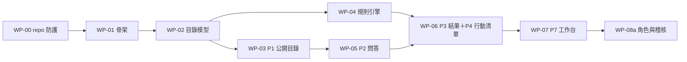

# 第一開發批次執行包（WP-00～WP-07、WP-08a）
work_id：STP-PLATFORM-PLAN-001｜版本：v0.3-draft（R1 修正）｜2026-10-04
狀態：**已備妥，本輪不開工**。啟動條件見 §1。本批次只使用合成資料，不處理真實個案、不部署正式環境、不提交任何申請。
上位文件：[BUILD_PLAN_AND_ACCEPTANCE.md](BUILD_PLAN_AND_ACCEPTANCE.md) §2、§5；規格：[ARCHITECTURE.md](ARCHITECTURE.md)、[RESOURCE_AND_ELIGIBILITY_ENGINE.md](RESOURCE_AND_ELIGIBILITY_ENGINE.md)、[DATA_MODEL_AND_STATE_MACHINES.md](DATA_MODEL_AND_STATE_MACHINES.md)。

## 0. 目標
讓覆核通過後可以直接開工，並朝原始終點前進：**接觸 → 需求盤點 → 資源比對 → 理解資格與缺漏 → 申請協助 → 追蹤 → 實際取得 → 更新與續辦**。本批次完成其中「需求盤點 → 資源比對 → 理解資格與缺漏 → 行動清單 → 協助員追蹤工作台」，是之後真實家庭取得資源（G1～G8 通過後）的共同基礎。

流程：合成資源目錄 → 需求問答 → 可解釋初篩 → 個人行動清單 → 協助員工作台。

## 1. 啟動條件（開工前逐項確認，缺項不開工）
| # | 條件 | 狀態（本文件撰寫時） | 備註 |
|---|---|---|---|
| 1 | 本輪規劃經獨立覆核 APPROVED（不得由作者宣告） | 待 GPT 覆核 | |
| 2 | 工程人力（D-307） | 未決 | 1 名：依序 D1→D4，約 9～13 週；2 名：D2 可與 D1 後半並行，約 5～7 週 |
| 3 | 技術堆疊（D-201：Django＋PostgreSQL＋HTMX） | 推薦且可逆 | 若負責人改選其他堆疊，須先重估工時，但資料模型、狀態機 JSON、參考規格不變 |
| 4 | 開發環境 | 本機 Docker Compose 即可 | 不需要雲端帳號（U-06）；staging 腳本可先寫、後部署 |
| 5 | 合成資料規範 | 已有 | `docs/platform/examples/`；一律 `is_synthetic=true` |
| 6 | repo 存取與分支規範 | 待負責人指定 | 建議：功能分支＋PR＋非作者覆核 |

## 2. 依賴順序

交付分四段（每段都可獨立驗收與示範）：
| 段 | 內容 | 工作包 | 工時（人日） |
|---|---|---|---|
| **D1（第一個可驗收交付物）** | 合成資源目錄上線：骨架＋CI＋目錄模型＋P1 公開查詢 | WP-00、01、02、03 | 16～24 |
| D2 | 規則引擎與正式推薦判定，重現全部參考案例 | WP-04 | 9～13 |
| D3 | 問答→可解釋初篩→行動清單（含代填與列印） | WP-05、06 | 10～14 |
| D4 | 協助員工作台（合成案件）＋基本角色與稽核 | WP-07、08a | 10～14 |
合計 45～65 人日（與 BUILD_PLAN §2 的加總一致，`tools/check_docs.py` 會核對）。

## 3. 任務拆解
任務 ID：`B<WP>-<序>`。工時單位人日，每個 WP 的任務加總等於 BUILD_PLAN 的 WP 工時。
| 任務 | 內容 | 輸入 | 輸出 | 驗收 | 工時 |
|---|---|---|---|---|---|
| B0-1 | CI 秘密掃描與個資樣式掃描（身分證號、手機號碼格式） | — | CI 工作 | 含假身分證號的測試 PR 被擋下 | 1～1.5 |
| B0-2 | PR 範本（勾選「未含真實個案」）與合成資料命名規範 | examples/README | `.github/` 範本 | 範本存在；規範文件連結 | 0.5 |
| B0-3 | CI 串接文件與參考規格檢查 | `tools/`、`examples/` | CI 步驟：`check_examples.py`、`gen_state_machines.py --check`、`check_docs.py` | 故意改壞任一文件，CI 失敗 | 0.5～1 |
| B1-1 | Django 專案骨架與 Docker Compose（PostgreSQL） | ARCHITECTURE §3 | 可啟動的應用 | `docker compose up` 後首頁可開 | 1～1.5 |
| B1-2 | CI：lint、test、遷移檢查 | B0 | 流水線 | 主分支全綠 | 1～1.5 |
| B1-3 | staging 部署腳本（只允許合成資料） | ARCHITECTURE §3.1 | 腳本與說明 | 啟動時檢查 `is_synthetic`，寫入非合成個案資料被拒 | 1～2 |
| B1-4 | 模組邊界檢查、載入 `state_machines.json` 的轉換函式骨架、`make spec-check` | ARCHITECTURE §5 | import 邊界規則；轉換函式 | `make spec-check` 執行 `check_examples.py` 通過 | 1 |
| B2-1 | 模型：Organization、Source、Resource、ResourceVersion | DATA_MODEL §2.1～2.4 | 遷移與 admin | 必填、枚舉、`conflict_status`、`application_window` 類型可驗證 | 2～3 |
| B2-2 | 模型：DocumentRequirement、HouseholdScopeDefinition、VerificationRecord、EligibilityRule | §2.5、2.6、2.15 | 遷移與 admin | 規則 JSON 通過 `validate_rule`（見 B4-1） | 1.5～2 |
| B2-3 | admin 與發布檢查：≥V2、查核人≠作者、發布人≠查核人、UNKNOWN 標記、不可變 | §3.1 轉換 RV-01～RV-14 | 轉換函式（人工部分） | 不符條件的發布被拒（T-07 的發布部分） | 2～3 |
| B2-4 | 匯入指令 `import_synthetic_catalog` | `synthetic_resources.json` | 6 項資源、6 個來源、2 個口徑 | 匯入後資料與 JSON 一致；RENT-006 為 EXPIRED | 1.5～2 |
| B3-1 | `catalog_visibility` 與 `GET /api/public/resources` | 引擎 §0.1 | 公開 API | 列表只含 PUBLISHED／NEEDS_RECHECK（T-04） | 1～2 |
| B3-2 | P1 頁面（篩選、詳情、來源與查核日期、列印） | USER_JOURNEYS P1 | 頁面 | 360px 寬可用；首屏 ≤300KB | 1.5～2 |
| B3-3 | 測試 T-04、T-21（未生效標示） | engine_cases | 測試 | 通過 | 0.5～1 |
| B4-1 | 規則 schema 與 `validate_rule`（拒絕不支援的運算子、組合、自述確認不符） | 引擎 §5 | 驗證器 | `engine_cases.json` 的 `invalid_rule_cases` 全過（T-30） | 1.5～2 |
| B4-2 | 事實與口徑計算：成員事實未知→UNKNOWN；同戶籍／共同生活口徑 | 引擎 §5.3 | 計算模組 | H1（3 vs 4 人）、H5（未知成員）通過（T-03、T-31） | 2～3 |
| B4-3 | 運算子與單條件結果（PASS／FAIL／FAIL_UNCONFIRMED／UNKNOWN／HUMAN；5% 人工確認點） | 引擎 §6.1 | 評估核心 | H3／H4 的條件結果通過 | 1.5～2 |
| B4-4 | ALL／ANY／CUSTOM 組合、資源結果、`flags`、`known_failures`、`missing_inputs` | 引擎 §6.2～6.3 | 彙總邏輯 | `combinator_cases` 全過；H6、H7 通過（T-26、T-27、T-29） | 1.5～2.5 |
| B4-5 | `recommendation_status`（FORMAL／MANUAL_CHECK_ONLY／NOT_RECOMMENDED） | 引擎 §0.2 | 判定函式 | `recommendation_cases` 全過（T-21～T-25） | 1.5～2 |
| B4-6 | 以 fixtures 重現全部參考案例；Assessment 持久化與重現 | `expected_assessments.json` | 測試與資料表 | 7 家庭×6 資源全部符合；相同輸入重算一致 | 1～1.5 |
| B5-1 | 免姓名免帳號 session、題庫（固定題 ≤15＋成員簡表） | USER_JOURNEYS P2 | P2 頁面與 API | 全部答「不知道」仍可完成（T-01） | 2～3 |
| B5-2 | 代填模式（記錄管道：電話、現場、紙本） | J4 | 代填畫面 | 可由協助員完整代填（T-12） | 1～1.5 |
| B5-3 | 急迫轉人工 J5：公開專線、URGENT 任務、非上班時段處置 | J5 | 流程與任務 | 第一頁答「明天沒有食物」立即顯示並建任務（T-17） | 1.5～2 |
| B5-4 | 測試 T-01、T-12、T-17 | — | 測試 | 通過 | 0.5 |
| B6-1 | 結果頁：只顯示 FORMAL、三分類、逐條理由、已知不符、缺漏、確認路徑 | USER_JOURNEYS P3 | P3 頁面 | 每個結果至少一條理由；資料不足不顯示為不符合 | 2～3 |
| B6-2 | R3／R4 的「人工查核項」頁籤 | 引擎 §0.2 | 頁籤 | FOOD-005 只對 R3／R4 可見（T-23） | 0.5～1 |
| B6-3 | 行動清單 P4 與 A4 大字版列印 | P4 | 頁面與列印樣式 | 一頁 A4；每步有負責人與期限 | 1.5～2 |
| B6-4 | 測試 T-02、T-03、T-05、T-06、T-26～T-28 | expected | 測試 | 通過 | 1 |
| B7-1 | Household、Person、Fact、FactKeyDefinition 模型與歷史（supersede） | DATA_MODEL §2.7～2.9 | 遷移與 admin | 同 subject＋fact_key 現值唯一 | 2～3 |
| B7-2 | 建案、匯入 session 答案為 Fact（C1）、責任人／備援／下一步的 DB 約束 | DATA_MODEL §2.11 | 建案流程 | 缺責任人或下一步的進行中案件無法儲存 | 2～3 |
| B7-3 | Interaction、ActionPlan、Task（基本）；自述不符產生 DATA_REQUEST 任務 | 引擎 §6.4 | 模型與任務 | `CONFIRM_SELF_REPORT` 產生 R3 任務；任務 `dedup_key` 唯一 | 1.5～2 |
| B7-4 | 協助員工作台 P7 與每日檢查 | P7 | 頁面與排程 | 今日到期／逾期／急迫分區；缺漏案件被報警 | 1.5～2 |
| B8-1 | 角色（R3／R4／R5／R7）與 ASG 可見性 | PRD §4 | 權限函式 | R3 看不到非指派案件（T-19 基本） | 1.5～2 |
| B8-2 | AuditEvent 只增（資料庫角色無 UPDATE／DELETE） | DATA_MODEL §2.20 | 稽核表 | 嘗試 UPDATE／DELETE 失敗 | 1～1.5 |
| B8-3 | 測試 T-19（基本）、T-15（基本升級） | — | 測試 | 通過 | 0.5 |

## 4. 可執行規格（必須讓產品重現）
本輪已提供**參考實作與預期值**，開發時以產品程式重現，不得以模型輸出或截圖作為正確基準：
| 檔案 | 用途 |
|---|---|
| `examples/synthetic_resources.json`、`synthetic_households.json` | 匯入與測試資料 |
| `examples/expected_assessments.json`（手算） | 7 家庭×6 資源的預期結果 |
| `examples/engine_cases.json` | 組合語意、規則驗證、正式推薦、取得計數、申請唯一性、回呼 |
| `examples/ref_engine.py`、`check_examples.py` | 參考實作與檢查（非產品程式碼）；`python3 docs/platform/examples/check_examples.py` |
| `state_machines.json`、`tools/gen_state_machines.py` | 狀態機單一事實來源；`--check` 驗證文件同步 |
| `tools/check_docs.py` | 連結、ID、欄位路徑、工時加總、狀態機與權限一致性 |
產品實作的對照測試只需把這些檔案當 fixtures 載入，斷言結果相同（`make spec-check` 同時執行參考檢查）。

## 5. 操作示範腳本（D3 結束時可示範；全程合成資料）
前置：已匯入合成目錄與 H1～H7 的對應輸入。
| 步驟 | 操作 | 預期畫面／結果 |
|---|---|---|
| 1 | 開啟 P1，篩選「示範縣・生活」 | 列出 LIVING-001、EMERG-002、EDU-003、CHILD-004、FOOD-005；**RENT-006（已過期）不在列表**；每筆顯示來源與最後查核日期 |
| 2 | 協助員在 P2 以代填模式（管道＝電話）輸入 H1：甲區、成員 4 位（含不同戶籍的祖母） | 完成後進入 P3 |
| 3 | 看 P3（H1） | 兒少生活補助與午餐補助：✅可能符合（共同生活 4 人、每人 11,500 元）；生活扶助：❔資料不足（同戶籍 3 人、每人 13,333 元；缺動產資料）；急難救助：⚠️依自述可能不符合（未確認），附確認路徑；每項有逐條理由 |
| 4 | 在 P3 切換到「人工查核項」頁籤（R3 視角） | 物資箱 FOOD-005：生效期間未知，標示「需先人工確認」，**受助者視角看不到** |
| 5 | 以 H5 重做（祖母是否同住：不知道） | 午餐與兒少補助變成❔資料不足，缺漏列出「祖母是否共同生活」；**同戶籍口徑的生活扶助不受影響**（仍可能符合） |
| 6 | 以 H6 重做（居住地經文件確認為乙區、收入未知） | 午餐補助：❔資料不足，並顯示「已知不符：居住地」；不會顯示為不符合 |
| 7 | 在 P4 為 H1 選擇「兒少生活補助」，產生行動清單並列印 | A4 一頁大字版；每步有負責人、期限、聯絡窗口 |
| 8 | 在 P7 建案（責任人＝協助員 A、備援＝協助員 B），下一步＝電話確認動產資料 | 工作台顯示今日到期；缺責任人或下一步無法儲存 |
| 9 | 切到協助員 B 之外的帳號 | 看不到此案件（T-19） |

## 6. 批次完成（Definition of Done）
由**非作者**逐項核對並留紀錄：
| # | 項目 | 證據 |
|---|---|---|
| 1 | D1～D4 全部驗收通過 | 各段驗收紀錄 |
| 2 | `check_examples.py` 與產品對照測試皆通過 | CI 紀錄 |
| 3 | T-01～T-06、T-12、T-15（基本）、T-17、T-19（基本）、T-21～T-31 通過 | 測試報告 |
| 4 | 示範腳本 §5 全程可重現 | 螢幕紀錄或操作紀錄 |
| 5 | 全部資料 `is_synthetic`；staging 拒絕非合成個案 | 測試與設定 |
| 6 | 文件與程式一致：規格若有變動，先改規格並通過 `check_docs.py` | PR 紀錄 |

## 7. 風險與升級
| 風險 | 影響 | 因應 |
|---|---|---|
| 規格與實作語意分歧（尤其組合語意、正式推薦） | 錯推薦或排除 | 以參考案例為準；有爭議先改規格並重跑 `check_examples.py` |
| 成員簡表讓 P2 太長 | 完成率低 | 簡表可只填部分；未填視為未知；B5-1 做可用性測試（5 位測試者） |
| 範圍膨脹到文件、通知、轉介 | 延誤 | 這些不在本批次；列入閘門批次 |
| 單人開發的覆核獨立性 | 作者自審 | 每個 PR 由非作者覆核；驗收由非作者執行 |
| 技術堆疊改選 | 工時變動 | 先重估；資料模型、狀態機 JSON、參考規格不變 |

## 8. 本批次之後（不在本批次，依 BUILD_PLAN §2）
1. 先做閘門批次中風險最高的 WP-08（完整權限與例外存取）、WP-09（同意與撤回清除）、WP-11（申請、轉介、成果與唯一約束），它們決定真實個案能否上平台。
2. 平行準備 WP-16（同意書、隱私政策、U-18～U-23 法律確認）與 P1 資源查核（≥30 項、V2）。
3. 閘門 G1～G8 未通過前，依 BUILD_PLAN §3.1 人工優先；本批次產出（匿名初篩＋行動清單）僅在滿足 AS-1～AS-6 後才能給真實使用者。
