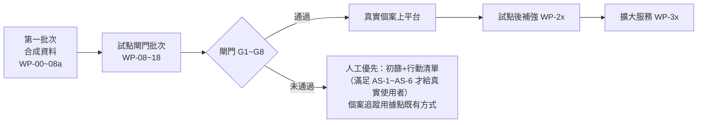

# 開發工作包與驗收計畫
work_id：STP-PLATFORM-PLAN-001｜版本：v0.3-draft（R1 修正）｜2026-10-04
工時為工程人日區間（估算），不含資源查核與個案服務人力（見 [OPERATIONS_AND_PRIVACY.md](OPERATIONS_AND_PRIVACY.md) §3）。

## 1. 路線總覽與 90 天計畫對照

| 90 天階段 | 業務工作（原計畫） | 平台工作 | 平台驗收 |
|---|---|---|---|
| 啟動前（建議新增「平台準備期」，見 [DECISIONS_AND_UNKNOWNS.md](DECISIONS_AND_UNKNOWNS.md) G-01） | — | 第一批次 | §5 驗收 |
| P0 第 1～2 週 | 選地區、訪談、合作容量 | WP-16 同意書與說明稿草稿；以第一批次 staging 做訪談示範（合成） | 示範不含真實資料 |
| P1 第 3～4 週 | 查核 30～50 項資源 | WP-10 資源維護流程；R5 在 staging→production 目錄建立資源；WP-17 golden set | ≥30 項 V2 發布；golden set ≥30 案 |
| P2 第 5～8 週 | 服務 20～30 戶 | 閘門批次完成並通過 G1～G8 後，個案上平台；未通過時依 §3.1 人工優先 | 閘門全數通過紀錄 |
| P3 第 9～12 週 | 成果驗證 | WP-14 報表、WP-17 錯漏分析與續辦提醒測試 | 第 90 天報告依 PRD §7 產出 |

原計畫工作包對照：
| 原 ID | 平台工作包 |
|---|---|
| STP-001 試點地區與機構盤點 | （業務）＋ WP-16 合作與資料分享協議範本 |
| STP-002 資源資料規格與首批目錄 | WP-02、WP-03、WP-10 |
| STP-003 需求問答與資格規則 | WP-04、WP-05、WP-06、WP-17 |
| STP-004 申請陪伴流程 | WP-11、WP-12 |
| STP-005 最小產品 | WP-01、WP-06、WP-07、WP-15 |
| STP-006 更新與提醒 | WP-10（影響分析）、WP-13 |
| STP-007 隱私與權限 | WP-08、WP-09、WP-16、WP-18 |
| STP-008 真實試點與成效 | WP-14、WP-17 |

## 2. 工作包（MVP＝第一批次＋試點閘門批次）
工時為估算（R1 修正後重新加總，見表後說明）。第一批次的逐項執行包見 [BATCH1_EXECUTION_PACK.md](BATCH1_EXECUTION_PACK.md)。
| ID | 目標 | 前置 | 交付物 | 模組 | 工時 | 驗收 | 風險 | 下一步 |
|---|---|---|---|---|---|---|---|---|
| WP-00 | repo 防護與合成資料規範 | — | CI 秘密掃描、個資樣式掃描、PR 範本、合成資料命名規範；CI 執行 `check_examples.py`、`gen_state_machines.py --check`、`check_docs.py` | repo | 2～3 | 含假身分證號格式的測試 PR 被 CI 擋下；文件檢查失敗時 CI 失敗 | 誤判過多 | WP-01 |
| WP-01 | 專案骨架 | WP-00 | Django 專案、Docker Compose、CI（lint、test、遷移檢查）、staging 部署腳本、import 邊界檢查；載入 `state_machines.json` 的轉換函式骨架 | 全部 | 4～6 | `make test` 全綠；staging 可部署合成資料 | 雲端帳號未定（U-06） | WP-02 |
| WP-02 | 資源目錄資料模型與後台 | WP-01 | Organization、Source（含狀態）、Resource、ResourceVersion（含 `conflict_status`、`application_window` 類型、`effective_unknown`）、DocumentRequirement、HouseholdScopeDefinition、VerificationRecord；`recommendation_status` 所需欄位 | catalog | 7～10 | 可由 admin 建立合成資源版本；UNKNOWN 欄位可標記；發布檢查生效 | 欄位過多影響輸入效率 | WP-03、WP-04 |
| WP-03 | 合成資源目錄與公開查詢 P1 | WP-02 | 匯入 [examples/synthetic_resources.json](examples/synthetic_resources.json)；P1 頁與 `GET /api/public/resources`（依 `catalog_visibility`） | catalog | 3～5 | T-04、T-21；行動裝置 360px；首屏 ≤300KB | — | WP-05 |
| WP-04 | 規則引擎與正式推薦判定 | WP-02 | criteria 驗證（JSON Schema；拒絕不支援的運算子與組合）、運算子、口徑計算（成員事實未知→UNKNOWN）、ALL／ANY／CUSTOM 組合語意、自述不符與確認路徑旗標、`recommendation_status`（FORMAL／MANUAL_CHECK_ONLY／NOT_RECOMMENDED） | eligibility | 9～13 | `check_examples.py` 全部對照案例（`engine_cases.json`、`expected_assessments.json`）以產品實作重現；重算一致；T-21～T-31 | 口徑表達不足；組合語意與規格不一致 | WP-06 |
| WP-05 | 需求問答 P2＋急迫轉人工 | WP-03 | 免姓名免帳號 session、題庫（固定題 ≤15＋成員簡表）、代填模式、J5 畫面與任務 | intake | 5～7 | T-01、T-12、T-17 | 題目用語需實地測試 | WP-06 |
| WP-06 | 結果解釋 P3＋行動清單 P4 | WP-04、WP-05 | 結果頁（只顯示 FORMAL、已知不符、確認路徑）、逐條理由、缺漏、列印大字版行動清單、R3／R4 的人工查核項頁籤 | intake、casework | 5～7 | T-02、T-03、T-05、T-06、T-26～T-28；列印 A4 一頁 | 解釋文字可讀性 | WP-07 |
| WP-07 | 協助員工作台 P7（合成） | WP-06 | ServiceCase、Household、Person、Fact、Interaction、ActionPlan、Task（基本，含自述確認任務）；建案、匯入 session、責任人／備援、每日檢查 | casework、tasks | 7～10 | 每案必有責任人＋下一步＋期限；T-15（基本升級） | 範圍膨脹 | WP-08a |
| WP-08a | 基本角色與稽核（第一批次） | WP-07 | R3／R4／R5／R7 角色、指派案件可見性、AuditEvent（只新增） | access、audit | 3～4 | T-19（基本）；稽核表禁止 UPDATE | — | 第一批次驗收 |
| WP-08 | 完整權限、MFA、稽核、例外存取 | WP-08a | 物件層級權限（含 R6／R8／R9）、權限矩陣自動測試、MFA、AccessGrant（BREAK_GLASS、REVIEW_SAMPLE）、ReviewNote、存取紀錄查詢 | access、audit | 4～7 | 矩陣每格有測試；T-19、T-32～T-35 | 權限規則複雜 | G1 |
| WP-09 | 同意、代理與撤回清除 | WP-08 | Consent 全欄位（含撤回欄位）、用途檢查函式、撤回流程（取消通知、RF-17、清除任務）、副本清冊對應的 `retention` 設定、DeletionLedger、`reapply_deletions()` | access、casework、retention | 5～8 | T-13、T-36、T-37 | 同意書內容未定（WP-16） | G2 |
| WP-10 | 資源維護流程 P9 | WP-02、WP-08a | 送審／查核／發布分權（轉換 RV-xx）、版本差異、暫停、影響分析與 REASSESS 任務、查核頻率排程、`recommendation_status` 檢視 | catalog、tasks | 5～8 | T-07、T-20、T-24、T-25 | — | P1 資源建置 |
| WP-11 | 申請、轉介、成果 P6 | WP-07、WP-09 | 由 `state_machines.json` 驅動的轉換函式與 API、證據欄位、冪等鍵、唯一約束、OutcomeEvent 與第二人驗證、ReviewDecision | casework | 9～13 | T-08、T-09、T-10、T-14、T-39～T-47 | 狀態邊界案例 | G5 |
| WP-12 | 文件 P5 | WP-11 | DocumentRecord、私有儲存、簽章 URL、病毒掃描、保存期刪除、人工登錄路徑 | documents | 5～8 | 不上傳也能送件；T-13 文件刪除 | 掃描元件維運 | G2 |
| WP-13 | 任務、通知與升級 P10 | WP-11 | Notification 與 NotificationEvent、Outbox、Email／簡訊轉接層（先接 sandbox）、回呼去重與亂序處理、重試、人工接管、升級規則 | tasks、notifications | 8～12 | T-11、T-15、T-44、T-45 | 簡訊供應商未定（U-12） | G4 |
| WP-14 | 成效報表 P12 | WP-11 | 彙總表、漏斗（家庭／件數分開）、依 OutcomeEvent 計數、ReportRun 版本化、時間、工時、成本輸入、n<5 遮蔽 | reporting | 6～9 | T-16、T-39～T-42；以合成資料核對手算結果 | 口徑誤解 | G5 |
| WP-15 | 社工複核佇列 P8＋容量 P11 | WP-11 | 佇列、複核結論（ReviewDecision）、抽查抽樣、機構容量與確認期限 | casework、catalog | 5～7 | T-08、T-09 | — | G3 |
| WP-16 | 合規與營運文件（非工程為主） | — | 同意書與說明稿、隱私政策（含匿名初篩告知）、資料分享協議範本、訓練教材、事件演練腳本、U-18～U-23 法律確認清單 | 文件 | 0～1 | 法律顧問審閱紀錄 | 法律意見時程 | G2、G8 |
| WP-17 | 品質驗證工具 | WP-04、WP-15 | golden set 匯入與比對、錯漏推薦統計、續辦提醒模擬 | eligibility、reporting | 2～4 | golden set 報告可產出 | 社工時間 | G6 |
| WP-18 | 正式環境與資安 | WP-08～WP-13 | production 專案、KMS、備份與還原演練（含重新套用刪除）、監控告警、弱點掃描、滲透測試修正、匿名初篩的 crypto-shredding 或不備份設定（AS-4） | ops | 6～10 | 還原演練紀錄；無高風險未修弱點；T-37 | 雲端選擇（D-202） | G7 |
| WP-19（選用） | AI 資源起草 | WP-10 | ai_gateway、資源欄位草稿、輸出檢查、回退 | ai_gateway | 3～5 | T-18；草稿只進 DRAFT | 供應商條款（U-09） | 試點後 |

合計：第一批次（WP-00～WP-07＋WP-08a）約 45～65 人日；MVP 全部（不含 WP-19）約 100～152 人日。以 2 名工程師並行約 10～15 週；1 名約 20～30 週。這是 [DECISIONS_AND_UNKNOWNS.md](DECISIONS_AND_UNKNOWNS.md) G-01 的依據。
R1 修正對工時的影響（相對 v0.2-draft 的 42～61／90～135）：WP-02 +1～1、WP-04 +2～3、WP-08 +1～2、WP-09 +1～2、WP-11 +2～3、WP-13 +1～2、WP-14 +1～2、WP-18 +1～2，合計 +10～17 人日；新增內容是組合語意與正式推薦判定、例外存取、撤回清除與刪除帳本、OutcomeEvent、回呼事件與 Outbox、報表版本化。`tools/check_docs.py` 會重新加總本表並與本段數字核對。

## 3. 試點前必須完成的閘門（真實個案上平台前）
| 閘門 | 內容 | 驗收證據 | 負責 |
|---|---|---|---|
| G1 權限 | 角色＋物件層級權限（含 R6／R7／R8／R9 的限制）、MFA 強制、離職停用流程、break-glass 與覆核授權 | 權限矩陣自動測試全通過（T-19、T-32～T-35）；MFA 覆蓋 100% 內部帳號；R7 無一般個案讀取的測試 | 工程＋R7 |
| G2 資料保護 | 資料責任人（控管者）指定；同意書與隱私政策經法律審閱；加密、保存期刪除排程、撤回流程、**副本清冊 CP-01～CP-24 全部有清除實作或明確例外**、刪除帳本與備份還原重新套用；事件處理計畫；U-18～U-23 的限制處理已寫入操作程序 | 法律審閱紀錄；T-13、T-36、T-37、T-38、T-48 通過；刪除排程與還原演練紀錄 | 負責人＋法律＋工程 |
| G3 人工接案 | 電話／紙本／現場流程、值班表、急迫流程與合作據點法定通報流程對接 | 合成案例演練（J4、J5）紀錄；值班表 | R4＋據點 |
| G4 補件追蹤 | 任務、提醒、升級、通知失敗改人工、回呼去重與亂序處理、內部逾期不推定失效 | T-11、T-15、T-44、T-45 通過；升級演練 | 工程＋R3 |
| G5 結果紀錄 | 申請／轉介／取得分開、核准證據與取得證據分開、第二人驗證、OutcomeEvent 計數、報表版本化、合成排除、申請唯一性與重複防護 | T-14、T-16、T-39～T-43、T-46、T-47 通過；手算核對 | 工程＋負責人 |
| G6 資源品質 | ≥30 項資源 V2 以上發布；golden set ≥30 案；golden set 中「可能符合」錯推薦 0 件、漏推薦 ≤10% 且原因已記錄；正式推薦判定與組合語意測試通過 | WP-17 報告；T-21～T-31 | R5＋R4 |
| G7 環境與資安 | production 獨立、備份還原成功、無高風險弱點、秘密管理 | 還原與掃描報告 | 工程 |
| G8 人員與合作 | 協助員完成訓練；合作據點書面確認接案容量與資料分享範圍 | 訓練紀錄；合作確認文件（私有存放） | 負責人 |

### 3.1 未通過閘門時的可用工具與資料邊界
**不論閘門狀態，local 與 staging 只能使用合成資料**；啟動時檢查 `is_synthetic`，拒絕寫入非合成個案資料。
| 工具／功能 | 前提 | 未滿足時可做 | 未滿足時**不得**做（真實資料） |
|---|---|---|---|
| 公開資源目錄（P1，無個人資料） | 資源已發布（V2 以上） | 以合成資料示範 | 不得公開未查核（V0／V1）資源 |
| 免姓名免帳號的匿名初篩與列印行動清單（真實使用者） | AS-1～AS-6（§3.2） | 以合成資料示範 | 不得讓真實使用者輸入任何答案 |
| 「請人協助我」聯絡表單（收集聯絡方式） | AS-1～AS-6＋G2＋G3 | 顯示據點電話 | 不得收集姓名、電話、Email 或地址 |
| 協助員案件工作台（真實家庭） | G1～G8 全部 | 合成案件演練 | 不得輸入任何真實家庭的姓名、聯絡方式、成員、所得、案件紀錄 |
| 申請／轉介追蹤 | G1、G2、G4、G5、G8 | 以合作據點既有方式（紙本或其系統）追蹤，週報記錄 | 不得在平台登錄真實申請、收件憑據、補件期限 |
| 文件上傳與本機辨識 | G1、G2、G7＋本人同意 | 人工登錄狀態（也是不上傳時的預設） | 不得上傳任何證件、薪資單、核定書等真實文件 |
| 通知（簡訊／Email） | G2、G4、G7、U-12 | sandbox 與合成號碼 | 不得對真實電話或信箱發送 |
| 成效報表對外使用 | G5、G6 | 以合成資料示範 | 不得以平台報表對外宣稱真實成果 |
任何閘門未通過：可用第一批次做**合成資料示範與訪談**；真實個案追蹤以合作據點既有方式進行，並記錄於週報。

### 3.2 匿名初篩的最低條件（AS）
免姓名、免帳號**不等於**合成資料，也不是完全匿名。真實使用者使用初篩前，需由 R7 與負責人簽核下列全部條件（簽核紀錄存私有儲存）：
| ID | 條件 |
|---|---|
| AS-1 | 資料控管者已指定（D-303）；入口顯示隱私告知與使用說明（資料用途、24 小時刪除、不是正式審核、可轉人工、緊急專線） |
| AS-2 | production 環境獨立；全程 HTTPS、靜態加密、存取限 R7 維運；無個人帳號直連資料庫 |
| AS-3 | 不收集可直接識別的資訊（姓名、身分證號、地址、電話）；地區只問到必要層級；不使用第三方追蹤或廣告腳本；IP 不落地（只存雜湊與短期速率限制計數）；日誌不含答案 |
| AS-4 | 24 小時自動硬刪已演練；初篩資料不進入長期備份（獨立 schema 並以每日輪替金鑰加密＝crypto-shredding，或排除於備份） |
| AS-5 | 初篩結果頁不要求聯絡資料；「請人協助我」在 G2、G3 未通過前關閉，改顯示據點電話 |
| AS-6 | 只顯示 `FORMAL`（V2 以上、期限已知）的資源，且標示「初篩不等於核定」；急迫通道只顯示公開專線（U-17 已再查核） |

## 4. 測試情境
全部以合成資料執行；資源與家庭來自 [examples/](examples/README.md)。自動化測試（單元或端對端）＋必要的人工演練。T-21 以後為 R1 修正新增。

| ID | 情境 | 設定 | 預期結果 |
|---|---|---|---|
| T-01 | 缺資料 | 家庭全部答「不知道」 | 所有資源為「資料不足」，列出缺漏；無任何資源顯示為不符合 |
| T-02 | 地區不符 | 住在示範縣乙區，資源僅限甲區 | 自述（C1）地區：「依現有資料可能不符合（依自述，未確認）」並提供確認路徑與替代資源；地區經文件確認（C2）才是「已確認」的不符合 |
| T-03 | 不同家庭口徑 | 同一家庭，A 方案計同戶籍、B 方案計實際共同生活 | 兩方案計入人數不同，各自顯示計算過程 |
| T-04 | 過期資源 | 資源 effective_to 已過 | 不出現在公開列表與正式推薦；舊評估仍可回溯 |
| T-05 | 併領排除 | 家庭正領取排除資源 | 自述：可能不符合（未確認）；已查看核定書（C2）：已確認不符合；兩者皆可能符合時標示擇一並進複核 |
| T-06 | 自述不符合但未確認 | 收入自述略高於門檻（5% 內） | FAIL_UNCONFIRMED＋確認路徑＋人工確認點，不排除 |
| T-07 | 來源衝突（發布時） | 兩來源門檻不同 | 無法發布；已發布者轉 SUSPENDED；建立查核任務 |
| T-08 | 人工例外 | 規則含 HUMAN_JUDGMENT 條件 | 結果「可能符合」並進 R4 佇列；R4 結論寫入，原結果保留 |
| T-09 | 額滿 | 機構容量 FULL | 建立轉介需確認候補；申請轉 ON_HOLD(CAPACITY_FULL)；推薦替代 |
| T-10 | 重複送件 | 同家庭同資源同期間第二次建立申請／重送同 Idempotency-Key | 第一種回 409 附既有申請；第二種回原結果不重複建立 |
| T-11 | 通知失敗 | 簡訊供應商回報失敗 | Notification FAILED→重試→FALLBACK_REQUIRED；建立人工任務；任務不自動完成 |
| T-12 | 無手機 | 代填模式、電話管道 | 可完成問答、列印行動清單、以電話任務追蹤；無任何步驟要求手機 |
| T-13 | 撤回同意 | 撤回 REMINDERS 與 DOCUMENT_STORAGE | 排程通知取消；文件 7 天內刪除；同意紀錄保留；稽核事件存在 |
| T-14 | 核准未取得 | 申請 APPROVED，Outcome PENDING_DELIVERY | 不計入實際取得；報表列為「核准待取得」 |
| T-15 | 內部逾期升級 | 補件期限前 1 工作日未完成 | 升級給備援與 R4；逾期後只設內部逾期警示、向承辦查詢並觸發漏追檢討；**申請狀態不變**（不推定 LAPSED） |
| T-16 | 合成資料排除 | 正式報表資料混入 is_synthetic | 不計入；資料品質警告 |
| T-17 | 急迫需求 | 第一頁回答「明天沒有食物」 | 立即顯示緊急資訊；建立 URGENT 任務；30 分鐘未認領升級 |
| T-18 | AI 不可用 | AI 呼叫逾時或錯誤 | 回退模板文字；流程不中斷；記錄回退 |
| T-19 | 越權存取 | R3 讀取非指派案件；R8 要求個案資料 | 403/404；稽核事件記錄嘗試 |
| T-20 | 新版本影響既有案件 | 發布新門檻版本 | 受影響案件評估標 STALE；依狀態建立任務；已送件者不變 |
| T-21 | 未生效資源 | `effective_from` 在 `as_of` 之後 | NOT_RECOMMENDED（NOT_YET_EFFECTIVE）；P1 標示生效日 |
| T-22 | 申請期間已截止 | 版本仍在有效期間，但 FIXED 申請期間已過／未到 | NOT_RECOMMENDED（WINDOW_CLOSED／WINDOW_NOT_OPEN） |
| T-23 | 期限未知 | `effective_to` 或申請期間未知 | MANUAL_CHECK_ONLY：不進受助者推薦，只對 R3／R4 顯示為人工查核項 |
| T-24 | 查核中 | NEEDS_RECHECK：低風險 3 天／15 天；高風險 | 低風險 14 天內可推薦並標「查核中」；超過 14 天或高風險不推薦 |
| T-25 | 來源衝突或失效時的推薦 | 已發布版本出現 `conflict_status=OPEN`，或來源 BROKEN／MOVED | NOT_RECOMMENDED（SOURCE_CONFLICT／SOURCE_INVALID）；並暫停或重新查核 |
| T-26 | 資料不足優先於已確認的不符 | 地區經文件確認不符（C2）＋收入未知 | 資源整體為資料不足；`known_failures` 保留地區；不顯示為不符合 |
| T-27 | 資料不足優先於自述的不符 | 地區自述不符（C1）＋收入未知 | 資料不足；保留已知不符；旗標 CONFIRM_SELF_REPORT 與確認任務 |
| T-28 | 自述不符一律有確認路徑 | 遠離門檻的自述不符（不只 5% 內） | FAIL_UNCONFIRMED＋R3 確認任務；14 天未確認進 R4 佇列 |
| T-29 | HUMAN 與 ANY／CUSTOM 組合 | 各組合真值表 | 依引擎文件 §6.2 的節點語意；全部通過 |
| T-30 | 不支援的組合或運算子 | NOT、N_OF_M、AGE_BETWEEN、DATE_WITHIN、區間值輸入、自述 C1 當作可確認不符 | 被拒絕並報錯；不得默默套用 ALL |
| T-31 | 成員口徑事實未知 | 成員是否共同生活未知 | 依該口徑的條件為資料不足；不得排除該成員後繼續計算；不依賴該事實的口徑不受影響 |
| T-32 | R9 覆核範圍 | 無授權／授權過期／授權內 | 無授權或過期 403；授權內只見去識別化抽樣，不可修改、不可匯出；每次存取留 `access_grant_id` |
| T-33 | R7 例外存取 | R7 讀取個案；BG 申請人自己核准；BG 過期 | 一般讀取 403；自己核准 403；雙人核准且在期限內才可存取、僅限指定案件與欄位；過期 403 |
| T-34 | R6 最小資料 | R6 查詢非轉介給自己的案件、讀取 shared_fields 以外欄位、同意撤回後存取 | 全部 403／404；只能見 REF 範圍並回覆受理狀態 |
| T-35 | R8 不可下鑽與匯出 | R8 嘗試個案層級查詢或匯出；n<5 格 | 403；n<5 遮蔽；只能匯出匿名彙總 |
| T-36 | 撤回清除與通知 | 依 §1.3.2 逐項撤回用途 | 副本清冊對應項目 7 天內刪除；REFERRAL_SHARE 轉介取消並建立 STOP_USE_NOTICE；ANONYMIZED_REPORTING 撤回後不計入報表 |
| T-37 | 備份還原重新套用刪除 | 還原到刪除發生之前的備份 | 隔離模式下 `reapply_deletions()` 重新刪除；對帳通過才解除；演練留紀錄 |
| T-38 | 稽核保護與受控清除 | 嘗試 UPDATE／DELETE AuditEvent（含 R7）；保存期滿清除 | 一般角色一律失敗並成為事件；清除只經 `audit_purge`＋雙人核可＋PurgeRecord＋雜湊鏈連續驗證 |
| T-39 | 取得計數：狀態推進不漏計 | 取得後轉 ONGOING／ENDED；跨觀察區間 | 已驗證取得維持計入；新增戶只在首次區間計；累計戶數正確 |
| T-40 | 部分取得與持續服務 | 先部分後完整；週期性給付 | 家庭與項次各只計一次；PERIOD_CONFIRMED 不增加戶數或項次 |
| T-41 | 取得需第二人驗證 | 未驗證、驗證人＝登錄人、驗證人＝案件責任人 | 不計入，列為「待驗證」；第二人驗證後才計入 |
| T-42 | 更正與重複給付 | DUPLICATE_PAYMENT_NOTED；CORRECTION 作廢原事件 | 重複給付不計；更正後新報表重算並留 restatement；舊報表不覆寫 |
| T-43 | 非法狀態轉換 | 跳過狀態、錯誤操作者、缺證據、`SYSTEM` 轉換由 API 呼叫、R3 執行更正 | 一律被拒（422／403），不產生副作用 |
| T-44 | 內部補件逾期不推定外部失效 | 補件期限已過，無機關通知 | 申請維持 SUPPLEMENT_REQUESTED；僅警示與升級；有機關通知與 R4 確認才可 AP-14 |
| T-45 | 回呼重複、亂序、同訊息多事件 | 見 `callback_scenarios` | 事件以 `(provider, provider_event_id)` 去重；狀態只前進；DELIVERED 後失敗只設 late_failure 並建任務 |
| T-46 | 並發建立 | 兩個不同 Idempotency-Key 同時建立同家庭同資源同期間申請 | 只有一件成功，另一件 409 附既有申請；不產生重複送件任務 |
| T-47 | 已核准或已不核准後的重新申請 | 同家庭同資源同期間 | ORIGINAL 被擋；REAPPLY／APPEAL／SUPPLEMENTARY 依條件建立並連結原件與理由 |
| T-48 | 文件處理路徑 | 本機辨識不可用；檔案未確認的辨識結果 | 回到人工登錄、流程不中斷；未確認結果 7 天刪除；任何情況都不會送出外部 AI |
| T-49 | 閘門未通過的資料邊界 | 在 staging 嘗試寫入非合成個案；G2 未通過時開啟聯絡表單 | 拒絕；聯絡表單關閉並顯示據點電話 |

### 4.1 可執行規格對照
下表指出目前已有**可執行參考規格**的測試（`python3 docs/platform/examples/check_examples.py`）；其餘由對應工作包實作。參考實作不是產品程式碼，用途是讓規格可被一致實作並防止文件互相矛盾。
| 測試 | 可執行規格位置 |
|---|---|
| T-01～T-06、T-08、T-09、T-31 | `expected_assessments.json`（H1～H7）與 `synthetic_*.json` |
| T-04、T-21～T-25 | `engine_cases.json` 的 `recommendation_cases`；`synthetic_resources.json` 的 RENT-006、FOOD-005 |
| T-26、T-27 | H6、H7；`combinator_cases` |
| T-28、T-29、T-30 | `combinator_cases`、`invalid_rule_cases`、H1／H3／H4／H5 |
| T-39～T-42、T-14 | `engine_cases.json` 的 `outcome_scenarios` |
| T-10、T-46、T-47 | `application_cases` 與 `IdempotencyStore` 檢查 |
| T-43、T-44 | `state_machines.json`＋`check_examples.py` 的狀態機檢查 |
| T-45 | `callback_scenarios` |
| 其餘（T-07、T-11～T-13、T-15～T-20、T-32～T-38、T-48、T-49） | 由 WP-08～WP-18 實作；本輪只有規格 |

## 5. 第一個最小開發批次
範圍：合成資料的資源目錄 → 需求問答 → 可解釋初篩 → 個人行動清單 → 協助員工作台。
工作包：WP-00、WP-01、WP-02、WP-03、WP-04、WP-05、WP-06、WP-07、WP-08a（約 45～65 人日）。**逐項執行包、依賴順序、第一個可驗收交付物與操作示範見 [BATCH1_EXECUTION_PACK.md](BATCH1_EXECUTION_PACK.md)。**

### 5.1 交付物
1. 可在本機與 staging 執行的 Django 應用與 CI（含文件與參考規格檢查）。
2. 合成資源目錄（[examples/synthetic_resources.json](examples/synthetic_resources.json) 匯入，6 項資源、虛構「示範縣」）。
3. P1 公開查詢、P2 問答（含代填、成員簡表與急迫轉人工）、P3 結果解釋、P4 行動清單（列印）、P7 工作台（合成案件）。
4. 規則引擎與正式推薦判定，以產品實作重現 `check_examples.py` 的全部對照案例。
5. 基本角色與稽核。
6. 操作說明（README）與示範腳本（一個合成家庭從問答到行動清單）。

### 5.2 驗收標準
| 項目 | 標準 |
|---|---|
| 規則正確 | `expected_assessments.json`、`engine_cases.json` 全部以產品實作重現；同輸入重算結果一致（含版本） |
| 三種結果與優先序 | 每項結果都有逐條理由；資料不足永不顯示為不符合（T-01、T-26、T-27）；自述不符一律有確認路徑（T-28） |
| 正式推薦 | 期限未知、未生效、已截止、查核中、來源衝突或失效的處理正確（T-21～T-25） |
| 不支援即拒絕 | T-30 通過 |
| 情境 | T-01～T-06、T-12、T-15（基本）、T-17、T-19（基本）、T-21～T-31 通過 |
| 可追溯 | 任一理由可點回規則條件→來源摘錄→來源與查核日期 |
| 人工可用 | 代填模式完成整個流程；行動清單列印 A4 一頁 |
| 工作台 | 每個進行中合成案件都有責任人、備援、下一步、期限；缺漏者每日檢查報警 |
| 資料安全 | 全部資料 is_synthetic；staging 拒絕非合成個案；CI 個資樣式掃描啟用 |
| 效能 | 公開頁首屏 ≤300KB；評估 50 項資源 ≤1 秒（合成資料） |
| 覆核 | 由非作者執行驗收清單並留紀錄 |
不在第一批次：真實個案、文件上傳、通知寄送、轉介、成果報表、AI。

## 6. 試點後與擴大服務工作包
| ID | 功能 | 前置 | 工時（估） | 驗收 | 觸發條件 |
|---|---|---|---|---|---|
| WP-21 | 受助者自助進度頁 F-21 | G1、G2 | 6～10 | 身分確認流程經資安審查 | PRD §5.2 |
| WP-22 | LINE 或其他通道 F-22 | WP-13、帳號 | 3～6 | 送達與回覆紀錄 | 取得帳號與預算 |
| WP-23 | 提供機構受限帳號 F-23 | WP-15 | 5～8 | R6 只見 REF 範圍最小欄位（T-34） | 轉介回覆慢 |
| WP-24 | 來源變動自動偵測 F-24 | WP-10 | 4～6 | 只建任務、不改資料 | 資源 >80 項 |
| WP-25 | AI 白話說明與問答引導 F-25 | WP-19、U-09 | 6～10 | 數值一致性檢查；T-18 | 草稿品質驗證後 |
| WP-26 | 本機文字辨識輔助 F-26（不送外部 AI） | WP-12、U-21 | 6～10 | 辨識結果須人工逐欄確認才寫入 Fact；不可用時回人工登錄（T-48） | 人工登錄工時高 |
| WP-27 | 家庭變動自動重評 F-27 | WP-10 | 3～5 | T-20 擴充 | 續辦案件出現 |
| WP-28 | 進階成本報表 F-28 | WP-14 | 3～5 | 與財務資料核對 | 經費提案 |
| WP-31 | 多縣市分區 F-31 | 第二地區查核 | 8～12 | 地區規則隔離測試 | 擴大決策 |
| WP-32 | 多機構租戶 F-32 | 合作協議 | 10～15 | 跨機構權限測試 | 擴大決策 |
| WP-33 | 官方資料介接 F-33 | 官方資格 | 待評估 | 依官方規範 | 取得資格（目前無） |
| WP-34 | 規則品質儀表板 F-34 | WP-17 | 4～6 | — | 樣本足夠 |
| WP-35 | 無障礙與多語 F-35 | — | 依語言數 | 母語者測試 | 需求證據 |
| WP-36 | 開放資源資料集 F-36 | 授權確認 | 3～5 | 授權條款 | 維護量能 |
| WP-37 | 外部 AI 文件處理 F-37（**待確認，未排程**） | D-313、U-21、法律確認 | 不估算 | 另立同意用途與供應商條款確認後才能立案 | 負責人書面核可 |
