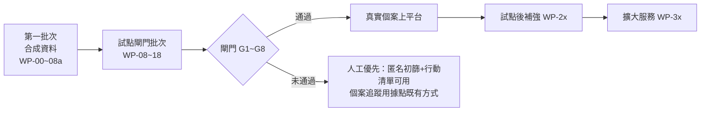

# 開發工作包與驗收計畫
work_id：STP-PLATFORM-PLAN-001｜版本：v0.2-draft｜2026-10-03
工時為工程人日區間（估算），不含資源查核與個案服務人力（見 [OPERATIONS_AND_PRIVACY.md](OPERATIONS_AND_PRIVACY.md) §3）。

## 1. 路線總覽與 90 天計畫對照

| 90 天階段 | 業務工作（原計畫） | 平台工作 | 平台驗收 |
|---|---|---|---|
| 啟動前（建議新增「平台準備期」，見 [DECISIONS_AND_UNKNOWNS.md](DECISIONS_AND_UNKNOWNS.md) G-01） | — | 第一批次 | §5 驗收 |
| P0 第 1～2 週 | 選地區、訪談、合作容量 | WP-16 同意書與說明稿草稿；以第一批次 staging 做訪談示範（合成） | 示範不含真實資料 |
| P1 第 3～4 週 | 查核 30～50 項資源 | WP-10 資源維護流程；R5 在 staging→production 目錄建立資源；WP-17 golden set | ≥30 項 V2 發布；golden set ≥30 案 |
| P2 第 5～8 週 | 服務 20～30 戶 | 閘門批次完成並通過 G1～G8 後，個案上平台 | 閘門全數通過紀錄 |
| P3 第 9～12 週 | 成果驗證 | WP-14 報表、WP-17 錯漏分析與續辦提醒測試 | 第 90 天報告依 PRD §7 產出 |

原計畫工作包對照：
| 原 ID | 平台工作包 |
|---|---|
| STP-001 試點地區與機構盤點 | （業務）＋ WP-16 合作與資料分享協議範本 |
| STP-002 資源資料規格與首批目錄 | WP-02、WP-03、WP-10 |
| STP-003 需求問答與資格規則 | WP-04、WP-05、WP-06、WP-17 |
| STP-004 申請陪伴流程 | WP-11、WP-12 |
| STP-005 最小產品 | WP-01、WP-06、WP-07、WP-15 |
| STP-006 更新與提醒 | WP-10（影響分析）、WP-13 |
| STP-007 隱私與權限 | WP-08、WP-09、WP-16、WP-18 |
| STP-008 真實試點與成效 | WP-14、WP-17 |

## 2. 工作包（MVP＝第一批次＋試點閘門批次）
| ID | 目標 | 前置 | 交付物 | 模組 | 工時 | 驗收 | 風險 | 下一步 |
|---|---|---|---|---|---|---|---|---|
| WP-00 | repo 防護與合成資料規範 | — | CI 秘密掃描、個資樣式掃描、PR 範本、合成資料命名規範 | repo | 2～3 | 含假身分證號格式的測試 PR 被 CI 擋下 | 誤判過多 | WP-01 |
| WP-01 | 專案骨架 | WP-00 | Django 專案、Docker Compose、CI（lint、test、遷移檢查）、staging 部署腳本、import 邊界檢查 | 全部 | 4～6 | `make test` 全綠；staging 可部署合成資料 | 雲端帳號未定（U-06） | WP-02 |
| WP-02 | 資源目錄資料模型與後台 | WP-01 | Organization、Source、Resource、ResourceVersion、DocumentRequirement、HouseholdScopeDefinition、VerificationRecord 模型與 admin | catalog | 6～9 | 可由 admin 建立合成資源版本；UNKNOWN 欄位可標記；發布檢查生效 | 欄位過多影響輸入效率 | WP-03、WP-04 |
| WP-03 | 合成資源目錄與公開查詢 P1 | WP-02 | 匯入 [examples/synthetic_resources.json](examples/synthetic_resources.json)；P1 頁與 `GET /api/public/resources` | catalog | 3～5 | T-04；行動裝置 360px；首屏 ≤300KB | — | WP-05 |
| WP-04 | 規則引擎 | WP-02 | criteria 驗證（JSON Schema）、運算子、口徑計算、三值邏輯、結果彙總、測試案例 runner | eligibility | 7～10 | [examples/expected_assessments.md](examples/expected_assessments.md) 全部案例通過；重算一致 | 口徑表達不足 | WP-06 |
| WP-05 | 需求問答 P2＋急迫轉人工 | WP-03 | 匿名 session、題庫（≤15 題）、代填模式、J5 畫面與任務 | intake | 5～7 | T-01、T-12、T-17 | 題目用語需實地測試 | WP-06 |
| WP-06 | 結果解釋 P3＋行動清單 P4 | WP-04、WP-05 | 結果頁、逐條理由、缺漏、列印大字版行動清單 | intake、casework | 5～7 | T-02、T-03、T-05、T-06；列印 A4 一頁 | 解釋文字可讀性 | WP-07 |
| WP-07 | 協助員工作台 P7（合成） | WP-06 | ServiceCase、Household、Person、Fact、Interaction、ActionPlan、Task（基本）；建案、匯入 session、責任人／備援、每日檢查 | casework、tasks | 7～10 | 每案必有責任人＋下一步＋期限；T-15（基本升級） | 範圍膨脹 | WP-08a |
| WP-08a | 基本角色與稽核（第一批次） | WP-07 | R3／R4／R5／R7 角色、指派案件可見性、AuditEvent（只新增） | access、audit | 3～4 | T-19（基本）；稽核表禁止 UPDATE | — | 第一批次驗收 |
| WP-08 | 完整權限、MFA、稽核 | WP-08a | 物件層級權限、權限矩陣自動測試、MFA、break-glass、存取紀錄查詢 | access、audit | 3～5（WP-08a 之外） | 矩陣每格有測試；T-19 | 權限規則複雜 | G1 |
| WP-09 | 同意與代理 | WP-08 | Consent 全欄位、用途檢查函式、撤回流程（取消通知、停止分享、刪除排程） | access、casework | 4～6 | T-13 | 同意書內容未定（WP-16） | G2 |
| WP-10 | 資源維護流程 P9 | WP-02、WP-08a | 送審／查核／發布分權、版本差異、暫停、影響分析與 REASSESS 任務、查核頻率排程 | catalog、tasks | 5～8 | T-07、T-20 | — | P1 資源建置 |
| WP-11 | 申請、轉介、成果 P6 | WP-07、WP-09 | 三個狀態機、證據欄位、冪等鍵、partial unique index、Outcome 驗證 | casework | 7～10 | T-08、T-09、T-10、T-14 | 狀態邊界案例 | G5 |
| WP-12 | 文件 P5 | WP-11 | DocumentRecord、私有儲存、簽章 URL、病毒掃描、保存期刪除 | documents | 5～8 | 不上傳也能送件；T-13 文件刪除 | 掃描元件維運 | G2 |
| WP-13 | 任務、通知與升級 P10 | WP-11 | Notification 狀態機、Email／簡訊轉接層（先接 sandbox）、回呼、重試、人工接管、升級規則 | tasks、notifications | 7～10 | T-11、T-15 | 簡訊供應商未定（U-12） | G4 |
| WP-14 | 成效報表 P12 | WP-11 | 彙總表、漏斗（家庭／件數分開）、時間、工時、成本輸入、n<5 遮蔽 | reporting | 5～7 | T-16；以合成資料核對手算結果 | 口徑誤解 | G5 |
| WP-15 | 社工複核佇列 P8＋容量 P11 | WP-11 | 佇列、複核結論、抽查抽樣、機構容量與確認期限 | casework、catalog | 5～7 | T-08、T-09 | — | G3 |
| WP-16 | 合規與營運文件（非工程為主） | — | 同意書與說明稿、隱私政策、資料分享協議範本、訓練教材、事件演練腳本 | 文件 | 工程 0～1；法律與營運另計 | 法律顧問審閱紀錄 | 法律意見時程 | G2、G8 |
| WP-17 | 品質驗證工具 | WP-04、WP-15 | golden set 匯入與比對、錯漏推薦統計、續辦提醒模擬 | eligibility、reporting | 2～4 | golden set 報告可產出 | 社工時間 | G6 |
| WP-18 | 正式環境與資安 | WP-08～WP-13 | production 專案、KMS、備份與還原演練、監控告警、弱點掃描、滲透測試修正 | ops | 5～8 | 還原演練紀錄；無高風險未修弱點 | 雲端選擇（D-202） | G7 |
| WP-19（選用） | AI 資源起草 | WP-10 | ai_gateway、資源欄位草稿、輸出檢查、回退 | ai_gateway | 3～5 | T-18；草稿只進 DRAFT | 供應商條款（U-09） | 試點後 |

合計：第一批次（WP-00～WP-07＋WP-08a）約 42～61 人日；MVP 全部（不含 WP-19）約 90～135 人日。以 2 名工程師並行約 9～14 週；1 名約 18～27 週。這是 [DECISIONS_AND_UNKNOWNS.md](DECISIONS_AND_UNKNOWNS.md) G-01 的依據。

## 3. 試點前必須完成的閘門（真實個案上平台前）
| 閘門 | 內容 | 驗收證據 | 負責 |
|---|---|---|---|
| G1 權限 | 角色＋物件層級權限、MFA 強制、離職停用流程、break-glass | 權限矩陣自動測試全通過；MFA 覆蓋 100% 內部帳號 | 工程＋R7 |
| G2 資料保護 | 資料責任人（控管者）指定；同意書與隱私政策經法律審閱；加密、保存期刪除排程、撤回流程；事件處理計畫 | 法律審閱紀錄；T-13 通過；刪除排程演練紀錄 | 負責人＋法律＋工程 |
| G3 人工接案 | 電話／紙本／現場流程、值班表、急迫流程與合作據點法定通報流程對接 | 合成案例演練（J4、J5）紀錄；值班表 | R4＋據點 |
| G4 補件追蹤 | 任務、提醒、升級、通知失敗改人工 | T-11、T-15 通過；升級演練 | 工程＋R3 |
| G5 結果紀錄 | 申請／轉介／取得分開、證據等級、報表口徑、合成排除 | T-14、T-16 通過；手算核對 | 工程＋負責人 |
| G6 資源品質 | ≥30 項資源 V2 以上發布；golden set ≥30 案；golden set 中「可能符合」錯推薦 0 件、漏推薦 ≤10% 且原因已記錄 | WP-17 報告 | R5＋R4 |
| G7 環境與資安 | production 獨立、備份還原成功、無高風險弱點、秘密管理 | 還原與掃描報告 | 工程 |
| G8 人員與合作 | 協助員完成訓練；合作據點書面確認接案容量與資料分享範圍 | 訓練紀錄；合作確認文件（私有存放） | 負責人 |
任何閘門未通過：真實個案不進平台；可用第一批次做匿名初篩與列印行動清單，個案追蹤以合作據點既有方式（紙本或其系統）進行，並記錄於週報。

## 4. 測試情境
全部以合成資料執行；資源與家庭來自 [examples/](examples/README.md)。自動化測試（單元或端對端）＋必要的人工演練。

| ID | 情境 | 設定 | 預期結果 |
|---|---|---|---|
| T-01 | 缺資料 | 家庭全部答「不知道」 | 所有資源為「資料不足」，列出缺漏；無任何資源顯示為不符合 |
| T-02 | 地區不符 | 住在示範縣乙區，資源僅限甲區 | 「依現有資料可能不符合」，理由為地區；提供複核方式與替代資源 |
| T-03 | 不同家庭口徑 | 同一家庭，A 方案計同戶籍、B 方案計實際共同生活 | 兩方案計入人數不同，各自顯示計算過程 |
| T-04 | 過期資源 | 資源 effective_to 已過 | 不出現在公開列表與正式推薦；舊評估仍可回溯 |
| T-05 | 併領排除 | 家庭自述正領取排除資源 | 結果「可能不符合」並標示依自述；兩者皆可能符合時標示擇一並進複核 |
| T-06 | 自述不符合但未確認 | 收入自述略高於門檻（5% 內） | FAIL_UNCONFIRMED＋人工確認點，不排除 |
| T-07 | 來源衝突 | 兩來源門檻不同 | 無法發布；已發布者轉 SUSPENDED；建立查核任務 |
| T-08 | 人工例外 | 規則含 HUMAN_JUDGMENT 條件 | 結果「可能符合」並進 R4 佇列；R4 結論寫入，原結果保留 |
| T-09 | 額滿 | 機構容量 FULL | 建立轉介需確認候補；申請轉 ON_HOLD(CAPACITY_FULL)；推薦替代 |
| T-10 | 重複送件 | 同家庭同資源同期間第二次建立申請／重送同 Idempotency-Key | 第一種回 409 附既有申請；第二種回原結果不重複建立 |
| T-11 | 通知失敗 | 簡訊供應商回報失敗 | Notification FAILED→重試→FALLBACK_REQUIRED；建立人工任務；任務不自動完成 |
| T-12 | 無手機 | 代填模式、電話管道 | 可完成問答、列印行動清單、以電話任務追蹤；無任何步驟要求手機 |
| T-13 | 撤回同意 | 撤回 REMINDERS 與 DOCUMENT_STORAGE | 排程通知取消；文件 7 天內刪除；同意紀錄保留；稽核事件存在 |
| T-14 | 核准未取得 | 申請 APPROVED，Outcome PENDING_DELIVERY | 不計入實際取得；報表列為「核准待取得」 |
| T-15 | 逾期升級 | 補件期限前 1 工作日未完成 | 升級給備援與 R4；逾期後 LAPSED 並觸發漏追檢討 |
| T-16 | 合成資料排除 | 正式報表資料混入 is_synthetic | 不計入；資料品質警告 |
| T-17 | 急迫需求 | 第一頁回答「明天沒有食物」 | 立即顯示緊急資訊；建立 URGENT 任務；30 分鐘未認領升級 |
| T-18 | AI 不可用 | AI 呼叫逾時或錯誤 | 回退模板文字；流程不中斷；記錄回退 |
| T-19 | 越權存取 | R3 讀取非指派案件；R8 要求個案資料 | 403/404；稽核事件記錄嘗試 |
| T-20 | 新版本影響既有案件 | 發布新門檻版本 | 受影響案件評估標 STALE；依狀態建立任務；已送件者不變 |

## 5. 第一個最小開發批次
範圍：合成資料的資源目錄 → 需求問答 → 可解釋初篩 → 個人行動清單 → 協助員工作台。
工作包：WP-00、WP-01、WP-02、WP-03、WP-04、WP-05、WP-06、WP-07、WP-08a（約 42～61 人日）。

### 5.1 交付物
1. 可在本機與 staging 執行的 Django 應用與 CI。
2. 合成資源目錄（[examples/synthetic_resources.json](examples/synthetic_resources.json) 匯入，6 項資源、虛構「示範縣」）。
3. P1 公開查詢、P2 問答（含代填與急迫轉人工）、P3 結果解釋、P4 行動清單（列印）、P7 工作台（合成案件）。
4. 規則引擎與測試：[examples/expected_assessments.md](examples/expected_assessments.md) 全部案例自動化。
5. 基本角色與稽核。
6. 操作說明（README）與示範腳本（一個合成家庭從問答到行動清單）。

### 5.2 驗收標準
| 項目 | 標準 |
|---|---|
| 規則正確 | expected_assessments 全部通過；同輸入重算結果一致（含版本） |
| 三種結果 | 每項結果都有逐條理由；資料不足永不顯示為不符合（T-01） |
| 情境 | T-01～T-06、T-12、T-15（基本）、T-17、T-19（基本）通過 |
| 可追溯 | 任一理由可點回規則條件→來源摘錄→來源與查核日期 |
| 人工可用 | 代填模式完成整個流程；行動清單列印 A4 一頁 |
| 工作台 | 每個進行中合成案件都有責任人、備援、下一步、期限；缺漏者每日檢查報警 |
| 資料安全 | 全部資料 is_synthetic；staging 拒絕非合成個案；CI 個資樣式掃描啟用 |
| 效能 | 公開頁首屏 ≤300KB；評估 50 項資源 ≤1 秒（合成資料） |
| 覆核 | 由非作者執行驗收清單並留紀錄 |
不在第一批次：真實個案、文件上傳、通知寄送、轉介、成果報表、AI。

## 6. 試點後與擴大服務工作包
| ID | 功能 | 前置 | 工時（估） | 驗收 | 觸發條件 |
|---|---|---|---|---|---|
| WP-21 | 受助者自助進度頁 F-21 | G1、G2 | 6～10 | 身分確認流程經資安審查 | PRD §5.2 |
| WP-22 | LINE 或其他通道 F-22 | WP-13、帳號 | 3～6 | 送達與回覆紀錄 | 取得帳號與預算 |
| WP-23 | 提供機構受限帳號 F-23 | WP-15 | 5～8 | R6 只見最小欄位 | 轉介回覆慢 |
| WP-24 | 來源變動自動偵測 F-24 | WP-10 | 4～6 | 只建任務、不改資料 | 資源 >80 項 |
| WP-25 | AI 白話說明與問答引導 F-25 | WP-19、U-09 | 6～10 | 數值一致性檢查；T-18 | 草稿品質驗證後 |
| WP-26 | 文件擷取輔助 F-26 | WP-12、U-09 | 6～10 | 擷取需確認才寫入 Fact | 文件登錄工時高 |
| WP-27 | 家庭變動自動重評 F-27 | WP-10 | 3～5 | T-20 擴充 | 續辦案件出現 |
| WP-28 | 進階成本報表 F-28 | WP-14 | 3～5 | 與財務資料核對 | 經費提案 |
| WP-31 | 多縣市分區 F-31 | 第二地區查核 | 8～12 | 地區規則隔離測試 | 擴大決策 |
| WP-32 | 多機構租戶 F-32 | 合作協議 | 10～15 | 跨機構權限測試 | 擴大決策 |
| WP-33 | 官方資料介接 F-33 | 官方資格 | 待評估 | 依官方規範 | 取得資格（目前無） |
| WP-34 | 規則品質儀表板 F-34 | WP-17 | 4～6 | — | 樣本足夠 |
| WP-35 | 無障礙與多語 F-35 | — | 依語言數 | 母語者測試 | 需求證據 |
| WP-36 | 開放資源資料集 F-36 | 授權確認 | 3～5 | 授權條款 | 維護量能 |
