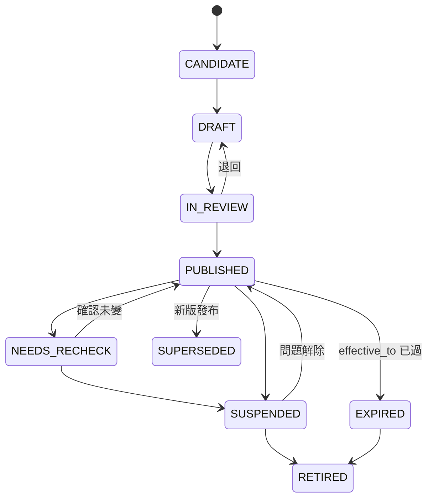
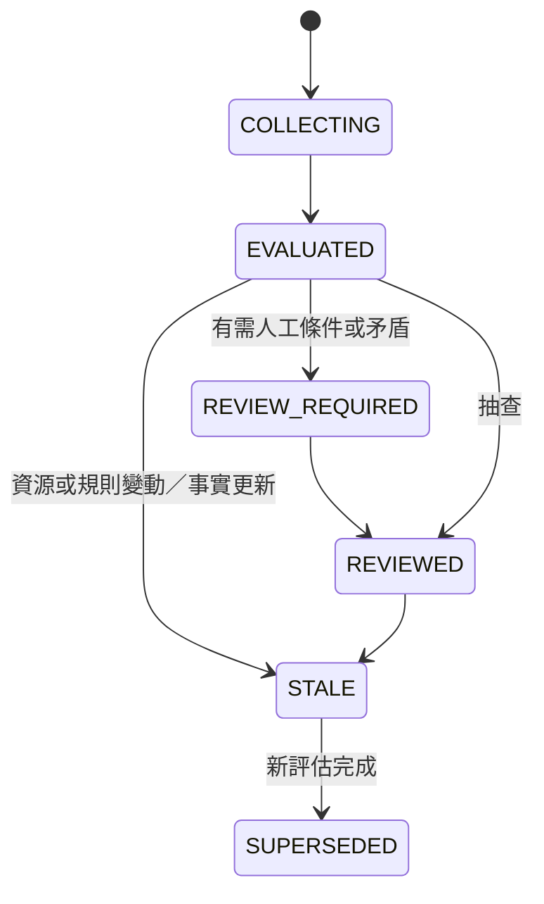
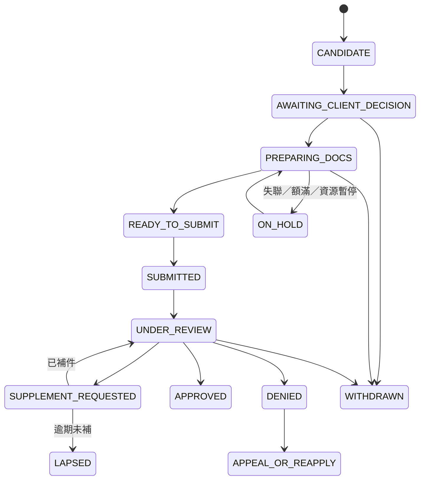
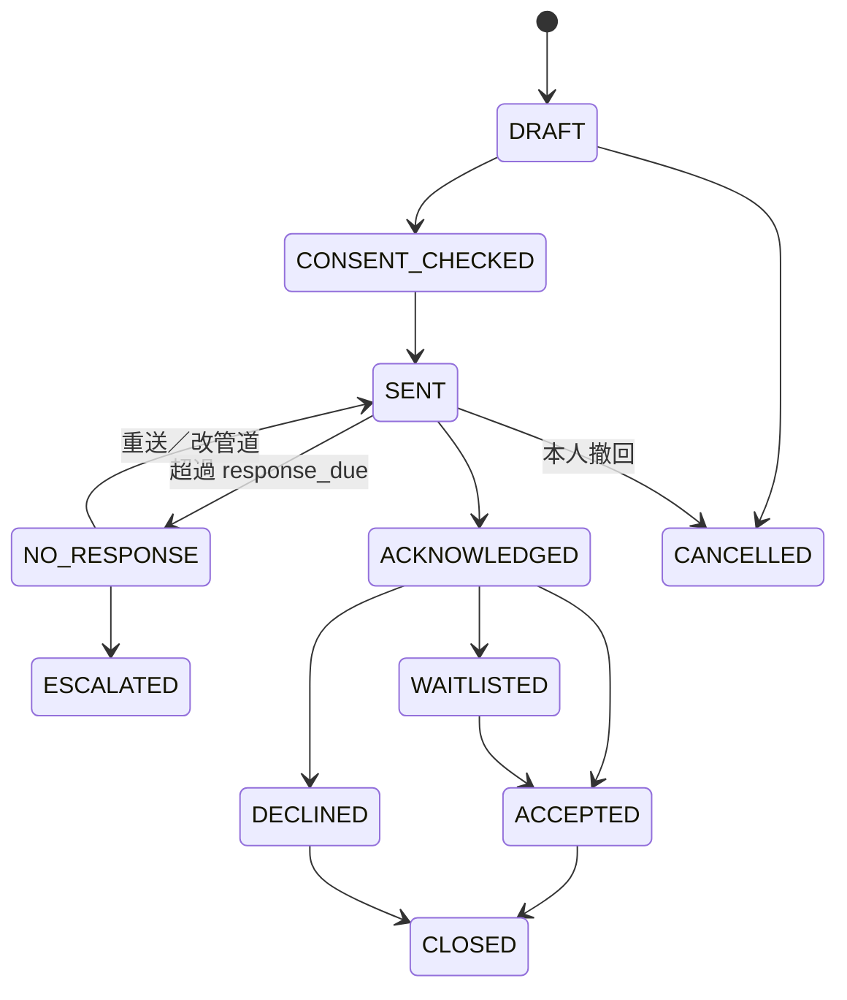
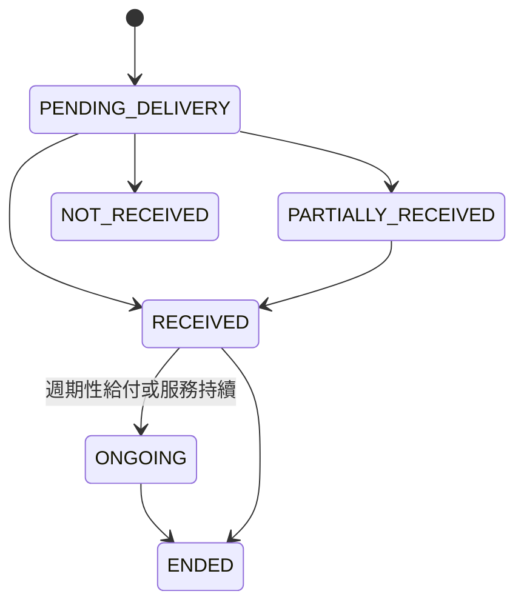
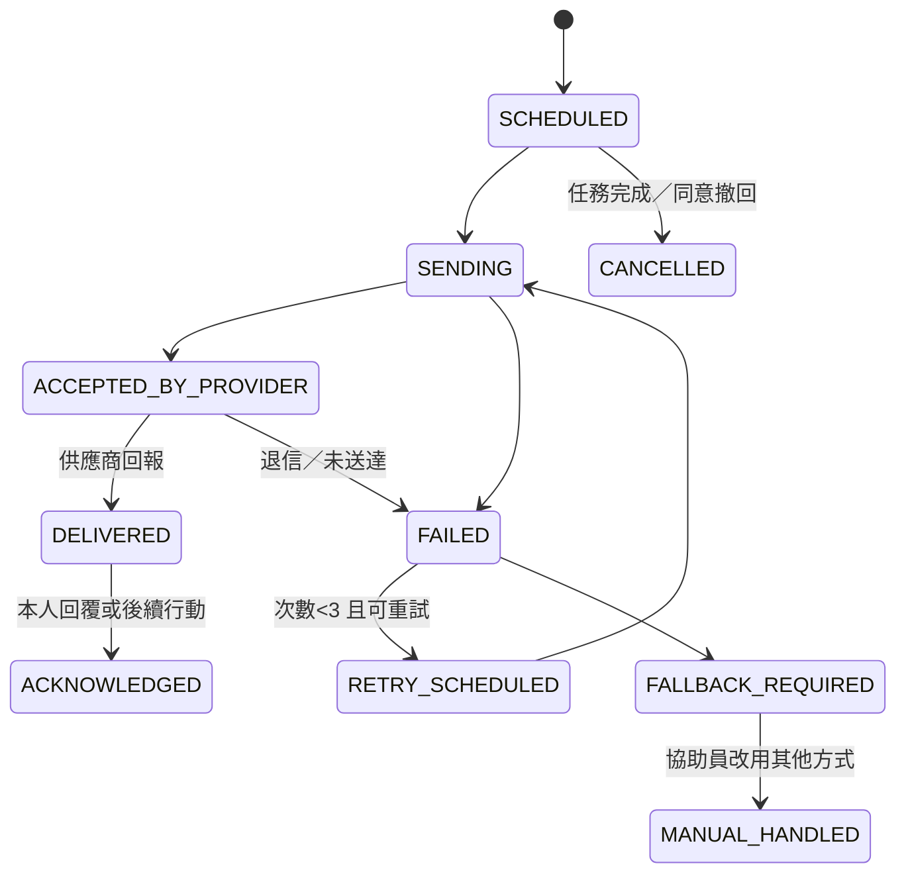

# 資料模型與狀態機
work_id：STP-PLATFORM-PLAN-001｜版本：v0.2-draft｜2026-10-03
相關：[資源與資格引擎](RESOURCE_AND_ELIGIBILITY_ENGINE.md)｜[資料保護與營運](OPERATIONS_AND_PRIVACY.md)｜[架構](ARCHITECTURE.md)｜[合成範例](examples/README.md)

## 1. 共同約定

### 1.1 型別
| 型別 | 說明 |
|---|---|
| `uuid` | UUIDv7（時間排序），所有主鍵 |
| `text` / `text[]` | UTF-8 字串／陣列 |
| `enum(...)` | 資料庫 CHECK 約束或參照表 |
| `date` / `timestamptz` | 日期／含時區時間（存 UTC，顯示 Asia/Taipei） |
| `money_twd` | `numeric(12,0)`，新台幣元；區間以 `int4range` |
| `jsonb` | 結構化內容，必有 JSON Schema 驗證（例：規則條件） |
| `ref(X)` / `refs(X)` | 外鍵至 X／多個外鍵（陣列） |

### 1.2 資料分類
| 代碼 | 名稱 | 例 | 位置 |
|---|---|---|---|
| PUB | 公開 | 已發布資源資訊、規則白話說明 | 可進公開 repo（僅合成或公開來源資料） |
| INT | 內部 | 查核紀錄、草稿、工作人員帳號、任務（不含個案內容） | 私有資料庫 |
| PRV | 私有個案 | 家庭代稱、聯絡方式、需求、申請狀態 | 私有資料庫，欄位層級權限 |
| SEN | 敏感 | 所得、財產、健康、身心障礙、身分證號、證件影本、家暴／兒少保護資訊 | 私有資料庫加密欄位或私有物件儲存；最小存取 |

公開 GitHub 只能放 PUB 與合成資料（見 [OPERATIONS_AND_PRIVACY.md](OPERATIONS_AND_PRIVACY.md) §1）。

### 1.3 確認程度（confirmation_level）
| 代碼 | 意義 |
|---|---|
| C0 | 未知／未提供 |
| C1 | 本人或代理人自述 |
| C2 | 協助員查看文件（記錄文件類型與日期，不一定保存影本） |
| C3 | 官方或提供機構確認（例如核定書、機構回覆） |

資源資訊另用查核程度（verification_level）：V0 未查核候選、V1 公開來源整理、V2 公開來源＋人工複核（第二人）、V3 經承辦或提供機構確認。正式推薦至少 V2。

### 1.4 共同欄位
所有實體：`id uuid`、`created_at`、`created_by ref(StaffUser)|null`、`updated_at`、`row_version int`（樂觀鎖）、`is_synthetic bool default false`。
個案類實體另有：`organization_id`（資料歸屬據點）、`retention_class`（見 [OPERATIONS_AND_PRIVACY.md](OPERATIONS_AND_PRIVACY.md) §1.4）、`deleted_at`（軟刪除，到期硬刪除）。

### 1.5 關係總覽
```mermaid
erDiagram
  Organization ||--o{ Resource : provides
  Source }o--o{ ResourceVersion : cites
  Resource ||--o{ ResourceVersion : versions
  ResourceVersion ||--o{ EligibilityRule : has
  ResourceVersion ||--o{ DocumentRequirement : requires
  Household ||--o{ Person : members
  Household ||--o{ ServiceCase : episodes
  Household ||--o{ Fact : facts
  Person ||--o{ Fact : facts
  Household ||--o{ Consent : grants
  ServiceCase ||--o{ Assessment : runs
  Assessment }o--o{ ResourceVersion : evaluates
  ServiceCase ||--o{ Application : files
  Application }o--|| ResourceVersion : targets
  ServiceCase ||--o{ Referral : sends
  Referral }o--|| Organization : to
  Application ||--o{ DocumentRecord : uses
  DocumentRequirement ||--o{ DocumentRecord : fulfilled_by
  Application ||--o{ Outcome : results
  Referral ||--o{ Outcome : results
  ServiceCase ||--o{ Task : has
  Task ||--o{ Notification : sends
  ServiceCase ||--o{ Interaction : logs
```

## 2. 實體規格
每個實體列：欄位（型別／必填／分類）、識別與關聯、資料來源與確認程度、更新保存刪除、去重與版本。

### 2.1 Organization（機構）
| 欄位 | 型別 | 必填 | 分類 | 說明 |
|---|---|---|---|---|
| name | text | 是 | PUB | 正式名稱 |
| org_type | enum(GOV_CENTRAL, GOV_LOCAL, PUBLIC_AGENCY, NGO, SCHOOL, HOSPITAL, PARTNER_SITE, OTHER) | 是 | PUB | |
| jurisdiction | text[] | 否 | PUB | 行政區代碼（內政部行政區代碼） |
| public_contacts | jsonb | 否 | PUB | 公開電話、地址、網址 |
| partnership_status | enum(NONE, CONTACTED, IN_DISCUSSION, AGREEMENT_SIGNED, ENDED) | 是 | INT | 預設 NONE；未簽署不得標示合作 |
| internal_contacts | jsonb | 否 | INT | 承辦窗口（工作聯絡方式） |
| capacity_status | enum(OPEN, LIMITED, FULL, UNKNOWN) | 是 | INT | 預設 UNKNOWN |
| capacity_confirmed_at / capacity_confirmed_via | timestamptz / text | 否 | INT | 超過 30 天自動回到 UNKNOWN |
- 識別：`id`；唯一鍵（name 正規化＋jurisdiction）。
- 來源：公開資料（V1）或電話確認（V3）。
- 保存：機構資料長期保存；終止合作改狀態不刪。
- 去重：名稱正規化（全半形、空白、「臺／台」）＋地址比對，人工合併。

### 2.2 Source（來源）—補充實體
| 欄位 | 型別 | 必填 | 分類 | 說明 |
|---|---|---|---|---|
| url_or_ref | text | 是 | PUB | URL 或「電話確認：某單位某日」 |
| source_type | enum(WEB_PAGE, PDF, ANNOUNCEMENT, REGULATION, FORM, PHONE_CONFIRMATION, EMAIL_CONFIRMATION, IN_PERSON) | 是 | PUB | |
| tier | enum(S1_LAW, S2_CENTRAL, S3_LOCAL, S4_PUBLIC_AGENCY, S5_NGO, S6_SECONDARY) | 是 | PUB | 見 [RESOURCE_AND_ELIGIBILITY_ENGINE.md](RESOURCE_AND_ELIGIBILITY_ENGINE.md) §2 |
| publisher_org_id | ref(Organization) | 否 | PUB | |
| published_at / source_updated_at | date | 否 | PUB | 原文標示日期；無則 UNKNOWN |
| retrieved_at | timestamptz | 是 | INT | |
| content_hash | text | 否 | INT | 正規化內容 SHA-256，用於變動偵測 |
| snapshot_ref | text | 否 | INT | 私有物件儲存中的快照（PDF／HTML）；授權不明時只存雜湊與摘錄 |
| fetch_policy | enum(MANUAL_ONLY, MANUAL_CHECK_LINK, AUTO_HASH_ALLOWED) | 是 | INT | 預設 MANUAL_ONLY；只有確認網站條款與 robots 允許才可 AUTO |
| status | enum(ACTIVE, MOVED, BROKEN, SUPERSEDED) | 是 | INT | |
- 去重：URL 正規化（去追蹤參數、尾斜線）；相同內容雜湊不同 URL 標記 `duplicate_of`。
- 保存：長期；快照依著作權與授權保存，僅內部查核使用。

### 2.3 Resource（資源）
| 欄位 | 型別 | 必填 | 分類 | 說明 |
|---|---|---|---|---|
| canonical_name | text | 是 | PUB | 跨年度不變的方案名稱 |
| provider_org_id | ref(Organization) | 是 | PUB | |
| level | enum(CENTRAL, LOCAL, PRIVATE) | 是 | PUB | |
| categories | enum[] (LIVING, EMERGENCY, CHILD_YOUTH, EDUCATION, FOOD_GOODS, HOUSING, EMPLOYMENT, HEALTH, CARE, LEGAL, OTHER) | 是 | PUB | |
| current_version_id | ref(ResourceVersion) | 否 | PUB | 目前發布版本 |
| lifecycle_status | 見 §3.1 | 是 | PUB | |
| owner_staff_id | ref(StaffUser) | 是 | INT | 維護責任人 |
| risk_tier | enum(HIGH, MEDIUM, LOW) | 是 | INT | 決定查核頻率 |
| next_review_due | date | 是 | INT | |
- 識別：`id`；`resource_key` 人類可讀鍵（例：`TW-DEMO-LIVING-001`），唯一。
- 去重：同一提供機構＋同名正規化＋同地區 → 候選重複，R5 人工判斷；「同一方案不同年度」是同一 Resource 的不同 ResourceVersion，不是新 Resource。
- 保存：不刪除，只 RETIRED。

### 2.4 ResourceVersion（資源版本）
| 欄位 | 型別 | 必填 | 分類 | 說明 |
|---|---|---|---|---|
| resource_id | ref(Resource) | 是 | PUB | |
| version_label | text | 是 | PUB | 例：`2026.1`、`2027-年度` |
| effective_from / effective_to | date | 否 | PUB | 未知則 null＋`effective_unknown=true` |
| application_window | jsonb | 否 | PUB | 申請期間（可多段）；常年受理則 `{"type":"ROLLING"}` |
| benefit_period_rule | jsonb | 否 | PUB | 給付期間與續辦規則（`renewal_rule`） |
| regions | text[] | 是 | PUB | 適用行政區代碼；未知則 `["UNKNOWN"]` 並禁止發布 |
| summary_plain | text | 是 | PUB | 白話摘要（AI 可起草，需 R5 確認） |
| service_content | text | 是 | PUB | 原文摘要 |
| amount_or_service | jsonb | 否 | PUB | 金額、次數或服務內容；未知標 UNKNOWN |
| how_to_apply | jsonb | 是 | PUB | 管道（臨櫃／郵寄／線上／據點轉介）、地點、時間、可否代辦（YES/NO/CONDITIONAL/UNKNOWN） |
| contact_points | jsonb | 是 | PUB | 公開窗口 |
| stacking_rules | jsonb | 否 | PUB | 併領／排除／相依（見引擎文件 §7） |
| household_scope_ids | refs(HouseholdScopeDefinition) | 否 | PUB | 此版本使用的家庭與所得財產口徑 |
| capacity_note | text | 否 | PUB | 名額資訊；民間資源預設「需電話確認」 |
| capacity_status / capacity_confirmed_at | enum(OPEN, LIMITED, FULL, UNKNOWN) / date | 是／否 | PUB | 服務層級名額；預設 UNKNOWN；超過 30 天未確認自動回 UNKNOWN（機構整體容量見 Organization） |
| source_ids | refs(Source) | 是 | PUB | 至少 1 個 |
| source_excerpt_map | jsonb | 是 | INT | 每個欄位或條件 → 來源與原文摘錄位置 |
| verification_level | enum(V0..V3) | 是 | INT | 發布需 ≥V2 |
| verified_by / verified_at / verification_method | ref / timestamptz / text | 發布時必填 | INT | |
| published_by / published_at | ref / timestamptz | 發布時必填 | INT | published_by ≠ verified_by |
| status | 見 §3.1 | 是 | PUB | |
| supersedes_version_id | ref(ResourceVersion) | 否 | PUB | 版本鏈 |
| change_summary | text | 否 | INT | 與上一版差異 |
- 不可變：發布後內容不可修改；修正必須建新版本（錯字修正可建 `patch` 版本並標記 `non_material=true`，不觸發重評）。
- 保存：永久（評估可追溯所需）。

### 2.5 EligibilityRule（資格規則）
| 欄位 | 型別 | 必填 | 分類 | 說明 |
|---|---|---|---|---|
| resource_version_id | ref | 是 | PUB | |
| rule_version | text | 是 | PUB | 語意化版本 `1.0.0`；同資源版本內修正規則也遞增 |
| criteria | jsonb | 是 | PUB | 條件陣列，格式見 [RESOURCE_AND_ELIGIBILITY_ENGINE.md](RESOURCE_AND_ELIGIBILITY_ENGINE.md) §5 |
| combinator | enum(ALL, ANY, CUSTOM) | 是 | PUB | CUSTOM 需 `expression` |
| authored_by / reviewed_by | ref | 是 | INT | 不可同一人 |
| test_cases | jsonb | 是 | INT | 至少：一個可能符合、一個資料不足、一個可能不符合 |
| authoring_origin | enum(HUMAN, AI_DRAFT_HUMAN_EDITED) | 是 | INT | AI 草稿未經人工審核不得發布 |
| status | enum(DRAFT, IN_REVIEW, PUBLISHED, RETIRED) | 是 | INT | |
- 不可變：發布後不可修改。
- 每個 criterion 必須有 `source_ref` 指向 Source 原文位置；沒有來源的條件不得存在。

### 2.6 HouseholdScopeDefinition（家庭口徑定義）—補充實體
| 欄位 | 型別 | 必填 | 分類 | 說明 |
|---|---|---|---|---|
| scope_key | text | 是 | PUB | 例：`SCOPE-L1` |
| member_inclusion | jsonb | 是 | PUB | 計入成員規則：關係（配偶、直系血親…）、是否需同戶籍、是否需共同生活、年齡、就學、服役等排除條件 |
| income_definition | jsonb | 是 | PUB | 所得項目、計算期間（月平均／年度）、是否含工作能力推估所得等；未知處標 UNKNOWN |
| property_definition | jsonb | 否 | PUB | 動產、不動產計算方式 |
| source_ref | jsonb | 是 | PUB | |
- 不同方案各自定義；**禁止**共用一個「預設家庭口徑」。若兩方案確實引用相同法規條文，可共用同一 scope_key，但仍各自連結來源。

### 2.7 Household（家庭）
| 欄位 | 型別 | 必填 | 分類 | 說明 |
|---|---|---|---|---|
| display_alias | text | 是 | PRV | 內部代稱（例：「林家-A12」），報表不用 |
| region_code | text | 是 | PRV | 居住區；戶籍地另存於 Fact（可能不同） |
| primary_contact_person_id | ref(Person) | 否 | PRV | |
| contact_preferences | jsonb | 否 | PRV | 管道順序、安全時段、可否留言、是否不可寄信到家 |
| baseline_resources | jsonb | 是 | PRV | 建案時已使用資源（用於判斷「新增」） |
| safety_flags | enum[] (DV_RISK, CHILD_PROTECTION, DO_NOT_CONTACT_AT_HOME, OTHER) | 否 | SEN | 只顯示給 R3／R4 |
| dedup_fingerprint | text | 否 | PRV | 私鑰 HMAC（姓名正規化＋生日＋電話後四碼），只用於比對 |
| merged_into_id | ref(Household) | 否 | PRV | |
- 識別：`id`；對外代號 `case_code`（短碼，不含個資）。
- 去重：建案時以 dedup_fingerprint 提示可能重複，R3 確認合併，保留 AuditEvent；不自動合併。
- 保存：依 retention_class，見營運文件 §1.4。

### 2.8 Person（成員）
| 欄位 | 型別 | 必填 | 分類 | 說明 |
|---|---|---|---|---|
| household_id | ref | 是 | PRV | 同一人可在多個家庭（例如分居父母），以 `person_link_id` 關聯 |
| display_name | text | 否 | PRV | 可只填稱呼 |
| relation_to_primary | enum(SELF, SPOUSE, PARTNER, CHILD, PARENT, GRANDPARENT, GRANDCHILD, SIBLING, OTHER_RELATIVE, NON_RELATIVE) | 是 | PRV | |
| birth_year_month | text | 否 | PRV | 初篩只需年齡區間；精確生日僅申請時 |
| age_band | enum | 否 | PRV | 初篩用 |
| co_residing | enum(YES, NO, UNKNOWN) | 是 | PRV | 實際共同生活 |
| same_household_registration | enum(YES, NO, UNKNOWN) | 是 | PRV | 同戶籍 |
| national_id | text（加密） | 否 | SEN | 只在申請確需時收集；預設不收 |
| is_minor | bool（計算） | — | PRV | |
- 口徑由 HouseholdScopeDefinition 在評估時套用；Person 只存事實，不存「是否計入」。

### 2.9 Fact（事實陳述）—補充實體
| 欄位 | 型別 | 必填 | 分類 | 說明 |
|---|---|---|---|---|
| subject_type / subject_id | enum(HOUSEHOLD, PERSON) / uuid | 是 | PRV | |
| fact_key | text | 是 | 依鍵 | 受控字彙，例：`monthly_earned_income`、`has_disability_certificate`、`recent_job_loss`；每鍵有分類（PRV/SEN） |
| value | jsonb | 是 | 依鍵 | 值或區間；`{"unknown":true}`、`{"declined":true}` |
| confirmation_level | enum(C0..C3) | 是 | INT | |
| evidence_note | text | 否 | PRV | 例：「查看 2026/9 薪資單」 |
| observed_period | daterange | 否 | PRV | 數值所指期間 |
| valid_from / superseded_at | timestamptz | 是 | INT | 新值不覆蓋舊值，形成歷史 |
| entered_by / channel | ref / enum | 是 | INT | |
- 去重：同 subject＋fact_key 只能有一筆 `superseded_at is null`。
- 保存：隨案件；撤回同意時刪除 SEN 類。

### 2.10 Consent（同意與代理授權）
| 欄位 | 型別 | 必填 | 分類 | 說明 |
|---|---|---|---|---|
| household_id / grantor_person_id | ref | 是 | PRV | |
| purposes | enum[] (CONTACT, SCREENING, CASE_MANAGEMENT, APPLICATION_ASSIST, REFERRAL_SHARE, DOCUMENT_STORAGE, REMINDERS, ANONYMIZED_REPORTING, AI_ASSIST_DEIDENTIFIED) | 是 | PRV | 用途別，逐項勾選 |
| share_targets | refs(Organization) | 否 | PRV | REFERRAL_SHARE 對象 |
| data_categories | enum[] | 是 | PRV | 可處理的資料類別 |
| reminder_channels | enum[] (PHONE, SMS, EMAIL, LINE, PAPER_MAIL, IN_PERSON) | 否 | PRV | |
| proxy | jsonb | 否 | PRV | 代理人 Person、依據類型、範圍（VIEW/EDIT/CONTACT/ACCOMPANY_SUBMIT）、期間、確認人 |
| method | enum(SIGNED_PAPER, VERBAL_RECORDED_BY_STAFF, ELECTRONIC_CHECKBOX) | 是 | PRV | |
| consent_text_version | text | 是 | INT | 對應同意書版本 |
| granted_at / expires_at | timestamptz | 是／否 | PRV | |
| revoked_at / revoked_purposes / revocation_channel | | 否 | PRV | 可部分撤回 |
| witnessed_by | ref(StaffUser) | 口頭時必填 | INT | |
- 版本策略：同意不修改，只新增新紀錄並把舊的標記 superseded；撤回是事件，不刪除同意紀錄本身（作為合法處理證據）。
- 系統檢查：每次分享、提醒、AI 呼叫、文件上傳前檢查對應 purpose 有效。

### 2.11 ServiceCase（服務案件）—補充實體
| 欄位 | 型別 | 必填 | 分類 | 說明 |
|---|---|---|---|---|
| household_id | ref | 是 | PRV | |
| source_channel | enum(SELF_HELP, PARTNER_INVITE, THIRD_PARTY_REFERRAL, PHONE, WALK_IN, PAPER) | 是 | PRV | |
| owner_staff_id / backup_staff_id | ref | 是 | INT | 進行中案件必填 |
| next_action / next_action_due | text / date | 是 | INT | 進行中案件必填（DB 約束） |
| last_contact_at / next_follow_up_at | timestamptz / date | 否 | INT | |
| status | enum(OPEN, URGENT, WAITING_EXTERNAL, LOST_CONTACT, PAUSED, CLOSED) | 是 | PRV | |
| close_reason | enum(ALL_RESOLVED, CLIENT_WITHDREW, LOST_CONTACT_90D, TRANSFERRED, PILOT_HANDOVER, OTHER) | 結案時必填 | PRV | |
- 同一家庭可有多個 episode（例如一年後續辦）；報表以家庭去重。

### 2.12 Assessment（評估）
| 欄位 | 型別 | 必填 | 分類 | 說明 |
|---|---|---|---|---|
| case_id 或 screening_session_id | ref | 二擇一 | PRV | 匿名初篩只有 session |
| trigger | enum(INITIAL, USER_UPDATE, RESOURCE_CHANGE, RENEWAL, MANUAL) | 是 | INT | |
| input_snapshot | jsonb | 是 | SEN | 評估當下使用的 Fact 值與確認程度（冷凍副本） |
| input_hash | text | 是 | INT | |
| engine_version | text | 是 | INT | 規則引擎程式版本 |
| results | jsonb | 是 | PRV | 每項：resource_version_id、rule_version、result(LIKELY_ELIGIBLE/INSUFFICIENT_DATA/LIKELY_INELIGIBLE)、criteria_results[]、missing_inputs[]、human_check_points[]、rank_score、rank_reasons |
| status | 見 §3.2 | 是 | PRV | |
| reviewed_by / review_note | ref / text | 否 | PRV | |
- 不可變：結果寫入後不修改；複核以 `ReviewDecision`（results 內的附加段）記錄，原結果保留。
- 重現：以 input_snapshot＋版本可重算，結果須一致（測試要求）。

### 2.13 Application（申請）
| 欄位 | 型別 | 必填 | 分類 | 說明 |
|---|---|---|---|---|
| case_id / household_id | ref | 是 | PRV | |
| resource_id / resource_version_id | ref | 是 | PRV | 版本以啟動時為準，可升版（記錄） |
| applicant_person_id | ref | 是 | PRV | |
| benefit_period_key | text | 是 | PRV | 例：`2026`、`2026H2`、`ONE_TIME:2026-10` |
| assessment_id | ref | 否 | PRV | 啟動依據 |
| client_confirmed_at / confirmed_by_person_id / confirmation_method | | 送件前必填 | PRV | 本人或代理人確認 |
| status | 見 §3.3 | 是 | PRV | |
| submission | jsonb | SUBMITTED 後必填 | PRV | 管道、日期、送件人（本人／陪同／代理）、收件憑據類型與號碼 |
| supplement_requests | jsonb[] | 否 | PRV | 補件內容、期限、完成日 |
| decision | jsonb | 否 | PRV | 結果、日期、理由摘要、通知文件已查看 |
| idempotency_key | text | 是 | INT | 建立請求冪等 |
- 唯一約束：`(household_id, resource_id, benefit_period_key)` 在非終止狀態中唯一（partial unique index）。
- 保存：依 retention_class。

### 2.14 Referral（轉介）
| 欄位 | 型別 | 必填 | 分類 | 說明 |
|---|---|---|---|---|
| case_id | ref | 是 | PRV | |
| to_organization_id / service_resource_id | ref | 是 | PRV | |
| consent_id | ref | 是 | PRV | 必須含 REFERRAL_SHARE 且對象相符 |
| shared_fields | text[] | 是 | PRV | 實際分享的欄位清單（最小必要） |
| channel | enum(PHONE, EMAIL, PAPER, PORTAL, IN_PERSON) | 是 | PRV | |
| status | 見 §3.4 | 是 | PRV | |
| response_due | date | 是 | INT | 預設 5 個工作日（試點前與據點約定） |
| idempotency_key | text | 是 | INT | |
- 唯一：`(case_id, to_organization_id, service_resource_id)` 在非終止狀態唯一。

### 2.15 DocumentRequirement（文件需求）
| 欄位 | 型別 | 必填 | 分類 | 說明 |
|---|---|---|---|---|
| resource_version_id | ref | 是 | PUB | |
| doc_type_key | text | 是 | PUB | 受控字彙（例：`household_registration_transcript`） |
| applies_to | jsonb | 是 | PUB | 適用成員條件（例：每位 18 歲以上計入成員） |
| mandatory | enum(YES, CONDITIONAL, NO) | 是 | PUB | |
| how_to_obtain | jsonb | 否 | PUB | 地點、費用、所需時間、可否代領 |
| validity_days | int | 否 | PUB | 例：發出後 3 個月內 |
| source_ref | jsonb | 是 | PUB | |

### 2.16 DocumentRecord（文件紀錄）
| 欄位 | 型別 | 必填 | 分類 | 說明 |
|---|---|---|---|---|
| application_id / requirement_id / person_id | ref | 是 | PRV | |
| status | enum(NOT_STARTED, IN_PROGRESS, READY, SUBMITTED, NOT_APPLICABLE, EXPIRED) | 是 | PRV | NOT_APPLICABLE 需理由 |
| stored_file | jsonb | 否 | SEN | 物件鍵、雜湊、大小、MIME、加密金鑰版本；預設不存 |
| issued_at / expires_at | date | 否 | PRV | |
| viewed_by_staff_at | timestamptz | 否 | INT | 協助員查看原件紀錄（C2 依據） |
| extraction | jsonb | 否 | SEN | OCR／AI 擷取結果，`confirmed=false` 前不得寫入 Fact |
- 保存：檔案預設申請結案後 90 天刪除（RT-DOC），除非本人另同意保存供續辦。

### 2.17 Task（任務）
| 欄位 | 型別 | 必填 | 分類 | 說明 |
|---|---|---|---|---|
| task_type | enum(FIRST_CONTACT, URGENT_RESPONSE, FOLLOW_UP, SUPPLEMENT, RENEWAL, REASSESS, REVIEW, RESOURCE_VERIFY, RESOURCE_RECHECK, REFERRAL_CHASE, NOTIFY_FALLBACK, DATA_REQUEST, OTHER) | 是 | INT | |
| case_id / resource_id | ref | 二擇一或皆無 | INT | |
| assignee_staff_id / backup_staff_id | ref | 是 | INT | |
| due_at | timestamptz | 是 | INT | |
| priority | enum(URGENT, HIGH, NORMAL, LOW) | 是 | INT | |
| status | enum(OPEN, IN_PROGRESS, DONE, CANCELLED, ESCALATED) | 是 | INT | |
| escalation_level | int | 是 | INT | 0 起 |
| time_spent_minutes | int | 否 | INT | 工時統計 |
| dedup_key | text | 否 | INT | 例：`SUPPLEMENT:{application_id}:{due}`；同鍵開啟中只能一筆 |

### 2.18 Notification（通知）
| 欄位 | 型別 | 必填 | 分類 | 說明 |
|---|---|---|---|---|
| task_id / case_id | ref | 否／是 | PRV | |
| recipient_type / recipient_ref | enum(CLIENT, PROXY, STAFF, ORG) / uuid | 是 | PRV | |
| channel | enum(SMS, EMAIL, LINE, PHONE_CALL, PAPER_MAIL, IN_APP) | 是 | PRV | 必須在 Consent.reminder_channels 中（對受助者） |
| template_key / rendered_summary | text | 是 | PRV | 內容不含敏感細節（例：不寫資源名稱中的身分字樣） |
| status | 見 §3.6 | 是 | PRV | |
| provider_message_id | text | 否 | INT | |
| attempts / last_error | int / text | 是／否 | INT | |
| idempotency_key | text | 是 | INT | `{task_id}:{channel}:{scheduled_for}` |
| scheduled_for | timestamptz | 是 | INT | 靜默時段（21:00–08:00）不發送 |
- 保存：內容摘要 1 年；之後只保留統計。

### 2.19 Outcome（成果）
| 欄位 | 型別 | 必填 | 分類 | 說明 |
|---|---|---|---|---|
| application_id 或 referral_id | ref | 二擇一 | PRV | |
| receipt_status | 見 §3.5 | 是 | PRV | |
| first_received_at | date | 取得時必填 | PRV | |
| benefit_description | text | 是 | PRV | 金額或服務內容；非金錢不換算 |
| amount_twd | money_twd | 否 | SEN | 若適用 |
| evidence_level | enum(E1, E2, E3) | 取得時必填 | INT | 定義見 [PRODUCT_REQUIREMENTS.md](PRODUCT_REQUIREMENTS.md) §7.2 |
| is_new_to_household | bool | 是 | INT | 依 baseline_resources 判斷，R4 可修正並寫理由 |
| verified_by | ref | 取得時必填 | INT | 試點中須為該案責任人以外的 R3 或 R4（見 §3.5） |
| not_received_reason | enum | 否 | PRV | |

### 2.20 AuditEvent（稽核事件）
| 欄位 | 型別 | 必填 | 分類 | 說明 |
|---|---|---|---|---|
| occurred_at | timestamptz | 是 | INT | |
| actor_type / actor_id | enum(STAFF, CLIENT_SESSION, SYSTEM, PROVIDER) / uuid | 是 | INT | |
| action | text | 是 | INT | 例：`case.view`、`document.download`、`application.transition`、`consent.revoke`、`breakglass.grant` |
| object_type / object_id | text / uuid | 是 | INT | |
| purpose | text | 敏感操作必填 | INT | |
| before_hash / after_hash / diff_summary | text / text / jsonb | 否 | INT | 不寫入敏感值本身 |
| ip_hash / user_agent_class | text | 否 | INT | |
| prev_event_hash | text | 是 | INT | 雜湊鏈，偵測竄改 |
- 只能新增，不可修改或刪除（資料庫權限層級禁止 UPDATE/DELETE）。
- 保存：5 年（RT-AUDIT，需負責人與法律確認）；個案刪除後稽核只保留不可識別 ID。

### 2.21 其他補充實體
| 實體 | 用途 | 關鍵欄位 |
|---|---|---|
| StaffUser | 工作人員帳號 | 角色、所屬機構、MFA 狀態、訓練完成日、啟用狀態 |
| HelpRequest | 匿名初篩後的聯絡請求、轉介線索 | 管道、聯絡方式（PRV）、狀態、首次聯絡期限；未轉成案件 30 天刪除 |
| Interaction | 接觸紀錄 | 管道、時間、對象、摘要、工時分鐘、是否成功聯繫 |
| ActionPlan | 行動清單版本 | 步驟 jsonb、交付方式（列印／簡訊／Email／口頭）、交付時間 |
| VerificationRecord | 資源查核紀錄 | 查核方式、聯絡對象職稱、結果、差異、查核人 |
| ScreeningSession | 匿名初篩工作階段 | 隨機 token、答案（PRV）、建立時間；未轉案件 24 小時後刪除 |

## 3. 狀態機
六個狀態機彼此獨立：資源能否推薦、評估結果、申請審查、轉介受理、實際取得、提醒送達。任何一個的「成功」都不代表其他狀態成功。

表格欄位：從 → 到｜誰可操作｜必要證據｜可否撤回（回到前一狀態）。

### 3.1 資源有效狀態（ResourceVersion.status）

| 轉換 | 誰 | 證據 | 可撤回 |
|---|---|---|---|
| CANDIDATE→DRAFT | R5 | 至少 1 個 Source | 是 |
| DRAFT→IN_REVIEW | R5（作者） | 必填欄位完整、每條件有 source_ref、規則測試案例通過 | 是（撤回送審） |
| IN_REVIEW→PUBLISHED | R5（第二人） | VerificationRecord（V2 以上）；查核人≠作者，發布人≠查核人 | 否（只能 SUSPEND 或發新版） |
| PUBLISHED→NEEDS_RECHECK | 系統／R5 | 來源雜湊變動、到期需查核、使用者回報、承辦回饋 | 是 |
| →SUSPENDED | R5、R4、R7 | 理由（來源失效、衝突、額滿、期限不明、錯誤） | 是（解除需查核紀錄） |
| PUBLISHED→SUPERSEDED | 系統 | 同 Resource 新版本發布 | 否 |
| PUBLISHED→EXPIRED | 系統（每日排程） | effective_to 或申請期限已過 | 否（需新版） |
| →RETIRED | R5＋R7 | 方案停辦證據或長期無效 | 否 |
推薦條件：只有 PUBLISHED 且 verification_level≥V2 且（effective_to 未過或未知時已人工標記可推薦）才進入正式推薦。NEEDS_RECHECK 期間仍推薦但顯示「查核中」，高風險資源（risk_tier=HIGH）則自動暫停推薦。

### 3.2 資格評估狀態（Assessment.status）

| 轉換 | 誰 | 證據 | 可撤回 |
|---|---|---|---|
| COLLECTING→EVALUATED | 系統 | input_snapshot、版本清單 | 否（重新評估產生新 Assessment） |
| EVALUATED→REVIEW_REQUIRED | 系統 | human_check_points 非空或 Fact 矛盾 | 否 |
| REVIEW_REQUIRED→REVIEWED | R4（非承辦） | 複核結論與理由 | 否（可再新增複核） |
| →STALE | 系統 | 觸發事件 ID | 否 |
| STALE→SUPERSEDED | 系統 | 新 Assessment ID | 否 |
每項資源的結果（LIKELY_ELIGIBLE / INSUFFICIENT_DATA / LIKELY_INELIGIBLE）存在 results 內，不是 Assessment 狀態。

### 3.3 申請審查狀態（Application.status）

| 轉換 | 誰 | 證據 | 可撤回 |
|---|---|---|---|
| CANDIDATE→AWAITING_CLIENT_DECISION | R3 | 本人表示有興趣 | 是 |
| →PREPARING_DOCS | R3 | 本人／代理人確認申請（method、時間） | 是（回到 AWAITING） |
| PREPARING_DOCS→READY_TO_SUBMIT | R3 | 必要文件皆 READY 或 NOT_APPLICABLE（有理由）；申請內容本人確認 | 是 |
| READY_TO_SUBMIT→SUBMITTED | R3 | 收件憑據（類型＋號碼或對方姓名時間）；冪等鍵 | 否（錯誤登錄由 R4 以更正事件處理） |
| SUBMITTED→UNDER_REVIEW | R3／系統 | 承辦確認收件或送件後 3 工作日自動 | 否 |
| →SUPPLEMENT_REQUESTED | R3 | 補件通知內容與期限 | 否 |
| SUPPLEMENT_REQUESTED→UNDER_REVIEW | R3 | 補件送出證據 | 否 |
| →APPROVED / DENIED | R3（R4 可） | 核定或不核准通知已查看（E2/E3）或本人告知（E1，需標記） | 更正需 R4 |
| →LAPSED | 系統 | 補件期限已過且無補件證據；觸發漏追檢討 | 否 |
| →WITHDRAWN | R3 | 本人撤回表示 | 否（重新申請建新件） |
| ↔ON_HOLD | R3 | 理由（LOST_CONTACT、CAPACITY_FULL、RESOURCE_SUSPENDED） | 是 |
| DENIED→APPEAL_OR_REAPPLY | R3＋R4 | 本人決定與正式管道資訊 | — |
終止狀態：APPROVED、DENIED、LAPSED、WITHDRAWN（APPROVED 後進入取得狀態機）。

### 3.4 轉介受理狀態（Referral.status）

| 轉換 | 誰 | 證據 | 可撤回 |
|---|---|---|---|
| DRAFT→CONSENT_CHECKED | 系統 | 有效 Consent（REFERRAL_SHARE＋對象） | 是 |
| →SENT | R3 | 送出紀錄（Email 副本雜湊、電話對象與時間）；冪等鍵 | 否 |
| SENT→ACKNOWLEDGED | R3／R6 | 對方確認收到 | 否 |
| →ACCEPTED / WAITLISTED / DECLINED | R3／R6 | 對方回覆內容；DECLINED 需理由 | 更正需 R4 |
| SENT→NO_RESPONSE | 系統 | response_due 已過 | 是 |
| NO_RESPONSE→ESCALATED | 系統 | 二次未回覆；建立 R4 任務 | 否 |
| →CANCELLED | R3 | 本人撤回；需通知對方停止使用資料 | 否 |
服務實際開始與完成記在 Outcome，不在轉介狀態中。

### 3.5 實際取得狀態（Outcome.receipt_status）

| 轉換 | 誰 | 證據 | 可撤回 |
|---|---|---|---|
| 建立 PENDING_DELIVERY | 系統 | Application APPROVED 或 Referral ACCEPTED | — |
| →PARTIALLY_RECEIVED / RECEIVED | R3 登錄；R4 或非承辦 R3 驗證 | E1～E3，first_received_at、內容 | 更正需 R4，保留原紀錄 |
| →ONGOING / ENDED | R3 | 給付或服務結束日期 | 否 |
| →NOT_RECEIVED | R3 | 原因（核准後撤銷、聯絡不到、機構無法提供） | 是（後續取得可轉 RECEIVED） |
驗證：試點中 RECEIVED 需第二人驗證（R4 或另一位 R3）才進入正式報表；未驗證者報表列為「待驗證」。

### 3.6 提醒送達狀態（Notification.status）

| 轉換 | 誰 | 證據 | 可撤回 |
|---|---|---|---|
| SCHEDULED→SENDING | 背景工作 | 檢查 Consent 與靜默時段通過 | — |
| →ACCEPTED_BY_PROVIDER | 背景工作 | provider_message_id | 否 |
| →DELIVERED | 供應商回呼 | 送達報告（若通道支援；不支援則停在 ACCEPTED） | 否 |
| →ACKNOWLEDGED | R3／本人回覆 | 回覆內容或 Interaction | 否 |
| →FAILED | 背景工作／回呼 | 錯誤碼 | — |
| FAILED→FALLBACK_REQUIRED | 系統 | 永久錯誤或重試用盡；建立 NOTIFY_FALLBACK 任務 | 否 |
| →MANUAL_HANDLED | R3 | Interaction 紀錄 | 否 |
規則：DELIVERED 不等於已知悉；任務只在 ACKNOWLEDGED 或實際行動紀錄後完成。電話通知（PHONE_CALL）由 R3 撥打後直接登錄 ACKNOWLEDGED 或 FAILED。

## 4. 保存與刪除摘要
| 資料 | 保存（推薦，需負責人與法律確認） | 刪除方式 |
|---|---|---|
| ScreeningSession（匿名） | 24 小時 | 排程硬刪除 |
| HelpRequest 未成案 | 30 天 | 排程硬刪除 |
| 個案（結案後） | 3 年（便於續辦與申訴） | 軟刪除→30 天後硬刪除；備份輪替後消失 |
| 文件檔案 | 申請結案後 90 天，或本人同意保存至續辦 | 物件刪除＋金鑰版本輪替紀錄 |
| 撤回同意 | 立即停止處理；SEN Fact 與文件 7 天內刪除；保留同意與撤回紀錄 | 同上 |
| 稽核事件 | 5 年 | 到期刪除；個案刪除後僅留不可識別 ID |
| 資源與版本 | 永久 | — |
細節與例外見 [OPERATIONS_AND_PRIVACY.md](OPERATIONS_AND_PRIVACY.md) §1.4。
