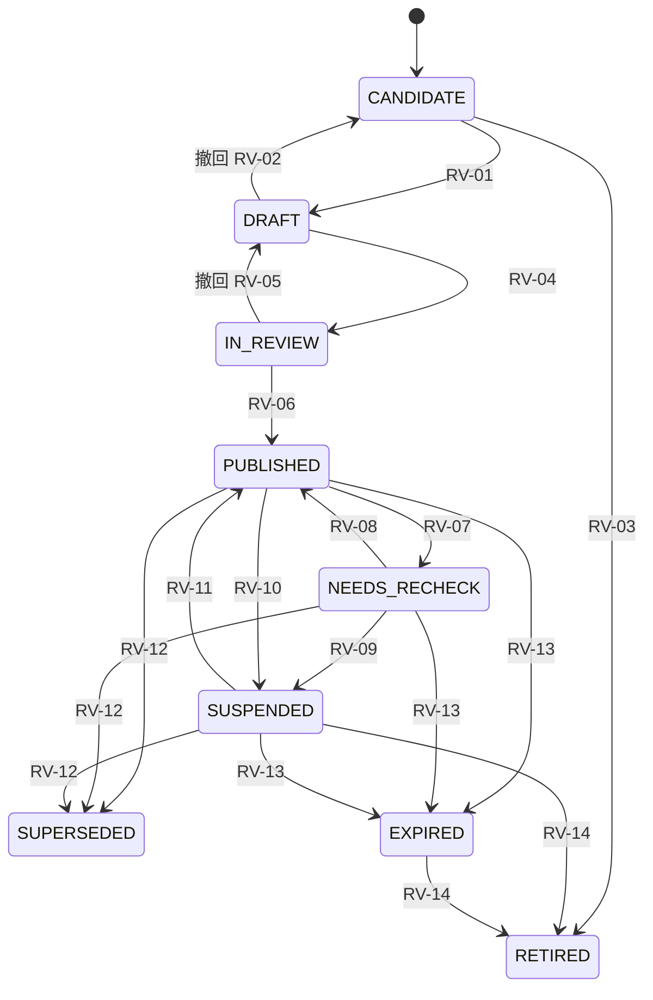
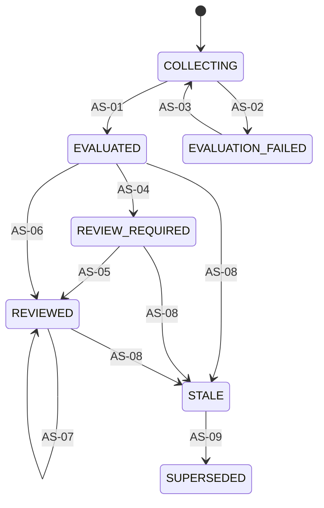
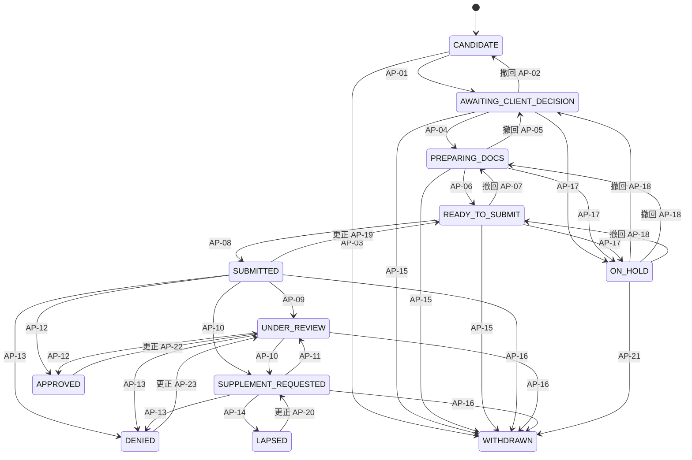
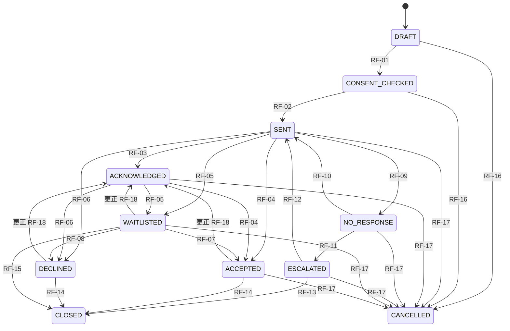
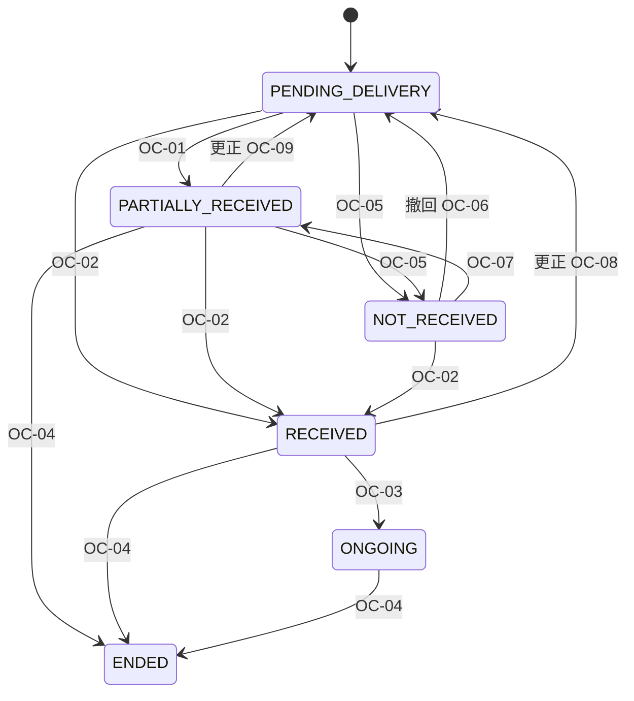
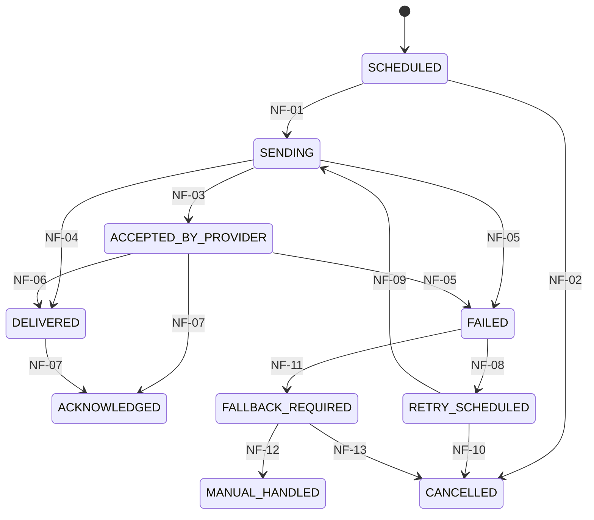

# 資料模型與狀態機
work_id：STP-PLATFORM-PLAN-001｜版本：v0.4-draft（R2 修正）｜2026-10-04
相關：[資源與資格引擎](RESOURCE_AND_ELIGIBILITY_ENGINE.md)｜[資料保護與營運](OPERATIONS_AND_PRIVACY.md)｜[架構](ARCHITECTURE.md)｜[合成範例](examples/README.md)

## 1. 共同約定

### 1.1 型別
| 型別 | 說明 |
|---|---|
| `uuid` | UUIDv7（時間排序），所有主鍵 |
| `text` / `text[]` | UTF-8 字串／陣列 |
| `enum(...)` | 資料庫 CHECK 約束或參照表 |
| `date` / `timestamptz` | 日期／含時區時間（存 UTC，顯示 Asia/Taipei） |
| `money_twd` | `numeric(12,0)`，新台幣元；區間以 `int4range` |
| `jsonb` | 結構化內容，必有 JSON Schema 驗證（例：規則條件） |
| `ref(X)` / `refs(X)` | 外鍵至 X／多個外鍵（陣列） |

### 1.2 資料分類
| 代碼 | 名稱 | 例 | 位置 |
|---|---|---|---|
| PUB | 公開 | 已發布資源資訊、規則白話說明 | 可進公開 repo（僅合成或公開來源資料） |
| INT | 內部 | 查核紀錄、草稿、工作人員帳號、任務（不含個案內容） | 私有資料庫 |
| PRV | 私有個案 | 家庭代稱、聯絡方式、需求、申請狀態 | 私有資料庫，欄位層級權限 |
| SEN | 敏感 | 所得、財產、健康、身心障礙、身分證號、證件影本、家暴／兒少保護資訊 | 私有資料庫加密欄位或私有物件儲存；最小存取 |

公開 GitHub 只能放 PUB 與合成資料（見 [OPERATIONS_AND_PRIVACY.md](OPERATIONS_AND_PRIVACY.md) §1）。

### 1.3 確認程度（confirmation_level）
| 代碼 | 意義 |
|---|---|
| C0 | 未知／未提供 |
| C1 | 本人或代理人自述 |
| C2 | 協助員查看文件（記錄文件類型與日期，不一定保存影本） |
| C3 | 官方或提供機構確認（例如核定書、機構回覆） |

資源資訊另用查核程度（verification_level）：V0 未查核候選、V1 公開來源整理、V2 公開來源＋人工複核（第二人）、V3 經承辦或提供機構確認。正式推薦至少 V2。

### 1.4 共同欄位
所有實體：`id uuid`、`created_at`、`created_by ref(StaffUser)|null`、`updated_at`、`row_version int`（樂觀鎖）、`is_synthetic bool default false`。
個案類實體（分類含 PRV／SEN）另有：`organization_id`（資料歸屬據點）、`retention_class`（對應 §1.6 的保存碼）、`deleted_at`（軟刪除，到期硬刪除）。

### 1.5 關係總覽
```mermaid
erDiagram
  Organization ||--o{ Resource : provides
  Source }o--o{ ResourceVersion : cites
  Resource ||--o{ ResourceVersion : versions
  ResourceVersion ||--o{ EligibilityRule : has
  ResourceVersion ||--o{ DocumentRequirement : requires
  ResourceVersion }o--o{ HouseholdScopeDefinition : uses
  Household ||--o{ Person : members
  Household ||--o{ ServiceCase : episodes
  Household ||--o{ Fact : facts
  Person ||--o{ Fact : facts
  Household ||--o{ Consent : grants
  ServiceCase ||--o{ Assessment : runs
  Assessment ||--o{ ReviewDecision : reviewed_by
  Assessment }o--o{ ResourceVersion : evaluates
  ServiceCase ||--o{ Application : files
  Application }o--|| ResourceVersion : targets
  Application ||--o{ Application : related
  ServiceCase ||--o{ Referral : sends
  Referral }o--|| Organization : to
  Application ||--o{ DocumentRecord : uses
  DocumentRequirement ||--o{ DocumentRecord : fulfilled_by
  Application ||--o| Outcome : results
  Referral ||--o| Outcome : results
  Outcome ||--o{ OutcomeEvent : events
  ServiceCase ||--o{ Task : has
  Task ||--o{ Notification : sends
  Notification ||--o{ NotificationEvent : callbacks
  ServiceCase ||--o{ Interaction : logs
  StaffUser ||--o{ AccessGrant : granted
```

### 1.6 共同規則適用表
下表是每個實體的預設規則；各實體小節只列例外。保存碼（RT-*）的期限數值見 [OPERATIONS_AND_PRIVACY.md](OPERATIONS_AND_PRIVACY.md) §1.4。
| 實體 | 分類 | 保存碼 | 刪除方式 | 去重 | 版本／更新策略 | 來源與確認程度 |
|---|---|---|---|---|---|---|
| Organization | PUB／INT | RT-REF | 不刪，停用 | 名稱正規化＋地址，人工合併 | 覆寫＋AuditEvent；容量保留確認日期 | V1～V3 |
| Source | PUB／INT | RT-REF | 不刪；快照依授權可刪 | URL 正規化＋內容雜湊 | 同 URL 新內容＝新快照列 | 來源層級 S1～S6 |
| Resource | PUB／INT | RT-REF | 不刪，RETIRED | 提供機構＋名稱＋地區候選比對，人工判斷 | 識別不變；`current_version_id` 指標 | 隨版本 |
| ResourceVersion | PUB／INT | RT-REF | 不刪 | `(resource_id, version_label)` 唯一 | 發布後不可變 | V0～V3 |
| EligibilityRule | PUB／INT | RT-REF | 不刪 | `(resource_version_id, rule_version)` 唯一 | 發布後不可變 | 作者≠審查者 |
| HouseholdScopeDefinition | PUB | RT-REF | 不刪 | `scope_key` 唯一 | 發布後不可變 | `source_ref` |
| DocumentRequirement | PUB | RT-REF | 不刪 | `(resource_version_id, doc_type_key, applies_to)` | 隨版本不可變 | `source_ref` |
| Household | PRV／SEN | RT-CASE | 軟刪→硬刪 | 指紋提示＋人工合併（不自動） | 覆寫＋AuditEvent；合併留 `merged_into_id` | C1 起 |
| Person | PRV／SEN | RT-CASE | 同上 | 同戶內關係＋稱呼＋歲數提示 | 覆寫＋AuditEvent | `info_source` |
| Fact | PRV／SEN | RT-CASE；撤回時 SEN 類 RT-SEN-REVOKED | 同上（含歷史版本） | `(subject, fact_key)` 現值唯一 | append-only，新值 supersede 舊值 | C0～C3 |
| Consent | PRV | RT-CASE（保留撤回紀錄作為證據） | 個案刪除時只留去識別化事件 | 無（每次新增） | 不改既有欄位；撤回只補撤回欄位 | 方式與見證人 |
| ServiceCase | PRV | RT-CASE | 軟刪→硬刪 | 同家庭多 episode 允許 | 覆寫＋AuditEvent | — |
| Assessment | PRV／SEN | RT-CASE；快照撤回時 RT-SEN-REVOKED | 同上 | 60 秒內同輸入回傳既有 | 不可變 | 輸入確認程度在快照內 |
| ReviewDecision | PRV | RT-CASE | 同上 | 無 | append-only | 複核人≠承辦 |
| Application | PRV | RT-CASE | 同上 | §2.13 唯一約束 | 欄位覆寫＋AuditEvent；狀態只經轉換 | 本人確認欄位、核准證據 A1～A3 |
| Referral | PRV | RT-CASE | 同上 | §2.14 唯一約束 | 同上 | 對方回覆紀錄 |
| Outcome／OutcomeEvent | PRV | RT-CASE | 同上 | 每個申請／轉介一筆；事件 append-only | 更正以 CORRECTION 事件作廢，不刪除 | 取得證據 E1～E3＋第二人驗證 |
| DocumentRecord | PRV／SEN | 紀錄 RT-CASE；檔案 RT-DOC | 檔案硬刪＋金鑰輪替紀錄；紀錄保留狀態 | `(application, requirement, person)` 唯一 | 狀態覆寫；檔案每次上傳為新物件，舊版 7 天後刪 | C2 查看紀錄 |
| Task | INT | RT-CASE | 隨案件 | `dedup_key` | 覆寫＋AuditEvent | — |
| Notification／NotificationEvent | PRV／INT | RT-NOTIF | 內容摘要到期硬刪，保留統計 | `idempotency_key`；事件 `(provider, provider_event_id)` | 狀態經轉換；事件 append-only | 供應商回呼 |
| AuditEvent／AccessGrant | INT | RT-AUDIT | 日常禁止；僅受控清除（§2.20） | 無 | append-only | — |
| ControlRecord／DeletionLedger | INT | RT-CTRL／RT-LEDGER | 到期受控清除 | `seq` 連號 | append-only（外部） | — |
| ReportRun | INT | RT-REPORT | 不刪 | 無 | 不覆寫，另立新版本 | 版本欄位見 §2.21 |
| ScreeningSession／HelpRequest | PRV | RT-SESSION／RT-LEAD | 到期硬刪 | token／同 session 一筆 | 覆寫 | C1 |
例外：任何實體的 `is_synthetic=true` 資料不得進入正式環境與正式報表。

## 2. 實體規格
每個實體列：欄位（型別／必填／分類）、識別與關聯、資料來源與確認程度、更新保存刪除、去重與版本。

### 2.1 Organization（機構）
| 欄位 | 型別 | 必填 | 分類 | 說明 |
|---|---|---|---|---|
| name | text | 是 | PUB | 正式名稱 |
| org_type | enum(GOV_CENTRAL, GOV_LOCAL, PUBLIC_AGENCY, NGO, SCHOOL, HOSPITAL, PARTNER_SITE, OTHER) | 是 | PUB | |
| jurisdiction | text[] | 否 | PUB | 行政區代碼（內政部行政區代碼） |
| public_contacts | jsonb | 否 | PUB | 公開電話、地址、網址 |
| partnership_status | enum(NONE, CONTACTED, IN_DISCUSSION, AGREEMENT_SIGNED, ENDED) | 是 | INT | 預設 NONE；未簽署不得標示合作 |
| internal_contacts | jsonb | 否 | INT | 承辦窗口（工作聯絡方式） |
| capacity_status | enum(OPEN, LIMITED, FULL, UNKNOWN) | 是 | INT | 預設 UNKNOWN |
| capacity_confirmed_at / capacity_confirmed_via | timestamptz / text | 否 | INT | 超過 30 天自動回到 UNKNOWN |
- 識別：`id`；唯一鍵（name 正規化＋jurisdiction）。
- 來源：公開資料（V1）或電話確認（V3）。
- 保存：機構資料長期保存；終止合作改狀態不刪。
- 去重：名稱正規化（全半形、空白、「臺／台」）＋地址比對，人工合併。

### 2.2 Source（來源）—補充實體
| 欄位 | 型別 | 必填 | 分類 | 說明 |
|---|---|---|---|---|
| url_or_ref | text | 是 | PUB | URL 或「電話確認：某單位某日」 |
| source_type | enum(WEB_PAGE, PDF, ANNOUNCEMENT, REGULATION, FORM, PHONE_CONFIRMATION, EMAIL_CONFIRMATION, IN_PERSON) | 是 | PUB | |
| tier | enum(S1_LAW, S2_CENTRAL, S3_LOCAL, S4_PUBLIC_AGENCY, S5_NGO, S6_SECONDARY) | 是 | PUB | 見 [RESOURCE_AND_ELIGIBILITY_ENGINE.md](RESOURCE_AND_ELIGIBILITY_ENGINE.md) §2 |
| publisher_org_id | ref(Organization) | 否 | PUB | |
| published_at / source_updated_at | date | 否 | PUB | 原文標示日期；無則 UNKNOWN |
| retrieved_at | timestamptz | 是 | INT | |
| content_hash | text | 否 | INT | 正規化內容 SHA-256，用於變動偵測 |
| snapshot_ref | text | 否 | INT | 私有物件儲存中的快照（PDF／HTML）；授權不明時只存雜湊與摘錄 |
| fetch_policy | enum(MANUAL_ONLY, MANUAL_CHECK_LINK, AUTO_HASH_ALLOWED) | 是 | INT | 預設 MANUAL_ONLY；只有確認網站條款與 robots 允許才可 AUTO |
| status | enum(ACTIVE, MOVED, BROKEN, SUPERSEDED) | 是 | INT | |
- 去重：URL 正規化（去追蹤參數、尾斜線）；相同內容雜湊不同 URL 標記 `duplicate_of`。
- 保存：長期；快照依著作權與授權保存，僅內部查核使用。

### 2.3 Resource（資源）
| 欄位 | 型別 | 必填 | 分類 | 說明 |
|---|---|---|---|---|
| canonical_name | text | 是 | PUB | 跨年度不變的方案名稱 |
| provider_org_id | ref(Organization) | 是 | PUB | |
| level | enum(CENTRAL, LOCAL, PRIVATE) | 是 | PUB | |
| categories | enum[] (LIVING, EMERGENCY, CHILD_YOUTH, EDUCATION, FOOD_GOODS, HOUSING, EMPLOYMENT, HEALTH, CARE, LEGAL, OTHER) | 是 | PUB | |
| current_version_id | ref(ResourceVersion) | 否 | PUB | 目前發布版本 |
| lifecycle_status | enum(ACTIVE, SUSPENDED, RETIRED) | 是 | PUB | 由目前版本衍生：目前版本 PUBLISHED／NEEDS_RECHECK→ACTIVE；SUSPENDED 或無可用版本→SUSPENDED；全部版本封存→RETIRED。是否可正式推薦不看此欄，見引擎文件 §0 |
| owner_staff_id | ref(StaffUser) | 是 | INT | 維護責任人 |
| risk_tier | enum(HIGH, MEDIUM, LOW) | 是 | INT | 決定查核頻率 |
| next_review_due | date | 是 | INT | |
- 識別：`id`；`resource_key` 人類可讀鍵（例：`TW-DEMO-LIVING-001`），唯一。
- 去重：同一提供機構＋同名正規化＋同地區 → 候選重複，R5 人工判斷；「同一方案不同年度」是同一 Resource 的不同 ResourceVersion，不是新 Resource。
- 保存：不刪除，只 RETIRED。

### 2.4 ResourceVersion（資源版本）
| 欄位 | 型別 | 必填 | 分類 | 說明 |
|---|---|---|---|---|
| resource_id | ref(Resource) | 是 | PUB | |
| version_label | text | 是 | PUB | 例：`2026.1`、`2027-年度` |
| effective_from / effective_to | date | 否 | PUB | 生效起日／截止日；未知則 null＋`effective_unknown=true`（期限不明，不進正式推薦，只供人工查核） |
| effective_unknown | bool | 是 | PUB | 正式定義見 §2.4.1；必須等於「`effective_to` 為空」，不一致即資料不合法 |
| recheck_started_at | date | NEEDS_RECHECK 時必填 | INT | 複查寬限起算日，正式定義見 §2.4.1；其他狀態必為空 |
| application_window | jsonb | 是 | PUB | `{type: ROLLING｜FIXED（ranges[{from,to}]，可多段）｜WITHIN_MONTHS_OF_EVENT（months，由條件判斷）｜UNKNOWN}`；UNKNOWN 不進正式推薦 |
| benefit_period_rule | jsonb | 否 | PUB | 給付期間與續辦規則：`{period_type, renewal{required(bool), lead_days, new_application_each_period(bool)}}`；續辦提醒讀取 `benefit_period_rule.renewal.lead_days` |
| regions | text[] | 是 | PUB | 適用行政區代碼；未知則 `["UNKNOWN"]` 並禁止發布 |
| summary_plain | text | 是 | PUB | 白話摘要（AI 可起草，需 R5 確認） |
| service_content | text | 是 | PUB | 原文摘要 |
| amount_or_service | jsonb | 否 | PUB | 金額、次數或服務內容；未知標 UNKNOWN |
| how_to_apply | jsonb | 是 | PUB | `{channels[], where, hours, proxy_allowed(YES／NO／CONDITIONAL／UNKNOWN)}`；channels 為臨櫃／郵寄／線上／據點轉介等 |
| contact_points | jsonb | 是 | PUB | 公開窗口 |
| stacking_rules | jsonb | 否 | PUB | 併領／排除／相依（見引擎文件 §7） |
| household_scope_ids | refs(HouseholdScopeDefinition) | 否 | PUB | 此版本使用的家庭與所得財產口徑 |
| capacity_note | text | 否 | PUB | 名額資訊；民間資源預設「需電話確認」 |
| capacity_status / capacity_confirmed_at | enum(OPEN, LIMITED, FULL, UNKNOWN) / date | 是／否 | PUB | 服務層級名額；預設 UNKNOWN；超過 30 天未確認自動回 UNKNOWN（機構整體容量見 Organization） |
| source_ids | refs(Source) | 是 | PUB | 至少 1 個 |
| source_excerpt_map | jsonb | 是 | INT | 每個欄位或條件 → 來源與原文摘錄位置 |
| verification_level | enum(V0..V3) | 是 | INT | 發布與正式推薦需 ≥V2 |
| conflict_status | enum(NONE, OPEN, RESOLVED) | 是 | INT | 來源衝突標記；OPEN 時不得發布，已發布者須暫停（引擎文件 §0、§9） |
| verified_by / verified_at / verification_method | ref / timestamptz / text | 發布時必填 | INT | |
| published_by / published_at | ref / timestamptz | 發布時必填 | INT | published_by ≠ verified_by |
| status | 見 §3.1 | 是 | PUB | |
| supersedes_version_id | ref(ResourceVersion) | 否 | PUB | 版本鏈 |
| change_summary | text | 否 | INT | 與上一版差異 |
- 不可變：發布後內容不可修改；修正必須建新版本（錯字修正可建 `patch` 版本並標記 `non_material=true`，不觸發重評）。`recheck_started_at` 是狀態轉換（RV-07、RV-08）寫入的**系統欄位**，不屬於「內容」，不受不可變限制。
- 保存：永久（評估可追溯所需）。

#### 2.4.1 必要欄位的正式定義與派生欄位
下表是 `recommendation_status`（引擎 §0.2）使用的欄位與派生值的單一定義；結構（型別、必要、列舉、未知鍵）另由 [schemas/resource_version.schema.json](schemas/resource_version.schema.json) 以 `tools/schema_lite.py` 驗證，**跨欄位規則**（如 `effective_unknown`）由 `examples/ref_engine.py` 驗證。結構驗證器只涵蓋它描述的結構，不等於驗證了全部語意。
| 欄位／派生值 | 型別 | 必填 | 類別 | 來源 | 更新時機 | 版本控管 |
|---|---|---|---|---|---|---|
| `effective_unknown` | bool | 是 | 輸入（人工） | R5 建立版本時依來源判斷「截止日是否未知」 | 發布前可改；發布後不可變（需新版本） | 隨 ResourceVersion 不可變 |
| `recheck_started_at` | date | NEEDS_RECHECK 時必填 | 系統寫入 | RV-07 的觸發事件時間（Asia/Taipei 日期），寫入同一交易並留 AuditEvent | RV-07 寫入；RV-08 清除；RV-09 暫停時保留供稽核 | 不隨版本內容；隨轉換歷史（AuditEvent） |
| `rule.expression`（CUSTOM） | tree | `combinator=CUSTOM` 時必填 | 輸入（人工） | R5 撰寫、R4 或第二人審查 | 規則發布前可改；發布後不可變 | 隨 EligibilityRule `rule_version` |
| 派生：`effective_unknown` 一致性 | bool | — | 派生 | 演算法：`effective_unknown == (effective_to is null)`，不一致 → `VERSION_INVALID` | 每次 `recommendation_status` 判定 | 引擎版本 |
| 派生：複查已過天數 | int | — | 派生 | 演算法：`(as_of 日期) − recheck_started_at`（日曆天）；缺少 → `RECHECK_START_MISSING`；格式不合或晚於 `as_of` → `RECHECK_START_INVALID`；`> 14` → `RECHECK_GRACE_EXCEEDED`（OP-08）；`risk_tier=HIGH` → `RECHECK_HIGH_RISK` | 每次判定 | 引擎版本；寬限天數為暫行參數（OP-08） |
| 派生：`catalog_visibility`、`recommendation_status` | enum | — | 派生 | 引擎 §0.1、§0.2 | 每次判定 | 引擎版本 |
API 欄位同步：`GET /api/admin/versions/{id}/recommendation` 回傳 `recommendation`、`reasons[]`、`flags[]`、`as_of`；建立與轉換版本的 API 欄位為上表與 §2.4 欄位（見 ARCHITECTURE §6）。

### 2.5 EligibilityRule（資格規則）
| 欄位 | 型別 | 必填 | 分類 | 說明 |
|---|---|---|---|---|
| resource_version_id | ref | 是 | PUB | |
| rule_version | text | 是 | PUB | 語意化版本 `1.0.0`；同資源版本內修正規則也遞增 |
| criteria | jsonb | 是 | PUB | 條件陣列，格式見 [RESOURCE_AND_ELIGIBILITY_ENGINE.md](RESOURCE_AND_ELIGIBILITY_ENGINE.md) §5 |
| combinator | enum(ALL, ANY, CUSTOM) | 是 | PUB | CUSTOM 需 `expression`；ALL／ANY 不得有 `expression` |
| expression | tree | CUSTOM 時必填 | PUB | 節點是條件 ID 字串，或 `{op: ALL｜ANY, children: [節點…]}`（`children` 非空）；必須恰好引用每個 `criterion_id` 一次；定義與驗證見引擎 §5.5、[schemas/eligibility_rule.schema.json](schemas/eligibility_rule.schema.json) |
| authored_by / reviewed_by | ref | 是 | INT | 不可同一人 |
| test_cases | jsonb | 是 | INT | 至少：一個可能符合、一個資料不足、一個可能不符合 |
| authoring_origin | enum(HUMAN, AI_DRAFT_HUMAN_EDITED) | 是 | INT | AI 草稿未經人工審核不得發布 |
| status | enum(DRAFT, IN_REVIEW, PUBLISHED, RETIRED) | 是 | INT | **必填，無預設值**：缺少時視為不可推薦（`RULE_STATUS_MISSING`），不得預設為 PUBLISHED |
- 不可變：發布後不可修改。
- 每個 criterion 必須有 `source_ref` 指向 Source 原文位置；沒有來源的條件不得存在。

### 2.6 HouseholdScopeDefinition（家庭口徑定義）—補充實體
| 欄位 | 型別 | 必填 | 分類 | 說明 |
|---|---|---|---|---|
| scope_key | text | 是 | PUB | 例：`SCOPE-L1` |
| member_inclusion | jsonb | 是 | PUB | 計入成員規則：關係（配偶、直系血親…）、是否需同戶籍、是否需共同生活、年齡、就學、服役等排除條件 |
| income_definition | jsonb | 是 | PUB | 所得項目、計算期間（月平均／年度）、是否含工作能力推估所得等；未知處標 UNKNOWN |
| property_definition | jsonb | 否 | PUB | 動產、不動產計算方式 |
| source_ref | jsonb | 是 | PUB | |
- **支援範圍**：`member_inclusion` 與 `income_definition` 內只有引擎 §5.3 表列的鍵被實作；規格雖提到年齡、就學、服役與工作能力推估所得，但**目前未支援**，出現即報錯並使規則不可推薦（`RULE_INVALID`），不得默默忽略。結構見 [schemas/household_scope.schema.json](schemas/household_scope.schema.json)。
- 不同方案各自定義；**禁止**共用一個「預設家庭口徑」。若兩方案確實引用相同法規條文，可共用同一 scope_key，但仍各自連結來源。

### 2.7 Household（家庭）
| 欄位 | 型別 | 必填 | 分類 | 說明 |
|---|---|---|---|---|
| display_alias | text | 是 | PRV | 內部代稱（例：「林家-A12」），報表不用 |
| region_code | text | 是 | PRV | 快取欄位：由 Fact `household.region_code` 的現值同步（只由系統寫入），供篩選與路由；評估一律讀 Fact，未知填 `UNKNOWN` |
| primary_contact_person_id | ref(Person) | 否 | PRV | |
| contact_preferences | jsonb | 否 | PRV | 管道順序、安全時段、可否留言、是否不可寄信到家 |
| case_code | text | 是 | PRV | 對外短代號（不含個資），唯一 |
| baseline_resources | jsonb | 是 | PRV | 建案時已使用資源：`[{resource_key或自由名稱, since(date｜UNKNOWN), source, confirmation_level}]`；用於判斷「新增」（`since` 未知視為「未確認是否新增」，另列） |
| safety_flags | enum[] (DV_RISK, CHILD_PROTECTION, DO_NOT_CONTACT_AT_HOME, OTHER) | 否 | SEN | 只顯示給 R3／R4 |
| dedup_fingerprint | text | 否 | PRV | 私鑰 HMAC（姓名正規化＋生日＋電話後四碼），只用於比對 |
| merged_into_id | ref(Household) | 否 | PRV | |
- 識別：`id`；對外代號 `case_code`。
- 去重：建案時以 dedup_fingerprint 提示可能重複，R3 確認合併，保留 AuditEvent；不自動合併。
- 保存：見 §1.6。

### 2.8 Person（成員）
| 欄位 | 型別 | 必填 | 分類 | 說明 |
|---|---|---|---|---|
| household_id | ref(Household) | 是 | PRV | 同一人在多個家庭（例如分居父母）以 `person_link_id` 關聯 |
| person_link_id | uuid | 否 | PRV | 跨家庭同一人的連結（人工確認後設定） |
| display_name | text | 否 | PRV | 可只填稱呼 |
| relation_to_primary | enum(SELF, SPOUSE, PARTNER, CHILD, PARENT, GRANDPARENT, GRANDCHILD, SIBLING, OTHER_RELATIVE, NON_RELATIVE, UNKNOWN) | 是 | PRV | 未知填 UNKNOWN，不得省略 |
| relation_confirmation_level | enum(C0..C3) | 是 | INT | |
| info_source | enum(SELF, PROXY_BY_APPLICANT, DOCUMENT_VIEWED, AGENCY) | 是 | INT | 成年成員資料由申請人代述時為 PROXY_BY_APPLICANT（限制處理見 [OPERATIONS_AND_PRIVACY.md](OPERATIONS_AND_PRIVACY.md) §1.3，法律待確認 U-19） |
| birth_year_month | text | 否 | PRV | 申請時才需要；初篩只收歲數 |
| national_id | text（應用層加密） | 否 | SEN | 只在該方案申請確需時收集；預設不收 |
- **口徑相關屬性不放在 Person**：歲數（`person.age`）、是否在學（`person.in_school`）、是否共同生活（`person.co_residing`）、是否同戶籍（`person.same_household_registration`）、各項所得（`person.monthly_earned_income` 等）一律以 Fact 記錄，以保留各自的確認程度與歷史。是否計入某方案的家庭，由評估時依 HouseholdScopeDefinition 計算，Person 不存「是否計入」。
- 識別：`id`；去重：同一 household 內以「關係＋稱呼＋歲數」提示重複，人工合併。
- 更新：覆寫＋AuditEvent；保存與刪除見 §1.6。

### 2.9 Fact（事實陳述）—補充實體
| 欄位 | 型別 | 必填 | 分類 | 說明 |
|---|---|---|---|---|
| subject_type / subject_id | enum(HOUSEHOLD, PERSON) / uuid | 是 | PRV | |
| fact_key | text | 是 | 依字彙 | 必須存在於 FactKeyDefinition（§2.21），例：`household.region_code`、`person.age`、`person.co_residing`、`person.monthly_earned_income` |
| value | jsonb | 是 | 依字彙 | 值；未知 `{"unknown":true}`；拒答 `{"declined":true}`；不支援區間以外的自由格式 |
| confirmation_level | enum(C0..C3) | 是 | INT | 未知或拒答為 C0 |
| source | enum(SELF, PROXY_BY_APPLICANT, DOCUMENT_VIEWED, AGENCY) | 是 | INT | |
| evidence_note | text | 否 | PRV | 例：「查看 2026/9 薪資單」 |
| observed_period | daterange | 否 | PRV | 數值所指期間 |
| valid_from / superseded_at | timestamptz | 是／否 | INT | 新值不覆蓋舊值，形成歷史 |
| entered_by / channel | ref(StaffUser)｜null / enum(SELF_ONLINE, PHONE, IN_PERSON, PAPER) | 是 | INT | |
- 唯一：同 subject＋fact_key 只能有一筆 `superseded_at is null`（partial unique index）。
- 區間值：`{"min":..,"max":..}` 只有在整段落在門檻同一側時才可判斷，否則該條件為 UNKNOWN。
- 保存：隨案件；撤回同意時 SEN 類依 RT-SEN-REVOKED 刪除（含歷史版本，見 [OPERATIONS_AND_PRIVACY.md](OPERATIONS_AND_PRIVACY.md) §1.4）。

### 2.10 Consent（同意與代理授權）
| 欄位 | 型別 | 必填 | 分類 | 說明 |
|---|---|---|---|---|
| household_id / grantor_person_id | ref(Household) / ref(Person) | 是 | PRV | |
| purposes | enum[] (CONTACT, SCREENING, CASE_MANAGEMENT, APPLICATION_ASSIST, REFERRAL_SHARE, DOCUMENT_STORAGE, DOCUMENT_EXTRACTION, REMINDERS, ANONYMIZED_REPORTING, AI_ASSIST_DEIDENTIFIED) | 是 | PRV | 用途別，逐項勾選；DOCUMENT_EXTRACTION 指本機文字辨識輔助，不含外部 AI |
| share_targets | refs(Organization) | 否 | PRV | REFERRAL_SHARE 對象 |
| data_categories | enum[] (CONTACT_INFO, HOUSEHOLD_COMPOSITION, INCOME_ASSET, HEALTH_DISABILITY, IDENTITY_DOCUMENTS, SAFETY_FLAGS, CASE_NOTES) | 是 | PRV | 可處理的資料類別 |
| reminder_channels | enum[] (PHONE, SMS, EMAIL, LINE, PAPER_MAIL, IN_PERSON) | 否 | PRV | |
| proxy | jsonb | 否 | PRV | `{proxy_person_id, basis_type(WRITTEN_AUTH／LEGAL_REP／GUARDIANSHIP／OTHER), scope[VIEW／EDIT／CONTACT／ACCOMPANY_SUBMIT], valid_from, valid_to, confirmed_by_staff_id}`；只記依據類型與查看人，不強制保存影本 |
| method | enum(SIGNED_PAPER, VERBAL_RECORDED_BY_STAFF, ELECTRONIC_CHECKBOX) | 是 | PRV | |
| consent_text_version | text | 是 | INT | 對應同意書版本 |
| granted_at / expires_at | timestamptz | 是／否 | PRV | |
| witnessed_by_staff_id | ref(StaffUser) | 口頭時必填 | INT | |
| superseded_by_id | ref(Consent) | 否 | INT | 修改同意＝新增新紀錄，舊紀錄指向新紀錄 |
| revoked_at | timestamptz | 撤回時必填 | PRV | 提出撤回的時間 |
| revocation_effective_at | timestamptz | 撤回時必填 | PRV | 系統開始停止處理的時間（同日） |
| revoked_purposes | enum[] | 撤回時必填 | PRV | 部分撤回只列被撤回的用途；全部撤回＝全部用途 |
| revocation_scope | enum(ALL, PARTIAL) | 撤回時必填 | PRV | |
| revoked_by_person_id | ref(Person) | 撤回時必填 | PRV | 本人或代理人 |
| revocation_channel | enum(PHONE, IN_PERSON, PAPER, EMAIL, OTHER) | 撤回時必填 | PRV | |
| revocation_recorded_by_staff_id | ref(StaffUser) | 撤回時必填 | INT | |
| revocation_reason | text | 否 | PRV | 本人自願提供才記錄 |
| revocation_cleanup | jsonb | 撤回時必填 | INT | 清除清單（對應 [OPERATIONS_AND_PRIVACY.md](OPERATIONS_AND_PRIVACY.md) §1.3 副本清冊）：每項 `{copy_id, action, status(PENDING／DONE／EXCEPTION), done_at, exception_basis}` |
| recipient_notices | jsonb | 否 | PRV | 已分享機構的停止使用通知：`{org_id, task_id, sent_at, acknowledged_at}` |
- 唯一識別：`id`；同一 household 同時有效的同意可有多筆（不同用途或對象）。
- 版本策略：同意紀錄不修改、不刪除（作為處理合法性證據）；修改＝新增並 supersede；撤回是在原紀錄上補撤回欄位（只增不改既有欄位）。個案刪除時，保留去識別化的同意／撤回事件（僅 ID、時間、用途），見 §1.6。
- 系統檢查：每次分享、提醒、AI 呼叫（若啟用）、文件上傳、文字辨識前檢查對應 purpose 有效且未過期。

### 2.11 ServiceCase（服務案件）—補充實體
| 欄位 | 型別 | 必填 | 分類 | 說明 |
|---|---|---|---|---|
| household_id | ref(Household) | 是 | PRV | |
| source_channel | enum(SELF_HELP, PARTNER_INVITE, THIRD_PARTY_REFERRAL, PHONE, WALK_IN, PAPER) | 是 | PRV | |
| owner_staff_id / backup_staff_id | ref(StaffUser) | 進行中案件必填 | INT | 兩者不同人 |
| next_action / next_action_due | text / date | 進行中案件必填（DB 約束） | INT | |
| last_contact_at / next_follow_up_at | timestamptz / date | 否 | INT | |
| status | enum(OPEN, URGENT, WAITING_EXTERNAL, LOST_CONTACT, PAUSED, CLOSED) | 是 | PRV | |
| close_reason | enum(ALL_RESOLVED, CLIENT_WITHDREW, LOST_CONTACT_90D, TRANSFERRED, PILOT_HANDOVER, CONSENT_REVOKED, OTHER) | 結案時必填 | PRV | |
- 同一家庭可有多個 episode（例如一年後續辦）；報表以家庭去重。

### 2.12 Assessment（評估）
| 欄位 | 型別 | 必填 | 分類 | 說明 |
|---|---|---|---|---|
| case_id｜screening_session_id | ref(ServiceCase)｜ref(ScreeningSession) | 二擇一 | PRV | |
| trigger | enum(INITIAL, USER_UPDATE, RESOURCE_CHANGE, RENEWAL, MANUAL) | 是 | INT | |
| input_snapshot | jsonb | 是 | SEN | 評估當下使用的 Fact 值與確認程度（凍結副本）；撤回同意時依 RT-SEN-REVOKED 刪除 |
| input_hash | text | 是 | INT | |
| engine_version | text | 是 | INT | |
| as_of | date | 是 | INT | 評估基準日（期限判斷用） |
| results | jsonb | 是 | PRV | 每個資源一筆：`resource_version_id`、`rule_version`、`result`(LIKELY_ELIGIBLE／INSUFFICIENT_DATA／LIKELY_INELIGIBLE)、`unconfirmed`(bool)、`criteria_results[]`、`known_failures[]`、`missing_inputs[]`、`human_check_points[]`、`flags[]`、`recommendation{status(FORMAL／MANUAL_CHECK_ONLY／NOT_RECOMMENDED), reasons[]}`、`rank_score`、`rank_reasons`；逐條理由含數值，視為 SEN |
| status | 見 §3.2 | 是 | PRV | |
- 不可變：結果寫入後不修改；複核以 ReviewDecision（§2.21）追加，原結果保留。
- 重現：以 input_snapshot＋版本＋as_of 可重算，結果須一致（測試要求）。
- 去重：相同 (case_id, input_hash, 版本清單, as_of) 於 60 秒內重複請求回傳既有結果。

### 2.13 Application（申請）
| 欄位 | 型別 | 必填 | 分類 | 說明 |
|---|---|---|---|---|
| case_id / household_id | ref(ServiceCase) / ref(Household) | 是 | PRV | |
| resource_id / resource_version_id | ref(Resource) / ref(ResourceVersion) | 是 | PRV | 版本以啟動時為準，升版需記錄（`version_history` jsonb） |
| applicant_person_id | ref(Person) | 是 | PRV | |
| benefit_period_key | text | 是 | PRV | 例：`2026`、`2026H2`、`ONE_TIME:2026-10` |
| kind | enum(ORIGINAL, REAPPLY, APPEAL, SUPPLEMENTARY) | 是 | PRV | 重新申請、救濟（申復、訴願等依通知所載管道）、補領或差額等補充申請 |
| related_application_id | ref(Application) | kind≠ORIGINAL 時必填 | PRV | |
| relation_reason | text | kind≠ORIGINAL 時必填 | PRV | 理由；kind 為 SUPPLEMENTARY 且原件已 APPROVED 時須 R4 核可 |
| relation_approved_by | ref(StaffUser) | 條件必填 | INT | |
| assessment_id | ref(Assessment) | 否 | PRV | 啟動依據 |
| approval_evidence | jsonb | APPROVED 時必填 | PRV | `{level(A1／A2／A3), type, date, viewed_by}`；與取得證據分開 |
| client_confirmed_at | timestamptz | READY_TO_SUBMIT 前必填 | PRV | 本人或代理人確認申請內容的時間 |
| confirmed_by_person_id | ref(Person) | 同上 | PRV | 確認者（本人或代理人） |
| confirmation_method | enum(IN_PERSON_SIGNED, IN_PERSON_VERBAL_RECORDED, PHONE_VERBAL_RECORDED, ELECTRONIC) | 同上 | PRV | |
| confirmed_as_proxy / proxy_consent_id | bool / ref(Consent) | 同上 | PRV | 代理確認時必填 proxy_consent_id |
| confirmation_witness_staff_id | ref(StaffUser) | 同上 | INT | |
| confirmed_content_hash | text | 同上 | INT | 確認時的申請內容雜湊；內容之後變更即清除確認 |
| status | 見 §3.3 | 是 | PRV | |
| held_from / held_reason | enum(狀態) / enum(LOST_CONTACT, CAPACITY_FULL, RESOURCE_SUSPENDED, WINDOW_NOT_OPEN, OTHER) | ON_HOLD 時必填 | PRV | |
| submission | jsonb | SUBMITTED 後必填 | PRV | `{channel, submitted_on, submitted_by(CLIENT／ACCOMPANIED／AUTHORIZED_PROXY), receipt_type, receipt_ref, voided(bool)}` |
| supplement_requests | jsonb[] | 否 | PRV | `{requested_at, items, due_on, completed_at, internal_overdue_flag}`；內部逾期只設旗標與升級，不改狀態 |
| decision | jsonb | 否 | PRV | 結果、日期、理由摘要 |
| idempotency_key | text | 是 | INT | 建立請求冪等 |
- **唯一約束與建立規則**（`examples/ref_engine.py` 的 `application_create_allowed` 與 `engine_cases.json` 的 `application_cases` 為可執行規格）：
  - `kind=ORIGINAL`：`unique(household_id, resource_id, benefit_period_key)` where `kind='ORIGINAL'`，**不論既有申請處於何種狀態**（含 APPROVED、DENIED、WITHDRAWN）至多一件。因此已核准或已被不核准後，不得直接再建立 ORIGINAL。
  - `kind=REAPPLY`：連結原件（`related_application_id`），原件須為 DENIED、WITHDRAWN 或 LAPSED，必填理由。
  - `kind=APPEAL`（救濟）：原件須為 DENIED 或 LAPSED，必填理由；依通知所載管道辦理，平台只記錄。
  - `kind=SUPPLEMENTARY`（補領、差額）：原件須為 APPROVED，必填理由並由 R4 核可（`relation_approved_by`）。
  - 同一 `(related_application_id, kind)` 在非 DENIED／WITHDRAWN／LAPSED 的狀態下只能有一件（partial unique index）。
  - 違反時 API 回 409 並附既有申請與可行的 kind，不建立新件。

#### 2.13.1 依 kind 的送件前檢查（AP-06；排除申請本身）
AP-06 的「防重複」**不是**「無任何同鍵已核准申請」。同鍵申請本來就可能存在：SUPPLEMENTARY 必須連結 APPROVED 的原件，若一律擋同鍵已核准的申請，合法的補領永遠無法送件。檢查必須**依 `kind` 分別進行，並排除正在檢查的這件申請本身**（`application_ready_check(existing, app_id)`）：
| kind | 通過條件（皆排除申請本身） | 對應原因碼 |
|---|---|---|
| ORIGINAL | 同家庭、同資源、同給付期間沒有其他 ORIGINAL（**不論任何狀態**） | 建立：`ORIGINAL_EXISTS_<狀態>`；AP-06：`ORIGINAL_DUPLICATE_<狀態>` |
| REAPPLY | 有關聯原件與理由；原件同家庭、同資源、同給付期間，狀態為 DENIED／WITHDRAWN／LAPSED；且無其他進行中的同種關聯件 | `RELATION_REQUIRED`、`RELATED_NOT_FOUND`、`RELATION_MISMATCH_HOUSEHOLD／RESOURCE／PERIOD`、`RELATED_STATE_INVALID_<狀態>`、`DUPLICATE_RELATED` |
| APPEAL | 同上，但原件須為 DENIED 或 LAPSED | 同上 |
| SUPPLEMENTARY | 同上，但原件須為 **APPROVED**，且已由 R4 核可（`relation_approved_by` 有值） | 同上，加 `R4_APPROVAL_REQUIRED` |
可執行規格：`examples/ref_engine.py` 的 `application_create_allowed`（建立時）與 `application_ready_check`（AP-06）；案例 `application_cases`、`application_ready_cases`、`application_lifecycle_cases`（SUPPLEMENTARY：建立→準備→READY_TO_SUBMIT 的正例，以及無核准、關係錯誤、重複關聯的反例；T-59）。狀態機轉換 AP-06 的前置條件由 `state_machines.json` 產生，不手改。
- 保存：依 retention_class。

### 2.14 Referral（轉介）
| 欄位 | 型別 | 必填 | 分類 | 說明 |
|---|---|---|---|---|
| case_id | ref(ServiceCase) | 是 | PRV | |
| to_organization_id / service_resource_id | ref(Organization) / ref(Resource) | 是 | PRV | |
| consent_id | ref(Consent) | 是 | PRV | 必須含 REFERRAL_SHARE 且對象相符 |
| shared_fields | text[] | 是 | PRV | 實際分享的欄位清單（最小必要，路徑使用 fact_key） |
| channel | enum(PHONE, EMAIL, PAPER, PORTAL, IN_PERSON) | 是 | PRV | |
| status | 見 §3.4 | 是 | PRV | |
| attempts | int | 是 | INT | 送出累計次數，上限 3（升級後 R4 另計） |
| response_due | date | 是 | INT | 預設 5 個工作日（暫行，與據點約定） |
| close_reason | enum(SERVICE_ENDED, CLIENT_NO_LONGER_NEEDS, WAITLIST_EXPIRED, NO_RESPONSE_FINAL, DECLINED_FINAL, OTHER) | CLOSED 時必填 | PRV | |
| cancel_reason | enum(CLIENT_WITHDREW, CONSENT_REVOKED, WRONG_RECIPIENT, OTHER) | CANCELLED 時必填 | PRV | |
| stop_use_notice_task_id | ref(Task) | RF-17 時必填 | INT | 通知對方停止使用資料的任務 |
| idempotency_key | text | 是 | INT | |
- 唯一：`(case_id, to_organization_id, service_resource_id)` 在非終止狀態（非 CLOSED、CANCELLED）唯一。

### 2.15 DocumentRequirement（文件需求）
| 欄位 | 型別 | 必填 | 分類 | 說明 |
|---|---|---|---|---|
| resource_version_id | ref(ResourceVersion) | 是 | PUB | |
| doc_type_key | text | 是 | PUB | 受控字彙（例：`household_registration_transcript`） |
| applies_to | jsonb | 是 | PUB | 適用成員條件（例：每位 18 歲以上計入成員） |
| mandatory | enum(YES, CONDITIONAL, NO) | 是 | PUB | |
| how_to_obtain | jsonb | 否 | PUB | 地點、費用、所需時間、可否代領 |
| validity_days | int | 否 | PUB | 例：發出後 3 個月內 |
| source_ref | jsonb | 是 | PUB | |

### 2.16 DocumentRecord（文件紀錄）
| 欄位 | 型別 | 必填 | 分類 | 說明 |
|---|---|---|---|---|
| application_id / requirement_id / person_id | ref(Application) / ref(DocumentRequirement) / ref(Person) | 是 | PRV | |
| status | enum(NOT_STARTED, IN_PROGRESS, READY, SUBMITTED, NOT_APPLICABLE, EXPIRED) | 是 | PRV | NOT_APPLICABLE 需理由 |
| not_applicable_reason | text | NOT_APPLICABLE 時必填 | PRV | |
| stored_file | jsonb | 否 | SEN | 物件鍵、雜湊、大小、MIME、加密金鑰版本；預設不存 |
| issued_at / expires_at | date | 否 | PRV | |
| viewed_by_staff_id / viewed_at | ref(StaffUser) / timestamptz | 否 | INT | 協助員查看原件紀錄（C2 依據） |
| extraction | jsonb | 否 | SEN | `{method(MANUAL／LOCAL_OCR), text, fields, confirmed(bool), confirmed_by, confirmed_at}`；`confirmed=false` 前不得寫入 Fact；7 天內未確認則刪除 |
- 文件處理路徑：預設 MANUAL（協助員查看後登錄）；LOCAL_OCR 為試點後選項，影像與文字不離開私有環境；**不送外部 AI**（見 [OPERATIONS_AND_PRIVACY.md](OPERATIONS_AND_PRIVACY.md) §1.6）。
- 保存：檔案預設申請結案後 90 天刪除（RT-DOC），除非本人另同意保存供續辦。

### 2.17 Task（任務）
| 欄位 | 型別 | 必填 | 分類 | 說明 |
|---|---|---|---|---|
| task_type | enum(FIRST_CONTACT, URGENT_RESPONSE, FOLLOW_UP, SUPPLEMENT, RENEWAL, REASSESS, REVIEW, DATA_REQUEST, RESOURCE_VERIFY, RESOURCE_RECHECK, REFERRAL_CHASE, NOTIFY_FALLBACK, STOP_USE_NOTICE, WITHDRAW_FILING, DELETION, OTHER) | 是 | INT | |
| case_id / resource_id | ref(ServiceCase) / ref(Resource) | 二擇一或皆無 | INT | |
| assignee_staff_id / backup_staff_id | ref(StaffUser) | 是 | INT | |
| due_at | timestamptz | 是 | INT | |
| priority | enum(URGENT, HIGH, NORMAL, LOW) | 是 | INT | |
| status | enum(OPEN, IN_PROGRESS, DONE, CANCELLED, ESCALATED) | 是 | INT | |
| escalation_level | int | 是 | INT | 0 起 |
| time_spent_minutes | int | 否 | INT | 工時統計 |
| dedup_key | text | 否 | INT | 例：`SUPPLEMENT:{application_id}:{due}`；同鍵且狀態為 OPEN／IN_PROGRESS／ESCALATED 時唯一（partial unique index） |

### 2.18 Notification（通知）
| 欄位 | 型別 | 必填 | 分類 | 說明 |
|---|---|---|---|---|
| task_id / case_id | ref(Task) / ref(ServiceCase) | 否／是 | PRV | |
| recipient_type / recipient_ref | enum(CLIENT, PROXY, STAFF, ORG) / uuid | 是 | PRV | |
| channel | enum(SMS, EMAIL, LINE, PHONE_CALL, PAPER_MAIL, IN_APP) | 是 | PRV | 對受助者必須在 Consent.reminder_channels 中 |
| template_key / rendered_summary | text | 是 | PRV | 內容不含敏感細節（例：不寫資源名稱中的身分字樣） |
| status | 見 §3.6 | 是 | PRV | |
| provider / provider_message_id | text | SENDING 後必填 | INT | **訊息 ID**：供應商對一則訊息的識別；同一則訊息可有多個回呼事件；`unique(provider, provider_message_id)` |
| attempts / last_error | int / text | 是／否 | INT | |
| error_class | enum(PERMANENT, TRANSIENT, UNKNOWN_OUTCOME) | 失敗時必填 | INT | |
| late_failure | bool | 是 | INT | DELIVERED 後才收到永久失敗事件時設定，不回退狀態並建立人工任務 |
| idempotency_key | text | 是 | INT | `{task_id}:{channel}:{scheduled_for}`；同時作為對供應商的冪等鍵 |
| scheduled_for | timestamptz | 是 | INT | 靜默時段（21:00–08:00）不發送 |
- 保存：內容摘要 1 年（RT-NOTIF）；之後只保留統計。

### 2.19 Outcome（成果）
Outcome 是「某申請或轉介的取得狀態容器」；計數與統計一律以其下已驗證的 OutcomeEvent 為準（§2.21、[PRODUCT_REQUIREMENTS.md](PRODUCT_REQUIREMENTS.md) §7.2）。
| 欄位 | 型別 | 必填 | 分類 | 說明 |
|---|---|---|---|---|
| application_id｜referral_id | ref(Application)｜ref(Referral) | 二擇一 | PRV | 唯一：每個 Application 或 Referral 至多一筆 |
| receipt_status | 見 §3.5 | 是 | PRV | |
| benefit_description | text | 取得後必填 | PRV | 金額或服務內容摘要；非金錢不換算 |
| amount_twd | money_twd | 否 | SEN | 若適用 |
| is_new_to_household | bool | 是 | INT | 依 Household.baseline_resources 與回溯期判斷；R4 可修正並寫理由（回溯期為暫行參數，見 [PRODUCT_REQUIREMENTS.md](PRODUCT_REQUIREMENTS.md) §7.6） |
| not_received_reason | enum(APPROVAL_REVOKED, AGENCY_CANNOT_DELIVER, CLIENT_UNREACHABLE, CLIENT_DECLINED_BENEFIT, ELIGIBILITY_CHANGED, CAPACITY_EXHAUSTED, ADMIN_DELAY_UNKNOWN, OTHER) | NOT_RECEIVED 時必填 | PRV | |
| not_received_note | text | 否 | PRV | |
| ended_on / end_reason | date / enum(BENEFIT_PERIOD_ENDED, SERVICE_COMPLETED, CLIENT_LEFT, ELIGIBILITY_ENDED, OTHER) | ENDED 時必填 | PRV | |

### 2.20 AuditEvent（稽核事件）
| 欄位 | 型別 | 必填 | 分類 | 說明 |
|---|---|---|---|---|
| occurred_at | timestamptz | 是 | INT | |
| actor_type / actor_id | enum(STAFF, CLIENT_SESSION, SYSTEM, PROVIDER) / uuid | 是 | INT | |
| actor_role | enum(R1..R9, SYSTEM) | 是 | INT | |
| action | text | 是 | INT | 例：`case.view`、`document.download`、`application.transition`、`consent.revoke`、`access_grant.use` |
| object_type / object_id | text / uuid | 是 | INT | |
| purpose | text | 敏感操作必填 | INT | |
| access_grant_id | ref(AccessGrant) | 經 break-glass 或覆核授權存取時必填 | INT | |
| before_hash / after_hash / diff_summary | text / text / jsonb | 否 | INT | 不寫入敏感值本身 |
| ip_hash / user_agent_class | text | 否 | INT | |
| chain_id / prev_event_hash | text / text | 是 | INT | 雜湊鏈（每個 chain_id 為一條，依機構與月份分鏈），偵測竄改 |
- **日常**：資料庫角色只授與 INSERT／SELECT，任何應用角色（含 R7）無 UPDATE／DELETE 權限。
- **保存期滿的受控清除**：只能由專用角色 `audit_purge` 以排程作業（按月分割區）執行，需同時滿足：①已過 RT-AUDIT 保存期；②無法律保全（legal hold）標記；③R7 與資料責任人雙人核可的清除單；④清除後寫入 PurgeRecord（期間、筆數、被清除區段最後雜湊 `chain_anchor`），並驗證剩餘鏈的連續性。
- 個案刪除時，稽核事件保留但 object 參照僅留不可識別 ID。

### 2.21 其他補充實體
| 實體 | 用途 | 關鍵欄位（型別、必填） | 分類 | 保存／刪除 |
|---|---|---|---|---|
| StaffUser | 工作人員帳號 | 角色[]（R3～R9）、所屬機構、MFA 狀態、`training_completed_at`、啟用狀態 | INT | 離職停用；紀錄長期 |
| FactKeyDefinition | Fact 受控字彙 | `fact_key`、`subject_type`、`value_schema`(jsonb)、`classification`(PRV／SEN)、`purpose`、`used_by_rules`；新增鍵需 R5＋工程審查且必須有對應規則或服務用途 | PUB | 永久 |
| HelpRequest | 初篩後的聯絡請求、第三人轉介線索 | 管道、聯絡方式(PRV)、`status`(NEW／CONTACTED／CONVERTED／UNREACHABLE／DECLINED)、首次聯絡期限 | PRV | 未成案 30 天硬刪 |
| ScreeningSession | 免姓名免帳號的暫時初篩（不等於匿名，視為去連結化的私有資料） | 隨機 token、答案(PRV)、建立時間；不記 IP（只記雜湊與短期速率限制計數） | PRV | 24 小時硬刪 |
| Interaction | 接觸紀錄 | 管道、時間、對象、摘要、`duration_minutes`、是否聯繫成功、`restricted_note`(bool；專業註記預設不對本人顯示) | PRV | 隨案件 |
| ActionPlan | 行動清單版本 | 步驟 jsonb、`delivered_via`（列印／簡訊／Email／口頭）、`delivered_at` | PRV | 隨案件 |
| VerificationRecord | 資源查核紀錄 | 查核方式、聯絡對象職稱（不記私人姓名）、日期、結果、差異、查核人 | INT | 永久 |
| ReviewNote | R9 獨立覆核意見（只增不改；不得修改被覆核資料） | `reviewer_id`、`object_type`／`object_id`、`access_grant_id`、`note`、`created_at` | INT | RT-AUDIT |
| PurgeRecord | 稽核事件受控清除紀錄 | `period`、`event_count`、`chain_anchor`（被清除區段最後雜湊）、`approved_by_1`／`approved_by_2`、`executed_at` | INT | RT-AUDIT |
| ReviewDecision | 評估複核（只增不改） | `assessment_id`、`resource_version_id`(null＝整份)、`decision`(CONFIRM／ADJUST_RESULT／RETURN_FOR_DATA／ESCALATE)、`kind`(REQUIRED／SAMPLE_AUDIT／FOLLOW_UP)、`reviewer_id`、`reason`(必填) | PRV | 隨案件 |
| OutcomeEvent | 取得事件（只增不改；統計依據） | `outcome_id`、`event_type`(FIRST_RECEIPT／FULL_RECEIPT／PARTIAL_RECEIPT／PERIOD_CONFIRMED／DUPLICATE_PAYMENT_NOTED／CORRECTION)、`occurred_on`、`evidence_level`(E1～E3)、`evidence_type`、`description`、`recorded_by`、`verified_by`／`verified_at`（第二人，須≠案件責任人與登錄人）、`voids_event_id`（CORRECTION 時必填）、`void_reason` | PRV | 隨案件 |
| NotificationEvent | 供應商回呼事件（只增不改） | `notification_id`、`provider`、`provider_event_id`（**事件 ID**；`unique(provider, provider_event_id)`）、`provider_message_id`、`event_type`、`provider_event_time`、`received_at`、`applied`(bool；重複、過時或回退事件為 false，仍保留)、`raw_summary` | INT | RT-NOTIF |
| AccessGrant | 例外存取授權 | `grant_type`(BREAK_GLASS／REVIEW_SAMPLE)、`grantee_id`、`scope`(案件 ID 清單或抽樣規格＋欄位範圍)、`purpose`(DATA_CORRECTION／DELETION_REQUEST／INCIDENT_INVESTIGATION／LEGAL_REQUEST／INDEPENDENT_REVIEW)、`requested_by`、`approved_by_1`／`approved_by_2`（BREAK_GLASS 雙人）、`valid_from`／`expires_at`（BREAK_GLASS ≤4 小時；REVIEW_SAMPLE ≤14 天）、`revoked_at`、`used_count` | INT | RT-AUDIT |
| ControlRecord（含 DeletionLedger 視圖） | 先寫（write-ahead）的外部控制紀錄，供備份還原後重新套用撤回、停止處理、刪除與遮蔽；外部、僅附加、雜湊鏈 | `seq`、`prev_hash`、`type`(CONSENT_REVOKE／HARD_DELETE／REDACT／APPLIED)、`table`、`id`、`consent_id`、`purposes`、`fields`（僅 REDACT）、`reason`(RETENTION_EXPIRED／CONSENT_REVOKED／CLIENT_REQUEST／INCIDENT)、`recorded_at`、`proof_hash`；**不含個人內容**；`HARD_DELETE`／`REDACT` 兩類即 DeletionLedger | INT | RT-CTRL／RT-LEDGER |
| ReportRun | 報表產出紀錄 | `report_type`、`period`、`data_cutoff_at`、`metric_spec_version`、`params`(jsonb；例：回溯月數、n 遮蔽門檻)、`engine_version`、`catalog_snapshot_id`、`output_hash`、`supersedes_run_id`、`restatement_note`；以不同版本重算時另立一筆，不覆寫 | INT | RT-REPORT |
| IdempotencyRecord／Outbox | 技術表（冪等與交易式外送），欄位見 [ARCHITECTURE.md](ARCHITECTURE.md) §6.3 | `actor_id`、`key`、`request_hash`、`state`、`response`＝`{status_code, resource_ref{type,id}, shape_version}`（IdempotencyRecord；只存形狀不存內容，欄位與重播語意見 ARCHITECTURE §6.3、參考案例 `engine_cases.json` 的 `replay_cases`）；`effect_type`、`payload`、`status`、`attempts`、`next_attempt_at`、`idempotency_key`、`last_error`（Outbox） | INT | 24 小時／已完成後 30 天 |

## 3. 狀態機
六個狀態機彼此獨立：資源能否推薦、評估結果、申請審查、轉介受理、實際取得、提醒送達。任何一個的「成功」都不代表其他狀態成功（核准≠取得、送達≠知悉、轉介受理≠服務開始）。

**單一事實來源**：[state_machines.json](state_machines.json)。本節的狀態表、圖與轉換表由 `python3 docs/platform/tools/gen_state_machines.py` 產生，`--check` 會驗證文件與 JSON 一致、轉換可到達、撤回確為反向轉換、更正只限 R4。
**API 對應**：狀態轉換 API 一律以 `transition_id`（下表的 ID）呼叫，伺服器依該轉換的操作者、前置條件、必要證據驗證；不接受直接指定 `to_status`（見 [ARCHITECTURE.md](ARCHITECTURE.md) §6）。
**通則**：
- 「撤回」＝以明確的反向轉換回到前一狀態，需理由並寫 AuditEvent；「更正」＝R4 針對誤登錄的轉換，原紀錄標記作廢但不刪除。
- 操作者 `SYSTEM` 的轉換只由排程或回呼觸發，不能由人工 API 呼叫（人工介入以對應的人工轉換為準）。
- 外部結果（核准、不核准、失效、受理）必須有外部依據；內部時限（例如補件期限）只產生警示與升級。

### 3.1 資源有效狀態（ResourceVersion.status）
<!-- BEGIN GENERATED:resource_version (來源：state_machines.json，請勿手改) -->

| 狀態 | 說明 | 終止狀態 |
|---|---|---|
| `CANDIDATE` | 候選（僅來源線索） | 初始 |
| `DRAFT` | 草稿 |  |
| `IN_REVIEW` | 送審／查核中 |  |
| `PUBLISHED` | 已發布 |  |
| `NEEDS_RECHECK` | 需重新查核 |  |
| `SUSPENDED` | 暫停推薦 |  |
| `SUPERSEDED` | 已被新版本取代 | 是 |
| `EXPIRED` | 已過期 |  |
| `RETIRED` | 已停用（封存） | 是 |



| ID | 從 → 到 | 類型 | 操作者 | 前置條件 | 必要證據 | 可否撤回 | 更正方式 |
|---|---|---|---|---|---|---|---|
| RV-01 | `CANDIDATE` → `DRAFT` | 一般 | R5 | 至少 1 個 Source 已登錄；去重檢查完成 | Source 記錄 | 可（RV-02） | — |
| RV-02 | `DRAFT` → `CANDIDATE` | 撤回 | R5 | 尚未送審 | 放棄理由 | 可（RV-01） | — |
| RV-03 | `CANDIDATE` → `RETIRED` | 一般 | R5 | 重複、不適用或查無資料 | 理由；重複時連結既有 Resource | 否 | 新建候選 |
| RV-04 | `DRAFT` → `IN_REVIEW` | 一般 | R5 | 必填欄位完整；每條件有 source_ref；期限與申請期間已填或標 UNKNOWN；規則測試 3 類案例通過 | 規則測試報告 | 可（RV-05） | — |
| RV-05 | `IN_REVIEW` → `DRAFT` | 撤回 | R5 | 作者撤回送審，或查核人退回 | 退回理由 | 可（RV-04） | — |
| RV-06 | `IN_REVIEW` → `PUBLISHED` | 一般 | R5 | 查核人≠作者；發布人≠查核人；verification_level≥V2；來源衝突=0；regions 無 UNKNOWN | VerificationRecord | 否 | 暫停（RV-10）或建立 patch／新版本 |
| RV-07 | `PUBLISHED` → `NEEDS_RECHECK` | 一般 | SYSTEM、R5 | 來源雜湊變動、到期需查核、使用者或承辦回報；寫入 `recheck_started_at`＝觸發時間 | 觸發事件 ID；`recheck_started_at` | 可（RV-08） | — |
| RV-08 | `NEEDS_RECHECK` → `PUBLISHED` | 一般 | R5 | 新 VerificationRecord 確認未變；發布人≠查核人；清除 `recheck_started_at` | VerificationRecord | 可（RV-07） | — |
| RV-09 | `NEEDS_RECHECK` → `SUSPENDED` | 一般 | SYSTEM、R5、R4、R7 | risk_tier=HIGH 者立即；其他超過 14 天未完成查核，或查核發現問題 | 理由；系統觸發時為逾期紀錄 | 否 | RV-11 恢復為 PUBLISHED（需新查核） |
| RV-10 | `PUBLISHED` → `SUSPENDED` | 一般 | R5、R4、R7 | 來源失效、衝突、期限不明、額滿或發現錯誤 | 理由 | 可（RV-11） | — |
| RV-11 | `SUSPENDED` → `PUBLISHED` | 一般 | R5 | 問題解除；新 VerificationRecord；仍在有效期間；發布人≠查核人 | VerificationRecord | 可（RV-10） | — |
| RV-12 | `PUBLISHED`、`NEEDS_RECHECK`、`SUSPENDED` → `SUPERSEDED` | 系統 | SYSTEM | 同一 Resource 的新版本發布 | 新版本 ID | 否 | 新版有誤時暫停新版，並以 patch 版本重新發布舊內容 |
| RV-13 | `PUBLISHED`、`NEEDS_RECHECK`、`SUSPENDED` → `EXPIRED` | 系統 | SYSTEM | effective_to 已過 | 每日排程紀錄 | 否 | effective_to 登錄錯誤時，建立 patch 版本更正並重新查核發布 |
| RV-14 | `SUSPENDED`、`EXPIRED` → `RETIRED` | 一般 | R5、R7 | 雙人確認；方案停辦或長期無效 | 停辦證據或查核紀錄 | 否 | 新建候選 |

<!-- END GENERATED:resource_version -->
規則：
- **「可展示於目錄」與「可正式推薦」是兩件事**，判定函式與狀態處理表見 [RESOURCE_AND_ELIGIBILITY_ENGINE.md](RESOURCE_AND_ELIGIBILITY_ENGINE.md) §0。狀態只是其中一項條件，不是唯一條件。
- PUBLISHED 的版本不可修改；更正走 patch 或新版本。

### 3.2 資格評估狀態（Assessment.status）
<!-- BEGIN GENERATED:assessment (來源：state_machines.json，請勿手改) -->

| 狀態 | 說明 | 終止狀態 |
|---|---|---|
| `COLLECTING` | 蒐集輸入 | 初始 |
| `EVALUATED` | 已評估 |  |
| `EVALUATION_FAILED` | 評估失敗（整體錯誤） |  |
| `REVIEW_REQUIRED` | 待人工複核 |  |
| `REVIEWED` | 已複核 |  |
| `STALE` | 已過時 |  |
| `SUPERSEDED` | 已被新評估取代 | 是 |



| ID | 從 → 到 | 類型 | 操作者 | 前置條件 | 必要證據 | 可否撤回 | 更正方式 |
|---|---|---|---|---|---|---|---|
| AS-01 | `COLLECTING` → `EVALUATED` | 系統 | SYSTEM | 輸入快照與版本清單已固定 | input_hash、資源版本與規則版本清單 | 否 | 重新評估（新 Assessment） |
| AS-02 | `COLLECTING` → `EVALUATION_FAILED` | 系統 | SYSTEM | 引擎整體錯誤（單一資源錯誤改為該資源 HUMAN，不在此） | 錯誤紀錄 | 可（AS-03） | — |
| AS-03 | `EVALUATION_FAILED` → `COLLECTING` | 一般 | SYSTEM、R3 | 錯誤已修復或重試 | 重試紀錄 | 否 | — |
| AS-04 | `EVALUATED` → `REVIEW_REQUIRED` | 系統 | SYSTEM | human_check_points 非空、Fact 矛盾，或併領需擇一比較 | 觸發的人工確認點清單 | 否 | R4 以 AS-05 結案 |
| AS-05 | `REVIEW_REQUIRED` → `REVIEWED` | 一般 | R4 | 複核人≠案件承辦 | ReviewDecision（結論與理由） | 否 | AS-07 追加複核 |
| AS-06 | `EVALUATED` → `REVIEWED` | 一般 | R4 | 被抽樣；複核人≠案件承辦 | ReviewDecision（kind=SAMPLE_AUDIT） | 否 | AS-07 追加複核 |
| AS-07 | `REVIEWED` → `REVIEWED` | 一般 | R4 | 追加複核（另一位 R4 或補充意見） | 新的 ReviewDecision | 否 | 再追加 ReviewDecision |
| AS-08 | `EVALUATED`、`REVIEW_REQUIRED`、`REVIEWED` → `STALE` | 系統 | SYSTEM | 事實更新、資源版本變動或暫停、規則版本變動 | 觸發事件 ID | 否 | 重新評估 |
| AS-09 | `STALE` → `SUPERSEDED` | 系統 | SYSTEM | 新 Assessment 完成 | 新 Assessment ID | 否 | — |

<!-- END GENERATED:assessment -->
規則：
- 每項資源的結果（LIKELY_ELIGIBLE／INSUFFICIENT_DATA／LIKELY_INELIGIBLE）存在 `results` 內，不是 Assessment 狀態；結果與組合語意見引擎文件 §6。
- 自述不符（FAIL_UNCONFIRMED）不使 Assessment 進入 REVIEW_REQUIRED，而是建立 R3 的 DATA_REQUEST 任務（5 個工作日內確認，暫行）；14 天仍未確認才進入 R4 佇列。

### 3.3 申請審查狀態（Application.status）
<!-- BEGIN GENERATED:application (來源：state_machines.json，請勿手改) -->

| 狀態 | 說明 | 終止狀態 |
|---|---|---|
| `CANDIDATE` | 候選（已列入行動清單） | 初始 |
| `AWAITING_CLIENT_DECISION` | 待本人決定 |  |
| `PREPARING_DOCS` | 準備文件 |  |
| `READY_TO_SUBMIT` | 可送件 |  |
| `SUBMITTED` | 已送件 |  |
| `UNDER_REVIEW` | 審查中 |  |
| `SUPPLEMENT_REQUESTED` | 待補件 |  |
| `APPROVED` | 已核准（尚未等於取得） | 是 |
| `DENIED` | 不核准 | 是 |
| `LAPSED` | 機關認定失效 | 是 |
| `WITHDRAWN` | 已撤回 | 是 |
| `ON_HOLD` | 暫緩 |  |



| ID | 從 → 到 | 類型 | 操作者 | 前置條件 | 必要證據 | 可否撤回 | 更正方式 |
|---|---|---|---|---|---|---|---|
| AP-01 | `CANDIDATE` → `AWAITING_CLIENT_DECISION` | 一般 | R3 | 資源目前可正式推薦，或 R4 同意以人工查核項處理 | 行動清單項目 | 可（AP-02） | — |
| AP-02 | `AWAITING_CLIENT_DECISION` → `CANDIDATE` | 撤回 | R3 | — | 理由 | 可（AP-01） | — |
| AP-03 | `CANDIDATE` → `WITHDRAWN` | 一般 | R3 | 本人不申請 | 本人表示（方式、時間）與原因 | 否 | 重新建立 Application |
| AP-04 | `AWAITING_CLIENT_DECISION` → `PREPARING_DOCS` | 一般 | R3 | 本人或代理人確認要申請；代理需有效 Consent.proxy | 確認紀錄（方式、時間） | 可（AP-05） | — |
| AP-05 | `PREPARING_DOCS` → `AWAITING_CLIENT_DECISION` | 撤回 | R3 | 尚未確認內容 | 理由 | 可（AP-04） | — |
| AP-06 | `PREPARING_DOCS` → `READY_TO_SUBMIT` | 一般 | R3 | 必要文件皆 READY 或 NOT_APPLICABLE（附理由）；申請內容已由本人或代理人逐項確認；再檢查資源仍可正式推薦且版本為最新（否則升版並重評）；送件前防重複依 `kind` 分別檢查並排除申請本身（DATA_MODEL §2.13.1）：ORIGINAL 無其他同家庭同資源同給付期間的 ORIGINAL；REAPPLY／APPEAL 關聯原件為同家庭、同資源、同給付期間且狀態符合條件，且無其他進行中的同種關聯件；SUPPLEMENTARY 關聯原件為 APPROVED、同家庭、同資源、同給付期間，已有 R4 核可（`relation_approved_by`），且無其他進行中的同種關聯件 | `confirmed_content_hash` 等確認欄位；防重複檢查結果（`application_ready_check`） | 可（AP-07） | — |
| AP-07 | `READY_TO_SUBMIT` → `PREPARING_DOCS` | 撤回 | R3 | 尚未送出；內容變更時清除本人確認 | 理由 | 可（AP-06） | — |
| AP-08 | `READY_TO_SUBMIT` → `SUBMITTED` | 一般 | R3 | 送件為人工動作；冪等鍵；本人確認與同意仍有效 | 收件憑據（類型與號碼，或對方姓名職稱與時間） | 否 | AP-19（R4 更正登錄錯誤） |
| AP-09 | `SUBMITTED` → `UNDER_REVIEW` | 一般 | R3 | 承辦確認收件或受理，或 R3 向承辦查詢後確認審查中（無自動轉換） | 承辦回覆紀錄（對象職稱、日期） | 否 | — |
| AP-10 | `SUBMITTED`、`UNDER_REVIEW` → `SUPPLEMENT_REQUESTED` | 一般 | R3 | 收到補件通知；建立補件任務與期限 | 補件通知（內容、期限） | 否 | 通知內容登錄錯誤時由 R4 更正欄位 |
| AP-11 | `SUPPLEMENT_REQUESTED` → `UNDER_REVIEW` | 一般 | R3 | 補件已送出 | 補件送出證據（收件憑據） | 否 | — |
| AP-12 | `SUBMITTED`、`UNDER_REVIEW` → `APPROVED` | 一般 | R3、R4 | 取得核准證據 A1～A3（A1 本人告知須標記待確認）；核准不等於取得 | 核准證據（類型、日期、查看人） | 否 | AP-22（R4 更正） |
| AP-13 | `SUBMITTED`、`UNDER_REVIEW`、`SUPPLEMENT_REQUESTED` → `DENIED` | 一般 | R3、R4 | 取得不核准通知或承辦回覆 | 通知或回覆；理由摘要 | 否 | AP-23（R4 更正） |
| AP-14 | `SUPPLEMENT_REQUESTED` → `LAPSED` | 一般 | R3、R4 | 須有機關書面通知或承辦確認申請因未補件而失效或駁回；不得僅因內部補件期限已過；R4 確認 | 機關通知（類型、日期、查看人）；R4 確認紀錄 | 否 | AP-20（機關後續受理補件時 R4 更正） |
| AP-15 | `AWAITING_CLIENT_DECISION`、`PREPARING_DOCS`、`READY_TO_SUBMIT` → `WITHDRAWN` | 一般 | R3 | 本人表示撤回 | 本人表示（方式、時間）與原因 | 否 | 重新建立 Application |
| AP-16 | `SUBMITTED`、`UNDER_REVIEW`、`SUPPLEMENT_REQUESTED` → `WITHDRAWN` | 一般 | R3 | 本人表示撤回，且已向承辦提出撤件（撤件任務完成後才可標記） | 撤件收件憑據或承辦確認 | 否 | 重新建立 Application（kind=REAPPLY，連結原件） |
| AP-17 | `AWAITING_CLIENT_DECISION`、`PREPARING_DOCS`、`READY_TO_SUBMIT` → `ON_HOLD` | 一般 | R3 | 原因：LOST_CONTACT／CAPACITY_FULL／RESOURCE_SUSPENDED／WINDOW_NOT_OPEN／OTHER；記錄 held_from | 原因紀錄 | 可（AP-18） | — |
| AP-18 | `ON_HOLD` → `AWAITING_CLIENT_DECISION`、`PREPARING_DOCS`、`READY_TO_SUBMIT` | 撤回 | R3 | 目標須等於 held_from；原因已解除；重新檢查可正式推薦 | 解除紀錄 | 可（AP-17） | — |
| AP-19 | `SUBMITTED` → `READY_TO_SUBMIT` | 更正 | R4 | 登錄為已送件但實際尚未送出 | 更正理由；原收件憑據標記作廢 | 否 | — |
| AP-20 | `LAPSED` → `SUPPLEMENT_REQUESTED` | 更正 | R4 | 機關確認仍受理補件 | 機關回覆 | 否 | — |
| AP-21 | `ON_HOLD` → `WITHDRAWN` | 一般 | R3 | 失聯滿 90 天或本人表示不再申請 | 聯絡嘗試紀錄或本人表示 | 否 | 重新建立 Application |
| AP-22 | `APPROVED` → `UNDER_REVIEW` | 更正 | R4 | 核准為誤登錄，或機關更正結果 | 更正理由；對應 OutcomeEvent 以 CORRECTION 作廢 | 否 | — |
| AP-23 | `DENIED` → `UNDER_REVIEW` | 更正 | R4 | 不核准為誤登錄，或機關更正結果 | 更正理由 | 否 | — |

<!-- END GENERATED:application -->
規則：
- **補件逾期**：內部補件期限到期只設 `supplement_requests[].internal_overdue_flag`、依營運升級流程通知備援與 R4；**不得**自動轉為 LAPSED。LAPSED 須有機關書面通知或承辦確認（AP-14），並經 R4 確認。
- **SUBMITTED→UNDER_REVIEW 無自動轉換**：需承辦確認或 R3 查詢結果（AP-09）；超過 21 天停留在 SUBMITTED 只觸發追蹤任務。
- **重新申請與救濟**：DENIED 為終止狀態；之後的重新申請、申復或救濟以新的 Application（`kind` 為 REAPPLY／APPEAL，連結原件與理由）建立。已核准或已不核准後不得以 ORIGINAL 重建，須依 §2.13 以 REAPPLY／APPEAL／SUPPLEMENTARY 建立並連結原件。
- 申請升版：資源有新版本時，PREPARING_DOCS／READY_TO_SUBMIT 的申請須重新確認內容（清除 `confirmed_*`），已送件者不變。

### 3.4 轉介受理狀態（Referral.status）
<!-- BEGIN GENERATED:referral (來源：state_machines.json，請勿手改) -->

| 狀態 | 說明 | 終止狀態 |
|---|---|---|
| `DRAFT` | 草稿 | 初始 |
| `CONSENT_CHECKED` | 同意已檢查 |  |
| `SENT` | 已送出 |  |
| `ACKNOWLEDGED` | 對方已收到 |  |
| `ACCEPTED` | 已受理 |  |
| `WAITLISTED` | 候補中 |  |
| `DECLINED` | 不受理 |  |
| `NO_RESPONSE` | 逾期未回覆 |  |
| `ESCALATED` | 已升級 |  |
| `CLOSED` | 已結束 | 是 |
| `CANCELLED` | 已取消 | 是 |



| ID | 從 → 到 | 類型 | 操作者 | 前置條件 | 必要證據 | 可否撤回 | 更正方式 |
|---|---|---|---|---|---|---|---|
| RF-01 | `DRAFT` → `CONSENT_CHECKED` | 系統 | SYSTEM | 有效 Consent 含 REFERRAL_SHARE 且對象相符；shared_fields 為同意資料類別的子集 | Consent ID | 否 | — |
| RF-02 | `CONSENT_CHECKED` → `SENT` | 一般 | R3 | 送出前再次檢查同意；冪等鍵；機構容量 FULL 時須確認候補 | 送出紀錄（管道、時間、內容雜湊或電話對象） | 否 | 送錯對象時以 RF-17 取消並通知 |
| RF-03 | `SENT` → `ACKNOWLEDGED` | 一般 | R3、R6 | 對方確認收到 | 對方回覆紀錄 | 否 | — |
| RF-04 | `SENT`、`ACKNOWLEDGED` → `ACCEPTED` | 一般 | R3、R6 | 對方表示受理 | 回覆內容（對象職稱、日期） | 否 | RF-18（R4 更正） |
| RF-05 | `SENT`、`ACKNOWLEDGED` → `WAITLISTED` | 一般 | R3、R6 | 對方表示候補 | 回覆內容與預計時間 | 否 | RF-18（R4 更正） |
| RF-06 | `SENT`、`ACKNOWLEDGED` → `DECLINED` | 一般 | R3、R6 | 對方表示不受理 | 回覆內容與理由 | 否 | RF-18（R4 更正） |
| RF-07 | `WAITLISTED` → `ACCEPTED` | 一般 | R3、R6 | 候補轉正 | 回覆內容 | 否 | RF-18（R4 更正） |
| RF-08 | `WAITLISTED` → `DECLINED` | 一般 | R3、R6 | 候補未成 | 回覆內容與理由 | 否 | RF-18（R4 更正） |
| RF-09 | `SENT` → `NO_RESPONSE` | 系統 | SYSTEM | response_due 已過 | 逾期紀錄 | 否 | — |
| RF-10 | `NO_RESPONSE` → `SENT` | 一般 | R3 | 重送或改用其他管道（重試，累計上限 3 次） | 新的送出紀錄 | 否 | — |
| RF-11 | `NO_RESPONSE` → `ESCALATED` | 系統 | SYSTEM | 第二次逾期或累計 2 次送出仍無回覆；建立 R4 任務 | 升級紀錄 | 否 | — |
| RF-12 | `ESCALATED` → `SENT` | 一般 | R4 | R4 聯絡機構窗口主管後重送 | 新的送出紀錄 | 否 | — |
| RF-13 | `ESCALATED` → `CLOSED` | 一般 | R4 | 本人同意改採其他資源，或機構確認無法受理（close_reason=NO_RESPONSE_FINAL） | 理由與替代方案 | 否 | — |
| RF-14 | `ACCEPTED`、`DECLINED` → `CLOSED` | 一般 | R3、R6 | 服務結束、本人不再需要或轉介週期完成（實際取得另見 Outcome） | 結案理由 | 否 | — |
| RF-15 | `WAITLISTED` → `CLOSED` | 一般 | R3 | 本人不再需要或候補逾期 | 本人表示或機構回覆 | 否 | — |
| RF-16 | `DRAFT`、`CONSENT_CHECKED` → `CANCELLED` | 一般 | R3 | 尚未送出 | 取消理由 | 否 | — |
| RF-17 | `SENT`、`ACKNOWLEDGED`、`NO_RESPONSE`、`ESCALATED`、`WAITLISTED`、`ACCEPTED` → `CANCELLED` | 一般 | R3、SYSTEM | 本人撤回、同意撤銷或送錯對象；必須建立「通知對方停止使用」任務 | 本人表示或撤回紀錄；停止使用通知任務 ID | 否 | 重新建立 Referral |
| RF-18 | `ACCEPTED`、`DECLINED`、`WAITLISTED` → `ACKNOWLEDGED` | 更正 | R4 | 回覆登錄錯誤 | 更正理由 | 否 | — |

<!-- END GENERATED:referral -->
規則：
- 服務實際開始與完成記在 Outcome，不在轉介狀態中。
- 取消（RF-17）一定同時建立 STOP_USE_NOTICE 任務；對方是否刪除資料依其自身義務，平台只記錄通知與回覆（見 [OPERATIONS_AND_PRIVACY.md](OPERATIONS_AND_PRIVACY.md) §1.3）。

### 3.5 實際取得狀態（Outcome.receipt_status）
<!-- BEGIN GENERATED:outcome (來源：state_machines.json，請勿手改) -->

| 狀態 | 說明 | 終止狀態 |
|---|---|---|
| `PENDING_DELIVERY` | 待取得 | 初始 |
| `PARTIALLY_RECEIVED` | 部分取得 |  |
| `RECEIVED` | 已取得 |  |
| `ONGOING` | 持續取得中 |  |
| `ENDED` | 已結束 | 是 |
| `NOT_RECEIVED` | 未取得 |  |

建立：Application 進入 APPROVED 或 Referral 進入 ACCEPTED 時由系統建立，初始為 PENDING_DELIVERY。



| ID | 從 → 到 | 類型 | 操作者 | 前置條件 | 必要證據 | 可否撤回 | 更正方式 |
|---|---|---|---|---|---|---|---|
| OC-01 | `PENDING_DELIVERY` → `PARTIALLY_RECEIVED` | 一般 | R3 | 實際取得部分給付或服務 | OutcomeEvent(PARTIAL_RECEIPT)，取得證據 E1～E3 | 否 | OC-09（R4 更正） |
| OC-02 | `PENDING_DELIVERY`、`PARTIALLY_RECEIVED`、`NOT_RECEIVED` → `RECEIVED` | 一般 | R3 | 實際取得給付或服務 | OutcomeEvent(FIRST_RECEIPT 或 FULL_RECEIPT)，取得證據 E1～E3 | 否 | OC-08（R4 更正） |
| OC-03 | `RECEIVED` → `ONGOING` | 一般 | R3 | 週期性給付或服務持續 | OutcomeEvent(PERIOD_CONFIRMED) | 否 | — |
| OC-04 | `PARTIALLY_RECEIVED`、`RECEIVED`、`ONGOING` → `ENDED` | 一般 | R3 | 給付或服務結束 | 結束日期與原因 | 否 | 結束不抹除歷史成果事件 |
| OC-05 | `PENDING_DELIVERY`、`PARTIALLY_RECEIVED` → `NOT_RECEIVED` | 一般 | R3 | 未能取得 | not_received_reason 與說明 | 否 | OC-06／OC-07 恢復 |
| OC-06 | `NOT_RECEIVED` → `PENDING_DELIVERY` | 撤回 | R3 | 機構重新安排或原因解除（未取得後恢復） | 恢復理由與機構回覆 | 可（OC-05） | — |
| OC-07 | `NOT_RECEIVED` → `PARTIALLY_RECEIVED` | 一般 | R3 | 後續取得部分給付或服務 | OutcomeEvent(PARTIAL_RECEIPT) | 否 | — |
| OC-08 | `RECEIVED` → `PENDING_DELIVERY` | 更正 | R4 | 取得為誤登錄 | 更正理由；以 OutcomeEvent(CORRECTION) 作廢原事件 | 否 | — |
| OC-09 | `PARTIALLY_RECEIVED` → `PENDING_DELIVERY` | 更正 | R4 | 部分取得為誤登錄 | 更正理由；以 OutcomeEvent(CORRECTION) 作廢原事件 | 否 | — |

<!-- END GENERATED:outcome -->
規則：
- **狀態不是計數依據**。統計只認 OutcomeEvent：事件經第二人驗證（`verified_by`≠案件責任人、≠登錄人）才計入正式報表；轉為 ONGOING、ENDED 不會使已驗證的取得事件消失；詳細計數見 [PRODUCT_REQUIREMENTS.md](PRODUCT_REQUIREMENTS.md) §7.2。
- RECEIVED 與 PARTIALLY_RECEIVED 的驗證要求相同（第二人）。驗證不是狀態轉換，而是對 OutcomeEvent 的驗證動作（`POST /api/outcome-events/{id}/verify`）。
- 核准證據（Application.approval_evidence，A1～A3）與取得證據（OutcomeEvent.evidence_level，E1～E3）分開：核定書只證明核准，不能作為取得證據。

### 3.6 提醒送達狀態（Notification.status）
<!-- BEGIN GENERATED:notification (來源：state_machines.json，請勿手改) -->

| 狀態 | 說明 | 終止狀態 |
|---|---|---|
| `SCHEDULED` | 已排程 | 初始 |
| `SENDING` | 發送中 |  |
| `ACCEPTED_BY_PROVIDER` | 供應商已受理 |  |
| `DELIVERED` | 供應商回報送達 |  |
| `ACKNOWLEDGED` | 本人已知悉 | 是 |
| `FAILED` | 失敗 |  |
| `RETRY_SCHEDULED` | 已排程重試 |  |
| `FALLBACK_REQUIRED` | 需改用其他方式 |  |
| `MANUAL_HANDLED` | 已人工處理 | 是 |
| `CANCELLED` | 已取消 | 是 |



| ID | 從 → 到 | 類型 | 操作者 | 前置條件 | 必要證據 | 可否撤回 | 更正方式 |
|---|---|---|---|---|---|---|---|
| NF-01 | `SCHEDULED` → `SENDING` | 系統 | SYSTEM | Consent 含用途且通道有效；非靜默時段；任務仍開啟 | worker 租約紀錄 | 否 | — |
| NF-02 | `SCHEDULED` → `CANCELLED` | 一般 | SYSTEM、R3 | 任務完成、同意撤回或 R3 取消 | 取消理由 | 否 | — |
| NF-03 | `SENDING` → `ACCEPTED_BY_PROVIDER` | 系統 | SYSTEM | 供應商同步回應成功 | provider_message_id | 否 | — |
| NF-04 | `SENDING` → `DELIVERED` | 系統 | SYSTEM | 送達回呼先於同步回應抵達（亂序） | provider_event_id | 否 | — |
| NF-05 | `SENDING`、`ACCEPTED_BY_PROVIDER` → `FAILED` | 系統 | SYSTEM | 錯誤回應、退信，或逾時；結果未知時 error_class=UNKNOWN_OUTCOME | 錯誤碼或 provider_event_id | 否 | — |
| NF-06 | `ACCEPTED_BY_PROVIDER` → `DELIVERED` | 系統 | SYSTEM | 供應商送達回呼（通道支援時） | provider_event_id | 否 | — |
| NF-07 | `ACCEPTED_BY_PROVIDER`、`DELIVERED` → `ACKNOWLEDGED` | 一般 | R3、SYSTEM | 本人回覆或有後續行動紀錄（電話通知由 R3 撥打後登錄） | 回覆內容或 Interaction | 否 | — |
| NF-08 | `FAILED` → `RETRY_SCHEDULED` | 系統 | SYSTEM | attempts<3 且錯誤可重試；UNKNOWN_OUTCOME 須先以供應商冪等鍵查詢結果，查不到才重試 | 重試排程 | 否 | — |
| NF-09 | `RETRY_SCHEDULED` → `SENDING` | 系統 | SYSTEM | 到達重試時間；重新檢查同意與靜默時段 | worker 租約紀錄 | 否 | — |
| NF-10 | `RETRY_SCHEDULED` → `CANCELLED` | 一般 | SYSTEM、R3 | 任務完成、同意撤回或 R3 取消 | 取消理由 | 否 | — |
| NF-11 | `FAILED` → `FALLBACK_REQUIRED` | 系統 | SYSTEM | 永久錯誤或重試用盡；建立 NOTIFY_FALLBACK 任務 | 任務 ID | 否 | — |
| NF-12 | `FALLBACK_REQUIRED` → `MANUAL_HANDLED` | 一般 | R3 | R3 改用其他同意的管道聯絡 | Interaction 紀錄 | 否 | — |
| NF-13 | `FALLBACK_REQUIRED` → `CANCELLED` | 一般 | R3、SYSTEM | 同意撤回，或已由其他方式聯絡且任務完成 | 取消理由 | 否 | — |

<!-- END GENERATED:notification -->
規則：
- DELIVERED 不等於已知悉；任務只在 ACKNOWLEDGED 或實際行動紀錄後完成。
- **回呼處理**：每個回呼先寫入 NotificationEvent（以 `(provider, provider_event_id)` 去重）；同一 `provider_message_id` 可有多個事件。狀態只能依上表轉換前進：亂序抵達的較低階事件（例如 ACCEPTED 晚於 DELIVERED）記錄為 `applied=false`；DELIVERED 後的永久失敗事件設 `late_failure=true` 並建立人工任務，不回退狀態。
- 逾時而結果未知（UNKNOWN_OUTCOME）時，先用供應商冪等鍵查詢，再決定是否重送，避免重複寄出。

## 4. 保存與刪除
保存期限數值與例外的單一來源是 [OPERATIONS_AND_PRIVACY.md](OPERATIONS_AND_PRIVACY.md) §1.4（暫行值，待負責人與法律確認）；各實體適用的保存碼見 §1.6；敏感資料副本清冊與撤回、備份還原後重新套用刪除的程序見該文件 §1.3。
