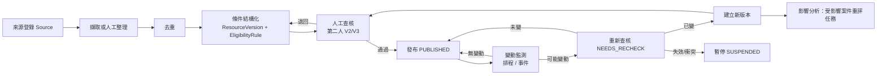

# 資源蒐集更新系統與資格規則引擎
work_id：STP-PLATFORM-PLAN-001｜版本：v0.2-draft｜2026-10-03
資料欄位見 [DATA_MODEL_AND_STATE_MACHINES.md](DATA_MODEL_AND_STATE_MACHINES.md)；合成範例見 [examples/](examples/README.md)。

基本立場：
- 不假設任何網站有 API、可任意擷取，或民間資源仍有名額。
- 公開資訊可查核；尚未確認的欄位一律標記 `UNKNOWN`，不補造、不由模型推測。
- 模型生成的資格條件不得直接進入正式推薦。

## 1. 流程總覽

| 步驟 | 責任人 | 輸入 | 輸出 | 完成條件 |
|---|---|---|---|---|
| 來源登錄 | R5 | URL、公告、電話確認紀錄 | Source（tier、fetch_policy） | 有出處與取得日期 |
| 擷取或人工整理 | R5（AI 可起草） | Source 原文 | 草稿欄位＋source_excerpt_map | 每欄可追溯到原文位置或標 UNKNOWN |
| 去重 | R5 | 草稿 | 連到既有 Resource 或新建 | 同方案不同年度歸同一 Resource |
| 條件結構化 | R5 | 原文條件 | EligibilityRule＋HouseholdScopeDefinition＋DocumentRequirement＋stacking_rules | 規則測試案例 3 類齊備 |
| 人工查核 | R5 第二人；裁量條件請 R4 | 草稿＋來源 | VerificationRecord | V2 以上；衝突已處理 |
| 發布 | R5（非查核人） | 已查核版本 | PUBLISHED | 自動檢查通過 |
| 變動監測 | 系統＋R5 | 頻率表、事件 | NEEDS_RECHECK 任務 | — |
| 重新查核 | R5 | 新舊比較 | 確認／新版本／暫停 | 有紀錄 |
| 更新或暫停 | R5、R4、R7 | 查核結果 | 新版本或 SUSPENDED＋影響分析 | 受影響案件都有任務 |

## 2. 來源分級
| 級別 | 類型 | 例 | 用途 | 單獨可達查核等級 |
|---|---|---|---|---|
| S1 | 法律、法規命令 | 社會救助法、兒少福利相關法規（全國法規資料庫） | 條件與口徑的最終依據 | V2（需第二人比對） |
| S2 | 中央主管機關公告、辦法、作業要點 | 衛福部、教育部、勞動部公告 | 全國性方案 | V2 |
| S3 | 地方政府公告、自治條例、申請須知 | 縣市社會局處網站、區公所 | 地方方案、門檻年度值 | V2 |
| S4 | 公部門委託或公營單位資訊 | 公所服務手冊、委託據點簡章 | 申請管道、窗口 | V1；需電話確認至 V3 |
| S5 | 民間機構公開資訊 | 基金會、協會、食物銀行網站或社群貼文 | 民間資源 | V1；名額與現況必須電話確認 |
| S6 | 次級整理 | 新聞、懶人包、論壇、他人整理的資源表 | 線索 | 不可作為正式來源，只能用來找到 S1～S5 |

規則：
- 條件衝突時，原則上 S1 > S2 > S3 > S4 > S5；但「地方門檻年度值」以最新 S3 為準，「實際受理窗口與時間」以 S4 電話確認（V3）為準。無法判斷時暫停並請 R4／承辦確認。
- 每個欄位可以來自不同來源，`source_excerpt_map` 記錄欄位→來源。

## 3. 不同來源格式的處理
| 格式 | 取得 | 處理 | 保存 |
|---|---|---|---|
| 網頁 | 人工開啟；只有在確認網站使用條款與 robots 允許且頻率低（≤每日 1 次）時才設 AUTO_HASH_ALLOWED | 擷取正文→正規化（去導覽、日期戳）→內容雜湊；人工整理欄位 | 雜湊＋必要摘錄；完整快照僅在授權明確時保存於私有儲存 |
| PDF | 人工下載 | 文字層擷取；掃描檔以 OCR 協助但需人工比對；記錄頁碼 | 檔案雜湊＋頁碼摘錄 |
| 公告（新聞稿、函文） | 人工 | 只取與方案有關的變更（日期、門檻、名額）；標記公告日期與生效日期 | 摘錄 |
| 電話／Email／現場確認 | R5 或 R3 | VerificationRecord：對象單位與職稱（不記私人姓名於公開層）、日期、問題、回答摘要 | 內部 |
| 表單（申請書） | 人工下載 | 推導 DocumentRequirement 與申請欄位；不把表單本身放公開 repo 除非授權允許 | 雜湊＋來源連結 |

## 4. 版本、原文、摘要與規則的連結
- **同一方案不同年度**：一個 Resource，多個 ResourceVersion（`version_label` 例 `2026`、`2027`）；新年度門檻（例如最低生活費）變動即新版本。舊版本保留（SUPERSEDED/EXPIRED），既有評估與申請繼續指向舊版本。
- **連結鏈**：`Source(原文, 雜湊, 頁碼)` ← `source_excerpt_map` ← `ResourceVersion(查核摘要, summary_plain)` ← `EligibilityRule.criteria[i].source_ref` ← `Assessment.results[].criteria_results[i]`。
  任何一條評估理由都能點回：規則條件 → 原文摘錄 → 來源 URL 與取得日期 → 查核紀錄。
- **非實質修正**（錯字、窗口電話更新）：建 patch 版本 `non_material=true`，不觸發重評，但仍需查核。

## 5. 資格規則格式
### 5.1 條件（criterion）結構
以下對應合成資源 `TW-DEMO-LIVING-001`（[examples/synthetic_resources.json](examples/synthetic_resources.json)），另加上說明模板欄位：
```json
{
  "criterion_id": "C2",
  "label_plain": "家庭平均每人每月收入不超過門檻",
  "input_keys": ["derived.income_per_capita"],
  "scope_key": "SCOPE-L1",
  "operator": "LTE",
  "threshold": {"value": 18000, "unit": "TWD/month/person", "threshold_source_ref": "S-0001#第2點"},
  "min_confirmation_for_fail": "C2",
  "on_missing": "INSUFFICIENT",
  "discretionary": false,
  "requires_human_when": ["value_within_5_percent_of_threshold"],
  "source_ref": "S-0001#第2點",
  "explain_template": {
    "pass": "依您提供的資料，平均每人每月約 {value} 元，低於門檻 {threshold} 元。",
    "fail": "依您提供的資料，平均每人每月約 {value} 元，高於門檻 {threshold} 元；計算方式可能與機關不同，可請協助員確認。",
    "unknown": "還需要家庭每月收入與共同生活人數，才能判斷這一項。"
  }
}
```
### 5.2 運算子（受控清單）
`EQ`、`NEQ`、`LT`、`LTE`、`GT`、`GTE`、`BETWEEN`、`IN`、`NOT_IN`、`EXISTS`、`REGION_IN`（含上層行政區展開）、`AGE_BETWEEN`（以指定基準日計）、`COUNT_MEMBERS_WHERE`（依 scope 計數）、`DATE_WITHIN`（申請期間）、`NOT_RECEIVING`（併領排除，見 §7）、`HUMAN_JUDGMENT`（不自動判斷，必定進人工）。
不支援任意程式碼或模型評斷；新運算子需工程與 R5 共同審查並加測試。

### 5.3 家庭口徑計算
1. 依 criterion.scope_key 取得 HouseholdScopeDefinition。
2. 依 member_inclusion 從 Person 中挑出計入成員（使用 co_residing、same_household_registration、relation、年齡等事實）。任何成員的必要事實為 UNKNOWN → 該條件結果為 UNKNOWN，列出缺哪位成員的哪項資料。
3. 依 income_definition 從 Fact 彙總（只彙總該定義列出的所得項目與期間），產生衍生值（例：`derived.income_per_capita`）。
4. 衍生值保留計算過程（成員清單、各項金額、公式），寫入 criteria_results 供解釋。
同一家庭對 A 方案計 4 人、對 B 方案計 3 人是正常結果，畫面需顯示「此方案的家庭人數算法」。

## 6. 評估演算法與結果
### 6.1 單條件結果
| 結果 | 條件 |
|---|---|
| PASS | 輸入已知且符合 |
| FAIL | 輸入已知且不符合，且確認程度 ≥ `min_confirmation_for_fail`；否則降為 FAIL_UNCONFIRMED |
| FAIL_UNCONFIRMED | 依自述或低確認程度資料不符合 |
| UNKNOWN | 輸入缺漏、拒答、口徑無法計算 |
| HUMAN | 運算子為 HUMAN_JUDGMENT、discretionary=true、或觸發 requires_human_when |

### 6.2 資源層級結果（combinator=ALL 時）
1. 任一條件 FAIL（已確認）→ **依現有資料可能不符合**（LIKELY_INELIGIBLE）。
2. 否則任一條件 FAIL_UNCONFIRMED → **依現有資料可能不符合**，並標記「依自述資料，建議確認」。
3. 否則任一條件 UNKNOWN → **資料不足**（INSUFFICIENT_DATA），列出缺漏輸入。
4. 否則（全部 PASS 或 HUMAN）→ **可能符合**（LIKELY_ELIGIBLE）；有 HUMAN 條件者列入 human_check_points 並進 R4 佇列。
- 規則：LIKELY_INELIGIBLE 不是排除；畫面仍顯示資源、理由與「如何請人複核」，並推薦替代資源。
- 資源本身的條件：資源非 PUBLISHED、地區不符（REGION_IN FAIL）、申請期間已過（DATE_WITHIN FAIL）也以條件呈現，使理由一致。
- ANY／CUSTOM 組合以三值邏輯（PASS > UNKNOWN > FAIL）計算，並有測試覆蓋。

### 6.3 每次評估必須記錄
resource_version_id、rule_version、engine_version、input_snapshot（含每個輸入的 confirmation_level）、input_hash、逐條 criteria_results（結果、使用值、門檻、來源、白話理由）、missing_inputs（缺什麼、問誰、哪份文件可證明）、human_check_points（為何需要人工、誰處理）、rank_score 與 rank_reasons、時間。

### 6.4 排序
排序分數只用於顯示順序，不影響結果分類。因子（權重為初始值，試點中由 R4 調整並版本化）：
| 因子 | 說明 | 初始權重 |
|---|---|---|
| 急迫對應 | 資源對應已回報的急迫需求 | 30 |
| 期限接近 | 申請截止 ≤30 天 | 20 |
| 結果 | 可能符合 > 資料不足 > 可能不符合 | 20 |
| 申請負擔（反向） | 文件數、需否臨櫃、處理時間 | 15 |
| 可用量 | 容量 OPEN > LIMITED > UNKNOWN > FULL | 15 |
不以金額排序；金額僅顯示。

## 7. 併領、排除與相依條件
`stacking_rules` 結構：
```json
{
  "excludes": [{"resource_key": "TW-DEMO-LIVING-001", "type": "SAME_PERIOD", "source_ref": "S-0004#第5點"}],
  "reduces": [{"resource_key": "TW-DEMO-EDU-003", "effect": "擇一領取或扣除差額", "source_ref": "..."}],
  "requires": [{"status_key": "low_income_household_status", "source_ref": "..."}],
  "priority_note": "其他法令已有相同性質給付者，依原文規定擇優或擇一"
}
```
處理方式：
- `excludes`：若 Fact 顯示家庭正在領取被排除資源 → 條件 FAIL（自述則 FAIL_UNCONFIRMED）；若兩者同時為「可能符合」→ 兩者都顯示，並標示「只能擇一，請協助員比較」，進 R4 佇列。
- `reduces`：不改變結果分類，只在解釋中顯示影響，並建立人工確認點。
- `requires`（相依）：前置身分或資源。前置未知 → INSUFFICIENT；前置正在申請中 → 結果標記「待前置結果」，行動清單把前置資源排在前面。
- 規則原文模糊（例：「其他同性質補助」未列舉）→ 一律 HUMAN_JUDGMENT，不由系統或模型推論。

## 8. 變動監測、頻率與對既有案件的影響
### 8.1 查核頻率
| 風險等級 | 定義 | 例行頻率 | 事件觸發 |
|---|---|---|---|
| HIGH | 有申請期限、名額、年度門檻；民間急難或物資；試點中 ≥3 案使用 | 每 2 週；期限前 14 天加查 | 來源雜湊變動、使用者／承辦回報、公告 |
| MEDIUM | 常年受理的地方方案；民間常態服務 | 每月 | 同上 |
| LOW | 法定常態給付且門檻年度調整 | 每季；每年 12～1 月（新年度門檻公告期）加查 | 同上 |
- 民間資源的名額／存貨：每次轉介前電話確認（不依頻率表）。
- 有自動雜湊監測的來源每日比對一次；雜湊變動只建立 NEEDS_RECHECK 任務，不自動改資料。

### 8.2 新版本對既有案件的影響
發布新版本或暫停時，系統執行影響分析：
| 案件狀態 | 處理 |
|---|---|
| 只有評估、未啟動申請 | 評估標 STALE；建立 REASSESS 任務（期限 5 個工作日；HIGH 資源 2 個工作日） |
| PREPARING_DOCS／READY_TO_SUBMIT | 建立高優先任務；R3 檢查文件與條件變化，必要時升版申請（記錄） |
| SUBMITTED 以後 | 不改變申請；新版本僅作資訊，除非承辦要求補件 |
| 續辦待建立 | 以新版本產生續辦任務 |
| 資源暫停 | 未送件者 ON_HOLD＋替代資源；已送件者繼續追蹤 |
影響清單本身存成一筆 AuditEvent，並在 P9 顯示每案處理進度。

## 9. 失效、衝突與名額不明
| 狀況 | 偵測 | 處理 |
|---|---|---|
| 來源 404／搬移 | 監測或人工 | Source BROKEN；資源 NEEDS_RECHECK；HIGH 風險立即 SUSPENDED；找到新網址後建新 Source |
| 來源衝突（兩來源條件不同） | 結構化或查核時 | 不得發布；記錄衝突欄位與兩方原文；電話向承辦確認（V3）；確認前若已發布則 SUSPENDED |
| 期限不明 | 欄位 UNKNOWN | 可發布但顯示「期限未公告，申請前確認」；risk_tier 提升為 HIGH |
| 名額不明 | capacity UNKNOWN | 可發布；轉介前必須確認；P11 顯示「需先電話確認」 |
| 金額不明 | UNKNOWN | 可發布；顯示「金額依審核結果」 |
| 民間資源可能已結束 | 30 天未確認 | 自動降為 NEEDS_RECHECK；60 天未確認自動 SUSPENDED |

## 10. 待查核佇列與責任人
- 每個 Resource 有 `owner_staff_id`（維護責任人）；每個查核任務有 assignee、backup、due_at。
- 佇列排序：已暫停且影響進行中案件 > HIGH 風險到期 > 新資源 > 其他。
- 每週資源品質會議（見 [OPERATIONS_AND_PRIVACY.md](OPERATIONS_AND_PRIVACY.md) §2.2）檢視：逾期查核數、暫停數、衝突數、錯漏推薦回報。
- 首批 30～50 項：按需求類別分給 R5，每人每日可查核量估 3～5 項（V2，含第二人複核），待 P1 實測校正。

## 11. AI 與規則、人工的分工
| 工作 | AI 可以 | 規則引擎負責 | 人工負責 |
|---|---|---|---|
| 資源整理 | 從原文起草欄位與白話摘要，附原文位置 | — | R5 逐欄核對、決定 UNKNOWN；第二人查核 |
| 規則撰寫 | 起草 criteria 草稿供參考（authoring_origin=AI_DRAFT_HUMAN_EDITED） | 結構驗證、測試案例 | R5 撰寫定稿；R4 檢視裁量條件；不得未審即發布 |
| 門檻、地區、期限、家庭口徑、排除、併領 | 不參與判斷 | 依已發布規則計算 | 規則異常時人工 |
| 白話解釋 | 以「已計算的結果與理由」改寫成易讀文字（試點後） | 提供結構化理由 | R5 審核模板；本人可要求人工說明 |
| 問答引導 | 依固定題庫改寫問法、解釋題意（試點後） | 決定要問哪題 | — |
| 文件擷取 | 擷取欄位草稿（試點後，需資料處理條件確認） | — | R3 確認後才寫入 Fact（C2） |
| 摘要與提醒草稿 | 案件接觸紀錄摘要、提醒文字草稿（去識別化輸入） | — | R3 確認後送出 |
| 裁量、例外、複雜家庭、矛盾資訊、急迫需求 | 不參與 | 標記 HUMAN | R4 |

硬性限制：
1. 模型輸出不寫入 EligibilityRule、ResourceVersion 的已發布欄位，只能寫入草稿欄位，並記錄 `ai_assisted=true`、模型名稱與提示版本。
2. 評估結果分類只由規則引擎產生；AI 生成的解釋不得改變分類，也不得新增未在 criteria_results 中出現的理由（以結構化輸入＋輸出檢查實作：解釋中的數值須與 criteria_results 相符，不符則改用模板文字）。
3. 送給外部模型的資料範圍見 [OPERATIONS_AND_PRIVACY.md](OPERATIONS_AND_PRIVACY.md) §1.6。

### 11.1 AI 不可用時的人工替代
| 功能 | 替代 |
|---|---|
| 資源欄位起草 | R5 直接依範本人工整理（MVP 預設就是人工，AI 只加速） |
| 白話解釋 | 使用每條件的 `explain_template`（人工撰寫、已發布），永遠可用 |
| 問答引導 | 固定題庫與協助員唸稿 |
| 文件擷取 | 協助員人工登錄 |
| 摘要／提醒草稿 | 模板＋協助員撰寫 |
系統設計：所有 AI 功能以功能旗標控制，逾時 10 秒或錯誤即回退模板，不阻斷流程；AI 錯誤率與回退次數列入監控。

## 12. 規則品質驗證
- 每條規則至少 3 個測試案例（可能符合／資料不足／可能不符合），發布前 CI 自動執行。
- 社工標註案例集（golden set）：P1 期間由 R4 以合成或去識別化情境標註 ≥30 個「應推薦／不應推薦」案例，作為錯漏推薦的基準；不使用模型自生答案作為正確基準。
- 每週抽查（[PRODUCT_REQUIREMENTS.md](PRODUCT_REQUIREMENTS.md) §7.5）發現的錯漏，回寫成新測試案例。
