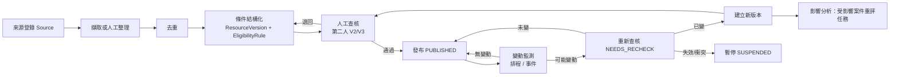

# 資源蒐集更新系統與資格規則引擎
work_id：STP-PLATFORM-PLAN-001｜版本：v0.4-draft（R2 修正）｜2026-10-04
資料欄位見 [DATA_MODEL_AND_STATE_MACHINES.md](DATA_MODEL_AND_STATE_MACHINES.md)；合成範例見 [examples/](examples/README.md)。

基本立場：
- 不假設任何網站有 API、可任意擷取，或民間資源仍有名額。
- 公開資訊可查核；尚未確認的欄位一律標記 `UNKNOWN`，不補造、不由模型推測。
- 模型生成的資格條件不得直接進入正式推薦。

## 0. 目錄展示與正式推薦（唯一判定）
「可展示於目錄」與「可正式推薦」是兩個不同判定，P1、P3、行動清單、申請建立、轉介都使用本節同一組函式，不得各自判斷。

### 0.1 目錄展示（`catalog_visibility`）
| 版本狀態 | 公開列表 | 詳情頁 | 備註 |
|---|---|---|---|
| PUBLISHED | 顯示 | 顯示 | 若 `as_of < effective_from` 加註「某月某日起適用」，仍不推薦 |
| NEEDS_RECHECK | 顯示，加「查核中」標記 | 顯示 | 是否仍可推薦見 §0.2 |
| SUSPENDED | 不列 | 以直接連結顯示「暫停推薦：原因」 | |
| EXPIRED／SUPERSEDED／RETIRED | 不列 | 僅在歷史版本頁顯示，標「已過期」「已被新版本取代」「已停用」 | 舊評估與申請仍指向該版本 |
| CANDIDATE／DRAFT／IN_REVIEW | 不公開 | 僅 R5／R4／R9 內部可見 | |

### 0.2 正式推薦（`recommendation_status`）
輸入：ResourceVersion、已發布的 EligibilityRule、其引用的 Source、`risk_tier`、評估基準日 `as_of`。輸出：`FORMAL`、`MANUAL_CHECK_ONLY`、`NOT_RECOMMENDED` 三者之一，加上全部原因碼。判定順序與結果：
| # | 檢查 | 不通過時 |
|---|---|---|
| 1 | 有已發布、**完整驗證通過**的 EligibilityRule（驗證流程見 §5.4：先完整結構驗證，再範圍參照驗證；兩階段都必須完成並通過，驗證未完成或中途例外一律視為不合法） | NOT_RECOMMENDED：`RULE_MISSING`（無規則）、`RULE_STATUS_MISSING`（缺 `rule.status`；**不得預設為已發布**）、`RULE_NOT_PUBLISHED`（`status` 不是 PUBLISHED）、`RULE_INVALID`（任何位置的非法條件、未支援的運算子或組合、非法 CUSTOM 運算式、未知或未支援的口徑範圍鍵、引用不存在的口徑） |
| 2 | 版本狀態 | PUBLISHED 通過；NEEDS_RECHECK：`risk_tier=HIGH` 為 `RECHECK_HIGH_RISK`（不推薦）；其他風險在進入 NEEDS_RECHECK 後 14 天內（OP-08 暫行）可推薦並加「查核中」標記，超過為 `RECHECK_GRACE_EXCEEDED`（不推薦，且依 RV-09 轉暫停）。**起算資料**：`ResourceVersion.recheck_started_at`（RV-07 寫入觸發時間；RV-08／09／12／13 離開時清除；DATA_MODEL §2.4.1）；已過天數＝`as_of` 日期 − `recheck_started_at` 日期（日曆天，Asia/Taipei），缺少為 `RECHECK_START_MISSING`、格式不合或晚於 `as_of` 為 `RECHECK_START_INVALID`（都不推薦）；非 NEEDS_RECHECK 狀態卻帶有起算日為 `VERSION_INVALID`；SUSPENDED／EXPIRED／SUPERSEDED／RETIRED／CANDIDATE／DRAFT／IN_REVIEW 一律 NOT_RECOMMENDED：`STATUS_<狀態>` |
| 3 | `verification_level` ≥ V2 | NOT_RECOMMENDED：`VERIFICATION_TOO_LOW` |
| 4 | `conflict_status` ≠ OPEN | NOT_RECOMMENDED：`SOURCE_CONFLICT` |
| 5 | 所引用 Source 皆為 ACTIVE | NOT_RECOMMENDED：`SOURCE_INVALID`（BROKEN／MOVED／SUPERSEDED，需重新查核並引用新來源） |
| 6 | 生效期間 | `as_of < effective_from`：NOT_RECOMMENDED `NOT_YET_EFFECTIVE`；`as_of > effective_to`：NOT_RECOMMENDED `PERIOD_ENDED`；`effective_to` 未知（`effective_unknown=true`）：**MANUAL_CHECK_ONLY** `PERIOD_UNKNOWN`；`effective_unknown` 必須與 `effective_to` 是否為空一致，不一致為 NOT_RECOMMENDED `VERSION_INVALID`（同樣，缺少必要欄位也是 `VERSION_INVALID`）|
| 7 | 申請期間 | `FIXED`：`as_of` 在所有區間之前 NOT_RECOMMENDED `WINDOW_NOT_OPEN`（顯示開放日）、之後 `WINDOW_CLOSED`；`UNKNOWN`：**MANUAL_CHECK_ONLY** `WINDOW_UNKNOWN`；`ROLLING` 通過；`WITHIN_MONTHS_OF_EVENT` 由條件判斷 |
結果彙總：任一檢查為 NOT_RECOMMENDED → NOT_RECOMMENDED；否則任一為 MANUAL_CHECK_ONLY → MANUAL_CHECK_ONLY；否則 FORMAL。
- **期限不明依原基線處理**（[DATA_AND_PRODUCT_SPEC.md](../DATA_AND_PRODUCT_SPEC.md) §5「期限不明…暫停自動推薦」）：不進正式推薦，保留人工查核入口。是否放寬（例如私有資源有 V3 確認與近 30 天容量確認時）是**待負責人決定的提案**，見 [DECISIONS_AND_UNKNOWNS.md](DECISIONS_AND_UNKNOWNS.md) D-311，未核准前不啟用。
- 容量不影響推薦狀態：FULL 加旗標 `CAPACITY_FULL`（轉介須確認候補）、UNKNOWN 加 `CAPACITY_UNCONFIRMED`（轉介前須電話確認）。
- 資格評估（§6）對 FORMAL 與 MANUAL_CHECK_ONLY 執行；NOT_RECOMMENDED 不產生新推薦（只保留舊評估供追溯）。
- 顯示：P3 對受助者只顯示 FORMAL；MANUAL_CHECK_ONLY 只對 R3／R4 顯示並標示「需先人工確認期限或申請期間」，確認後由 R5 建立新版本；NOT_RECOMMENDED 不顯示於 P3。
- 再檢查時點：評估時、列入行動清單（AP-01）、進入 READY_TO_SUBMIT（AP-06）、私有資源轉介送出（RF-02）、每日排程（既有行動清單項目失效時標 STALE 並建立重評任務）。

## 1. 流程總覽

| 步驟 | 責任人 | 輸入 | 輸出 | 完成條件 |
|---|---|---|---|---|
| 來源登錄 | R5 | URL、公告、電話確認紀錄 | Source（tier、fetch_policy） | 有出處與取得日期 |
| 擷取或人工整理 | R5（AI 可起草） | Source 原文 | 草稿欄位＋source_excerpt_map | 每欄可追溯到原文位置或標 UNKNOWN |
| 去重 | R5 | 草稿 | 連到既有 Resource 或新建 | 同方案不同年度歸同一 Resource |
| 條件結構化 | R5 | 原文條件 | EligibilityRule＋HouseholdScopeDefinition＋DocumentRequirement＋stacking_rules | 規則測試案例 3 類齊備 |
| 人工查核 | R5 第二人；裁量條件請 R4 | 草稿＋來源 | VerificationRecord | V2 以上；衝突已處理 |
| 發布 | R5（非查核人） | 已查核版本 | PUBLISHED | 自動檢查通過 |
| 變動監測 | 系統＋R5 | 頻率表、事件 | NEEDS_RECHECK 任務 | — |
| 重新查核 | R5 | 新舊比較 | 確認／新版本／暫停 | 有紀錄 |
| 更新或暫停 | R5、R4、R7 | 查核結果 | 新版本或 SUSPENDED＋影響分析 | 受影響案件都有任務 |

## 2. 來源分級
| 級別 | 類型 | 例 | 用途 | 單獨可達查核等級 |
|---|---|---|---|---|
| S1 | 法律、法規命令 | 社會救助法、兒少福利相關法規（全國法規資料庫） | 條件與口徑的最終依據 | V2（需第二人比對） |
| S2 | 中央主管機關公告、辦法、作業要點 | 衛福部、教育部、勞動部公告 | 全國性方案 | V2 |
| S3 | 地方政府公告、自治條例、申請須知 | 縣市社會局處網站、區公所 | 地方方案、門檻年度值 | V2 |
| S4 | 公部門委託或公營單位資訊 | 公所服務手冊、委託據點簡章 | 申請管道、窗口 | V1；需電話確認至 V3 |
| S5 | 民間機構公開資訊 | 基金會、協會、食物銀行網站或社群貼文 | 民間資源 | V1；名額與現況必須電話確認 |
| S6 | 次級整理 | 新聞、懶人包、論壇、他人整理的資源表 | 線索 | 不可作為正式來源，只能用來找到 S1～S5 |

規則：
- 條件衝突時，原則上 S1 > S2 > S3 > S4 > S5；但「地方門檻年度值」以最新 S3 為準，「實際受理窗口與時間」以 S4 電話確認（V3）為準。無法判斷時暫停並請 R4／承辦確認。
- 每個欄位可以來自不同來源，`source_excerpt_map` 記錄欄位→來源。

## 3. 不同來源格式的處理
| 格式 | 取得 | 處理 | 保存 |
|---|---|---|---|
| 網頁 | 人工開啟；只有在確認網站使用條款與 robots 允許且頻率低（≤每日 1 次）時才設 AUTO_HASH_ALLOWED | 擷取正文→正規化（去導覽、日期戳）→內容雜湊；人工整理欄位 | 雜湊＋必要摘錄；完整快照僅在授權明確時保存於私有儲存 |
| PDF | 人工下載 | 文字層擷取；掃描檔以 OCR 協助但需人工比對；記錄頁碼 | 檔案雜湊＋頁碼摘錄 |
| 公告（新聞稿、函文） | 人工 | 只取與方案有關的變更（日期、門檻、名額）；標記公告日期與生效日期 | 摘錄 |
| 電話／Email／現場確認 | R5 或 R3 | VerificationRecord：對象單位與職稱（不記私人姓名於公開層）、日期、問題、回答摘要 | 內部 |
| 表單（申請書） | 人工下載 | 推導 DocumentRequirement 與申請欄位；不把表單本身放公開 repo 除非授權允許 | 雜湊＋來源連結 |

## 4. 版本、原文、摘要與規則的連結
- **同一方案不同年度**：一個 Resource，多個 ResourceVersion（`version_label` 例 `2026`、`2027`）；新年度門檻（例如最低生活費）變動即新版本。舊版本保留（SUPERSEDED/EXPIRED），既有評估與申請繼續指向舊版本。
- **連結鏈**：`Source(原文, 雜湊, 頁碼)` ← `source_excerpt_map` ← `ResourceVersion(查核摘要, summary_plain)` ← `EligibilityRule.criteria[i].source_ref` ← `Assessment.results[].criteria_results[i]`。
  任何一條評估理由都能點回：規則條件 → 原文摘錄 → 來源 URL 與取得日期 → 查核紀錄。
- **非實質修正**（錯字、窗口電話更新）：建 patch 版本 `non_material=true`，不觸發重評，但仍需查核。

## 5. 資格規則格式
### 5.1 條件（criterion）結構
以下對應合成資源 `TW-DEMO-LIVING-001`（[examples/synthetic_resources.json](examples/synthetic_resources.json)），另加上說明模板欄位：
```json
{
  "criterion_id": "C2",
  "label_plain": "家庭平均每人每月收入不超過門檻",
  "input_keys": ["derived.income_per_capita"],
  "scope_key": "SCOPE-L1",
  "operator": "LTE",
  "threshold": {"value": 18000, "unit": "TWD/month/person", "threshold_source_ref": "S-0001#第2點"},
  "min_confirmation_for_fail": "C2",
  "on_missing": "INSUFFICIENT",
  "discretionary": false,
  "requires_human_when": ["value_within_5_percent_of_threshold"],
  "source_ref": "S-0001#第2點",
  "explain_template": {
    "pass": "依您提供的資料，平均每人每月約 {value} 元，低於門檻 {threshold} 元。",
    "fail": "依您提供的資料，平均每人每月約 {value} 元，高於門檻 {threshold} 元；計算方式可能與機關不同，可請協助員確認。",
    "unknown": "還需要家庭每月收入與共同生活人數，才能判斷這一項。"
  }
}
```
條件欄位約束（發布前驗證，違反者拒絕發布）：
- `min_confirmation_for_fail` 只能是 `C2` 或 `C3`（預設 `C2`）。**自述（C1）永遠不能產生已確認的不符合**，只能得到 `FAIL_UNCONFIRMED`；
- `operator` 必須在 §5.2 的受控清單內；`scope_key` 若有則必須存在；每個條件必須有 `source_ref`；
- `requires_human_when` 目前只支援 `value_within_5_percent_of_threshold`（5% 為暫行參數）。

- `rule.status` 必填且只有 `PUBLISHED` 可推薦；`combinator=CUSTOM` 時 `expression` 必填且依 §5.5 的結構；`ALL`／`ANY` 不得帶 `expression`；
- 條件與規則的鍵是封閉集合，未知的鍵一律報錯（不默默忽略）。

### 5.2 運算子（受控清單）
| 運算子 | 說明 | 參考 runner（`examples/check_examples.py`） |
|---|---|---|
| `EQ`、`NEQ`、`LT`、`LTE`、`GT`、`GTE`、`BETWEEN`、`IN`、`NOT_IN`、`EXISTS` | 比較；`IN` 的值為清單 | 支援 |
| `REGION_IN` | 行政區（含上層行政區展開） | 支援 |
| `COUNT_MEMBERS_WHERE` | 依 scope 計數符合條件的成員 | 支援；`threshold` 只允許 `where` 與 `min_count`（整數 ≥1）；`where` 必須含 `age_between`（`[最小, 最大]` 兩個整數且 0 ≤ 最小 ≤ 最大），可加 `in_school`（布林，三態：**未提供該鍵＝不依就學篩選**；`true`＝只計在學成員；`false`＝只計**不在學**成員，不得當作未提供而略過；加上此鍵後，範圍內成員的 `person.in_school` 未知則整個條件為 `UNKNOWN`，不得排除該成員）；其他鍵（含 `relation_in`、`co_residing`、`same_household_registration`）一律報錯，不得忽略 |
| `NOT_RECEIVING` | 併領排除，見 §7 | 支援 |
| `HUMAN_JUDGMENT` | 不自動判斷，必定進人工 | 支援 |
| `AGE_BETWEEN`（依基準日計歲） | 以生日計算 | **不支援，runner 報錯**（正式實作需支援） |
| `DATE_WITHIN`（日期區間） | 申請期間目前由 §0.2 處理，不作為條件 | **不支援，runner 報錯** |
| 區間值輸入 `{"min","max"}` | 見 [DATA_MODEL_AND_STATE_MACHINES.md](DATA_MODEL_AND_STATE_MACHINES.md) §2.9 | **不支援，runner 報錯** |
不支援任意程式碼或模型評斷；新運算子需工程與 R5 共同審查並加測試。**遇到不支援的運算子、組合或輸入一律拒絕並報錯，不得默默略過或套用其他語意**（規格上不支援者：`NOT`、`N_OF_M` 組合）。

### 5.3 家庭口徑計算
1. 依 criterion.scope_key 取得 HouseholdScopeDefinition。
2. 依 member_inclusion 從 Person 挑出計入成員。判斷所需的事實（`person.co_residing`、`person.same_household_registration`、關係、`person.age` 等，皆為 Fact，各有確認程度）**任一成員未知時，不得把該成員直接排除後繼續計算**：整個依賴此 scope 的條件結果為 UNKNOWN，`missing_inputs` 列出缺哪位成員的哪項事實。沒有任何成員資料（無法確認家庭組成）同為 UNKNOWN。
3. 依 income_definition 從 Fact 彙總（只彙總該定義列出的所得項目與期間），產生衍生值（例：`derived.income_per_capita`）。
4. 衍生值保留計算過程（成員清單、各項金額、公式），寫入 criteria_results 供解釋。
同一家庭對 A 方案計 4 人、對 B 方案計 3 人是正常結果，畫面需顯示「此方案的家庭人數算法」。

**口徑定義的支援範圍（F-02）**：參考 runner 只實作下表；表外的鍵、型別不符或不支援的組合**一律報錯**（`scope_problems`），不得默默忽略——否則規格上寫了「年齡 0～17」卻實際計入所有成員，會算出錯誤人數與錯誤的推薦。
| 位置 | 已支援 | 已知但**未支援**（出現即報錯） | 其他鍵 |
|---|---|---|---|
| 口徑頂層 | `scope_key`、`label_plain`、`member_inclusion`、`income_definition`、`property_definition`、`source_ref` | — | 未知鍵報錯 |
| `member_inclusion` | `relation_in`（清單，值須在關係列舉內）、`same_household_registration`（`YES`／`NO`）、`co_residing`（`YES`／`NO`） | `age_between`、`in_school`、`military_service`、`exclusions` | 未知鍵報錯 |
| `income_definition` | `items`（`monthly_earned_income`、`monthly_pension`）、`period`（`MONTHLY_AVERAGE`） | `ANNUAL`／`ANNUAL_AVERAGE` 期間、`include_imputed_income`／`imputed_income`（工作能力推估所得） | 未知鍵或項目報錯 |
未支援的能力是**正式實作要補的項目**（WP-04），補完前，使用到它們的規則在 runner 與正式推薦都是 `RULE_INVALID`，不得推薦。成員資料未知時仍遵守上述第 2 點：不排除該成員，結果為 UNKNOWN。

### 5.4 規則驗證流程（兩階段，缺一不可）
1. **完整結構驗證**：整份規則（所有條件、`combinator`、`expression`、`status`、鍵與型別）逐項檢查並**收集全部問題**，不在第一個問題停止；結果與條件出現的順序無關（非法條件在第一個或最後一個，結論相同）。
2. **範圍參照驗證**：必須提供**完整的口徑表**；每個被引用的 `scope_key` 必須存在，且該口徑通過 §5.3 的支援範圍檢查。引用不存在的口徑是驗證錯誤；呼叫端不可用空表略過這一步（缺少口徑表視為程式錯誤，不是合法）。
3. 任一階段發現問題或**未能完成**（例外、缺輸入）→ 規則不合法，`recommendation_status` 為 `NOT_RECOMMENDED` 加 `RULE_INVALID`。**驗證未完成不得視為通過。**
參考實作：`ref_engine.rule_problems`／`validate_rule`／`recommendation_status`；案例：`engine_cases.json` 的 `illegal_criterion_variants`、`illegal_expression_variants`、`scope_cases`、`criterion_shape_cases`、`recommendation_cases`；順序獨立測試：`check_examples.py` 的 `test_rule_validation_order_independence`（T-57、T-58）。

### 5.5 CUSTOM 運算式（`expression`）
- 型別：節點是條件 ID 字串，或 `{"op": "ALL"｜"ANY", "children": [節點…]}`（`children` 非空）；只支援巢狀 ALL／ANY，`NOT`、`N_OF_M` 等報錯（T-30）。
- 約束：運算式必須**恰好引用每個已定義的 `criterion_id` 一次**，不得引用不存在或重複的條件。
- 單一事實來源：`schemas/eligibility_rule.schema.json` 描述結構；引用完整性由 `validate_rule` 驗證（結構驗證器不能表達）。

## 6. 評估演算法與結果
### 6.1 單條件結果
| 結果 | 條件 |
|---|---|
| PASS | 輸入已知且符合 |
| FAIL | 輸入已知且不符合，且所用輸入的確認程度 ≥ `min_confirmation_for_fail`（C2 以上） |
| FAIL_UNCONFIRMED | 輸入已知且不符合，但確認程度低於 `min_confirmation_for_fail`（包含所有 C1 自述）；**永遠需要確認路徑**，與是否接近門檻無關 |
| UNKNOWN | 輸入缺漏、拒答、scope 成員事實未知、區間值跨越門檻、衍生值無法計算 |
| HUMAN | 運算子為 `HUMAN_JUDGMENT` 或 `discretionary=true`（機關裁量，系統不判斷） |

`requires_human_when`（例如接近門檻）觸發時，條件結果維持 PASS／FAIL／FAIL_UNCONFIRMED 不變，只在資源結果加旗標 `HUMAN_CHECK` 並新增人工確認點。

### 6.2 組合語意（ALL、ANY、CUSTOM）
條件以樹狀組合：節點為 `ALL` 或 `ANY`，葉為條件。`combinator=ALL` 與 `ANY` 是只有單一層節點的特例；`CUSTOM` 是巢狀的 `{"op":"ALL｜ANY","children":[條件ID｜節點]}`，發布前驗證，只接受 `ALL`／`ANY`，其他一律拒絕。每個節點產生五種結果之一，語意（先符合的優先）：
| 節點 | 結果規則（由上而下，第一個成立者） |
|---|---|
| ALL | ① 任一子項 UNKNOWN → **UNKNOWN**（即使另有 FAIL 或 FAIL_UNCONFIRMED）；② 任一 FAIL → FAIL；③ 任一 FAIL_UNCONFIRMED → FAIL_UNCONFIRMED；④ 任一 HUMAN → HUMAN；⑤ PASS |
| ANY | ① 任一 PASS → PASS；② 任一 UNKNOWN → UNKNOWN；③ 任一 HUMAN → HUMAN；④ 全部為 FAIL → FAIL；⑤ 其餘（含 FAIL_UNCONFIRMED）→ FAIL_UNCONFIRMED |
「資料不足優先」是刻意設計：必要資料未知時，結果不能被其他已知的不符覆蓋；已知的不符以 `known_failures` 保留（見 §6.3），不隱藏也不據以排除。

### 6.3 資源層級結果
根節點結果對應資源結果：
| 根節點結果 | 資源結果 | 說明 |
|---|---|---|
| PASS | **可能符合**（LIKELY_ELIGIBLE） | |
| HUMAN | **可能符合**，加旗標 `HUMAN_CHECK` | 進 R4 佇列（AS-04） |
| UNKNOWN | **資料不足**（INSUFFICIENT_DATA） | 列出 `missing_inputs`；若有已知不符（FAIL／FAIL_UNCONFIRMED）則 `known_failures` 保留逐條理由並加旗標 `KNOWN_MISMATCH_PRESENT`，畫面顯示「有 N 項條件目前看來不符，且還有 M 項資料不足」，**不顯示為不符合** |
| FAIL_UNCONFIRMED | **依現有資料可能不符合**，`unconfirmed=true` | 旗標 `CONFIRM_SELF_REPORT`（見 §6.4） |
| FAIL | **依現有資料可能不符合**，`unconfirmed=false` | 仍不是排除：畫面顯示理由、確認方式與替代資源 |
- 地區、期限等條件與其他條件一視同仁地進入組合，理由格式一致。
- 提案（**未啟用**，待負責人決定，見 D-312）：ALL 節點中，已確認（C2 以上）的地區或期間 FAIL 與 UNKNOWN 並存時，改判為依現有資料可能不符合。目前不啟用，因為與「資料不足不得排除」的基線衝突。

### 6.4 自述不符的確認路徑
任何 FAIL_UNCONFIRMED 都會：
1. 在 `flags` 加 `CONFIRM_SELF_REPORT`，`human_check_points` 列出該條件與可證明的文件類型；
2. 建立 R3 的 DATA_REQUEST 任務（5 個工作日內向本人確認或查看文件，暫行）；確認後更新 Fact（C2）並重新評估；
3. 14 天仍未確認：進入 R4 佇列（暫行）；
4. P3 的用語：「依您提供的資料目前看起來可能不符合；這項資料還沒有被確認，請協助員幫您再確認一次。這不是拒絕。」
`value_within_5_percent_of_threshold` 只是額外的人工確認點（`HUMAN_CHECK`），不是自述不符的唯一處理路徑。

### 6.5 每次評估必須記錄
resource_version_id、rule_version、engine_version、`as_of`、input_snapshot（含每個輸入的 confirmation_level）、input_hash、逐條 criteria_results（結果、使用值、門檻、來源、白話理由、計算過程）、`known_failures`、missing_inputs（缺什麼、問誰、哪份文件可證明）、human_check_points、`flags`、`recommendation`（狀態與原因碼，見 §0.2）、rank_score 與 rank_reasons、時間。

### 6.6 排序
排序分數只用於顯示順序，不影響結果分類。因子（權重為暫行初始值，試點中由 R4 調整並版本化）：
| 因子 | 說明 | 初始權重 |
|---|---|---|
| 急迫對應 | 資源對應已回報的急迫需求 | 30 |
| 期限接近 | 申請截止 ≤30 天 | 20 |
| 結果 | 可能符合 > 資料不足 > 可能不符合 | 20 |
| 申請負擔（反向） | 文件數、需否臨櫃、處理時間 | 15 |
| 可用量 | 容量 OPEN > LIMITED > UNKNOWN > FULL | 15 |
不以金額排序；金額僅顯示。

## 7. 併領、排除與相依條件
`stacking_rules` 結構：
```json
{
  "excludes": [{"resource_key": "TW-DEMO-LIVING-001", "type": "SAME_PERIOD", "source_ref": "S-0004#第5點"}],
  "reduces": [{"resource_key": "TW-DEMO-EDU-003", "effect": "擇一領取或扣除差額", "source_ref": "..."}],
  "requires": [{"status_key": "low_income_household_status", "source_ref": "..."}],
  "priority_note": "其他法令已有相同性質給付者，依原文規定擇優或擇一"
}
```
處理方式：
- `excludes`：若 Fact 顯示家庭正在領取被排除資源 → 條件 FAIL（自述則 FAIL_UNCONFIRMED）；若兩者同時為「可能符合」→ 兩者都顯示，並標示「只能擇一，請協助員比較」，進 R4 佇列。
- `reduces`：不改變結果分類，只在解釋中顯示影響，並建立人工確認點。
- `requires`（相依）：前置身分或資源。前置未知 → INSUFFICIENT；前置正在申請中 → 結果標記「待前置結果」，行動清單把前置資源排在前面。
- 規則原文模糊（例：「其他同性質補助」未列舉）→ 一律 HUMAN_JUDGMENT，不由系統或模型推論。

## 8. 變動監測、頻率與對既有案件的影響
### 8.0 複查寬限的起算資料
`NEEDS_RECHECK` 的寬限天數必須由**可稽核的時間**計算，不得由「版本曾經被標記」之類的旗標推斷：RV-07 轉換時寫入 `recheck_started_at`（等於觸發事件時間，隨轉換的 AuditEvent 可稽核）、離開 NEEDS_RECHECK 的所有轉換（RV-08、RV-09、RV-12、RV-13）一律清除，歷史只留在 RV-07 的 AuditEvent；`recommendation_status` 以 `as_of` 與 `recheck_started_at` 計算已過日曆天數（§0.2 第 2 項）。見 DATA_MODEL §2.4.1。

### 8.1 查核頻率
| 風險等級 | 定義 | 例行頻率 | 事件觸發 |
|---|---|---|---|
| HIGH | 有申請期限、名額、年度門檻；民間急難或物資；試點中 ≥3 案使用 | 每 2 週；期限前 14 天加查 | 來源雜湊變動、使用者／承辦回報、公告 |
| MEDIUM | 常年受理的地方方案；民間常態服務 | 每月 | 同上 |
| LOW | 法定常態給付且門檻年度調整 | 每季；每年 12～1 月（新年度門檻公告期）加查 | 同上 |
- 民間資源的名額／存貨：每次轉介前電話確認（不依頻率表）。
- 有自動雜湊監測的來源每日比對一次；雜湊變動只建立 NEEDS_RECHECK 任務，不自動改資料。

### 8.2 新版本對既有案件的影響
發布新版本或暫停時，系統執行影響分析：
| 案件狀態 | 處理 |
|---|---|
| 只有評估、未啟動申請 | 評估標 STALE；建立 REASSESS 任務（期限 5 個工作日；HIGH 資源 2 個工作日） |
| PREPARING_DOCS／READY_TO_SUBMIT | 建立高優先任務；R3 檢查文件與條件變化，必要時升版申請（記錄） |
| SUBMITTED 以後 | 不改變申請；新版本僅作資訊，除非承辦要求補件 |
| 續辦待建立 | 以新版本產生續辦任務 |
| 資源暫停 | 未送件者 ON_HOLD＋替代資源；已送件者繼續追蹤 |
影響清單本身存成一筆 AuditEvent（內含逐案 ID，僅供有該案權限者經 P7／P8 的任務查看）；P9（R5／R4·INT／R7／R9 的資源維護頁）**只顯示資源層級影響摘要**（有無受影響案件、彙總件數），不含逐案 ID、家庭或處理進度——逐案進度由 R3·ASG／R4·SITE-REV 在 P7／P8 看，R5 角色限制不變、不新增個案權限（PRD §4.3）。

## 9. 失效、衝突與名額不明
| 狀況 | 偵測 | 處理 |
|---|---|---|
| 來源 404／搬移 | 監測或人工 | Source BROKEN；資源 NEEDS_RECHECK（正式推薦判定因 `SOURCE_INVALID` 立即不推薦）；HIGH 風險立即 SUSPENDED；找到新網址後建新 Source 並重新查核 |
| 來源衝突（兩來源條件不同） | 結構化或查核時 | 設 `conflict_status=OPEN`：不得發布；已發布者立即不推薦（`SOURCE_CONFLICT`）並暫停；記錄衝突欄位與兩方原文；電話向承辦確認（V3）後標 RESOLVED |
| 期限不明（`effective_unknown` 或申請期間 UNKNOWN） | 欄位 UNKNOWN | 不進正式推薦（MANUAL_CHECK_ONLY，§0.2），僅 R3／R4 可見；R5 向承辦或機構確認後發布新版本；`risk_tier` 提升為 HIGH |
| 名額不明 | capacity UNKNOWN | 可發布；轉介前必須確認；P11 顯示「需先電話確認」 |
| 金額不明 | UNKNOWN | 可發布；顯示「金額依審核結果」 |
| 民間資源可能已結束 | 30 天未確認 | 自動降為 NEEDS_RECHECK；60 天未確認自動 SUSPENDED |

## 10. 待查核佇列與責任人
- 每個 Resource 有 `owner_staff_id`（維護責任人）；每個查核任務有 assignee、backup、due_at。
- 佇列排序：已暫停且影響進行中案件 > HIGH 風險到期 > 新資源 > 其他。
- 每週資源品質會議（見 [OPERATIONS_AND_PRIVACY.md](OPERATIONS_AND_PRIVACY.md) §2.2）檢視：逾期查核數、暫停數、衝突數、錯漏推薦回報。
- 首批 30～50 項：按需求類別分給 R5，每人每日可查核量估 3～5 項（V2，含第二人複核），待 P1 實測校正。

## 11. AI 與規則、人工的分工
| 工作 | AI 可以 | 規則引擎負責 | 人工負責 |
|---|---|---|---|
| 資源整理 | 從原文起草欄位與白話摘要，附原文位置 | — | R5 逐欄核對、決定 UNKNOWN；第二人查核 |
| 規則撰寫 | 起草 criteria 草稿供參考（authoring_origin=AI_DRAFT_HUMAN_EDITED） | 結構驗證、測試案例 | R5 撰寫定稿；R4 檢視裁量條件；不得未審即發布 |
| 門檻、地區、期限、家庭口徑、排除、併領 | 不參與判斷 | 依已發布規則計算 | 規則異常時人工 |
| 白話解釋 | 以「已計算的結果與理由」改寫成易讀文字（試點後） | 提供結構化理由 | R5 審核模板；本人可要求人工說明 |
| 問答引導 | 依固定題庫改寫問法、解釋題意（試點後） | 決定要問哪題 | — |
| 文件擷取 | **不使用外部 AI**；MVP 由人工登錄，試點後可選本機文字辨識（§11.2） | — | R3 確認後才寫入 Fact（C2） |
| 摘要與提醒草稿 | 案件接觸紀錄摘要、提醒文字草稿（去識別化輸入） | — | R3 確認後送出 |
| 裁量、例外、複雜家庭、矛盾資訊、急迫需求 | 不參與 | 標記 HUMAN | R4 |

硬性限制：
1. 模型輸出不寫入 EligibilityRule、ResourceVersion 的已發布欄位，只能寫入草稿欄位，並記錄 `ai_assisted=true`、模型名稱與提示版本。
2. 評估結果分類只由規則引擎產生；AI 生成的解釋不得改變分類，也不得新增未在 criteria_results 中出現的理由（以結構化輸入＋輸出檢查實作：解釋中的數值須與 criteria_results 相符，不符則改用模板文字）。
3. 送給外部模型的資料範圍見 [OPERATIONS_AND_PRIVACY.md](OPERATIONS_AND_PRIVACY.md) §1.6；**文件影像與文件文字不送外部 AI**。

### 11.1 AI 不可用時的人工替代
| 功能 | 替代 |
|---|---|
| 資源欄位起草 | R5 直接依範本人工整理（MVP 預設就是人工，AI 只加速） |
| 白話解釋 | 使用每條件的 `explain_template`（人工撰寫、已發布），永遠可用 |
| 問答引導 | 固定題庫與協助員唸稿 |
| 文件擷取 | 人工登錄（預設路徑本身，不依賴任何自動化） |
| 摘要／提醒草稿 | 模板＋協助員撰寫 |
系統設計：所有 AI 功能以功能旗標控制，逾時 10 秒或錯誤即回退模板，不阻斷流程；AI 錯誤率與回退次數列入監控。

### 11.2 文件處理路徑（已選定）
| 路徑 | 狀態 | 說明 |
|---|---|---|
| 人工登錄 | **預設，MVP 與試點** | R3 查看文件後登錄結構化欄位與狀態（C2）；不需保存影本 |
| 本機文字辨識（LOCAL_OCR） | 試點後選項（F-26，WP-26） | 於私有環境內的辨識程式處理，影像與辨識文字不離開私有環境；需本人 DOCUMENT_STORAGE＋DOCUMENT_EXTRACTION 同意；辨識結果須 R3 逐欄確認才寫入 Fact；未確認結果 7 天內刪除；具體引擎待評估（U-21） |
| 外部 AI 文件處理 | **未啟用、待確認功能**（D-313、U-21） | 與「文件影像不送外部 AI」並存的前提是另立用途（新增同意用途與同意書版本）、供應商資料使用／保存／處理地點條款經法律確認、負責人書面核可；在此之前系統不提供、文件亦不得送出 |
不可用時（辨識程式失敗、環境故障）：回到人工登錄，流程不中斷（T-48）。MVP 不把任何個案資料送外部 AI。

## 12. 規則品質驗證
- 每條規則至少 3 個測試案例（可能符合／資料不足／可能不符合），發布前 CI 自動執行；引擎另有組合語意單元測試（`examples/engine_cases.json`：UNKNOWN＋FAIL、UNKNOWN＋FAIL_UNCONFIRMED、HUMAN、ANY、CUSTOM、不支援組合被拒絕）與正式推薦判定測試。
- 社工標註案例集（golden set）：P1 期間由 R4 以合成或去識別化情境標註 ≥30 個「應推薦／不應推薦」案例，作為錯漏推薦的基準；不使用模型自生答案作為正確基準。
- 每週抽查（[PRODUCT_REQUIREMENTS.md](PRODUCT_REQUIREMENTS.md) §7.5）發現的錯漏，回寫成新測試案例。
